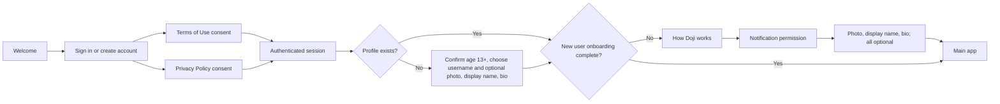
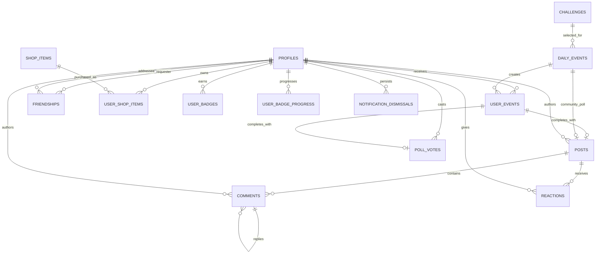
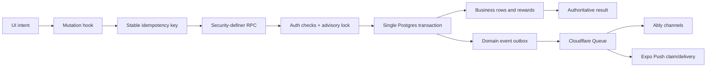

# Doji: authoritative product and system context

Last verified: August 18, 2026

This is the primary map of what Doji is, how the product flows, who owns each
piece of state, and how the mobile client, Postgres, Cloudflare, Ably, Expo Push,
and Supabase Realtime connect. Read this before changing a screen, query, RPC,
event, notification, or infrastructure component.

Detailed transport guarantees live in
[`docs/REALTIME_ARCHITECTURE.md`](docs/REALTIME_ARCHITECTURE.md). If these files
disagree, fix both in the same change. The current code and migrations remain the
executable source of truth.

## Product in one paragraph

Doji is a social daily-challenge app. One shared challenge goes live for eligible
users at the same instant. A user has exactly 10 minutes, authorized by the
database clock, to participate. Completing the Doji unlocks that day's social
experience and protects the user's streak. Posts, shared poll results, comments,
replies, reactions, mentions, friendships, leaderboards, Sparks, badges, profile
presentation, and shop cosmetics update live. A missed user remains locked unless
an allowed buy-in reopens participation. Submitting any challenge type returns the
user directly to the feed; there is no success interstitial.

## Product contracts that must not regress

- Challenge authorization uses server time, never the phone clock.
- The live participation window is exactly 10 minutes.
- Challenge pre-live, activation, and close are durable one-shot events, not recurring
  polling jobs or client schedules.
- Exactly 20 minutes before activation, the server advances to a challenge-free
  pre-live state. The prior occurrence stays durable but leaves the active feed
  because every feed read is keyed by the authoritative occurrence. The app shows the coming-soon banner
  from that authoritative state; it does not reveal the challenge early.
- A completed write and its realtime/push events commit together.
- A failed submission cannot create a completion notification.
- Retrying the same command cannot create a second post, vote, reaction, comment,
  reward, or notification.
- A user has at most one active reaction per post. Their first reaction notifies
  the applicable owner/friends; changing, removing, or re-adding it does not
  create another alert. A comment heart notifies the comment author once per
  reacting user, and self-hearts never notify.
- Users do not need to restart or manually refresh to see committed activity.
- The feed is unlocked only after the current user completes today's Doji
  (`completed` or paid `late`).
- Poll and Would You Rather challenges use one community post. Generic polls may
  include an `Other` answer; Would You Rather has exactly two choices and never
  offers `Other`. Aggregate results are global; social alerts and the Friends view
  are limited to accepted friends.
- Selecting a person opens their profile. The relationship control handles add,
  accept, sent, and unfriend states; its adjacent menu contains block and report.
  Neither duplicates “View profile.”
- Whenever a name or username is shown, show that user's avatar and equipped frame.
- Blocking immediately removes the person and their content from the viewer's UI
  and removes the friendship. It does not create moderation work; only an explicit
  report action enters the admin queue.
- A banned account keeps its authenticated session but cannot enter onboarding or
  the app. It is routed exclusively to the branded ban screen with Contact Support
  and Sign Out actions; a live ban takes effect as soon as the owner profile updates.
- Cleared or dismissed notifications are durable account state and never return
  after reinstall or sign-in on another device.
- Light and dark themes must both meet contrast and state-visibility requirements.
- Text-entry screens use the shared keyboard components. Focused fields scroll
  fully above the keyboard and toolbar, and keyboard movement is synchronized.

## End-to-end user journey



Product requirement: account creation presents two independent, initially
unchecked consents—Terms of Use and Privacy Policy. Each label links to its own
readable document. Date of birth and username are required on the single profile-setup
page; photo, display name, and bio are optional. The date is evaluated by the server
clock, is never stored, and only a versioned 13-plus assurance result is retained.
There is no separate profile screen or “skip for now” detour.

Routing is enforced in `app/_layout.tsx`, `hooks/useAuthGate.ts`,
`lib/authRoute.ts`, and `lib/onboardingGate.ts`. The root layout owns session
restoration, profile hydration, protected route groups, fonts, theme, keyboard
provider, push-token registration, notification deep links, and global toasts.
After authentication, protected-route selection waits for the initial owner
profile read to finish: a session whose profile is still hydrating is not treated
as a new account. Refreshing an already loaded profile keeps the app group mounted.

## Daily Doji lifecycle

```mermaid
sequenceDiagram
  participant Alarm as Cloudflare Durable Object
  participant DB as Supabase Postgres
  participant Relay as Cloudflare Queue / Edge relay
  participant Live as Ably and Expo Push
  participant App as Mobile app

  Alarm->>DB: begin_daily_event_prelive(event_id)
  DB->>DB: stamp prelive_at; write doji.pre_live event
  Live-->>App: Doji coming soon
  Alarm->>DB: activate_daily_event(event_id) 20 minutes later
  DB->>DB: stamp fires_at and closes_at; seed 128 push shards
  DB->>DB: write one global identifier event
  DB-->>Alarm: committed activation
  DB->>Relay: wake outbox relay
  Relay->>Live: publish sockets and claim push delivery
  Live-->>App: Doji is live
  App->>DB: get_current_doji_state()
  App->>DB: atomic idempotent submission RPC
  DB->>DB: complete occurrence, content, rewards, badge progress, events
  DB-->>App: authoritative success
  App->>App: navigate directly to feed
  Alarm->>DB: close_daily_event(event_id)
  DB->>DB: resolve misses/shields and queue close events
  Alarm->>Alarm: register the next one-shot event
```

After an ambiguous submission response, the client checks the authorized committed
receipt before showing failure. A committed post navigates directly to the feed; the
client never compensates with a second direct insert.

`schedule-daily-challenge` prepares/registers the first or next future event; it is
not a recurring dispatcher. `DojiEventAlarm` wakes exactly at pre-live, activation,
and close.
An idempotent re-registration also re-arms the matching Durable Object alarm because
stored phase state can outlive a failed or consumed invocation. Occurrences and their
content are retained outside the active feed and removed only by explicit retention
policy, never by the activation-critical transaction.
Postgres owns `fires_at`, `closes_at`, `expires_at`, eligibility, and final status.

Per-user status flow:

```text
pending -> completed
pending -> missed -> buy_in_open -> late
```

- `completed`: submitted inside the normal window.
- `missed`: normal window closed without completion.
- `buy_in_open`: the user spent Sparks and may submit without the original
  10-minute restriction; payment routes directly into the response flow.
- `late`: completed through the buy-in path; it unlocks the feed.

Users created that day retain the existing server-owned signup-day exception and may
complete their assigned Doji for free until that exception's deadline. Everyone else
receives the normal 10-minute server window. After a normal miss, only a successful
Sparks buy-in reopens that occurrence. A paid occurrence remains available until
completion or until a newer Doji supersedes it; the original 10-minute cutoff is not
applied again.

Client gating rules are centralized in `lib/participationGate.ts`. Screens must not
reimplement status or time logic. `hooks/useUserEvent.ts` reads
`get_current_doji_state`, synchronizes the server-clock offset, and returns the
authoritative occurrence.

## Challenge types and completion

| Type             | User action                                            | Authoritative completion  |
| ---------------- | ------------------------------------------------------ | ------------------------- |
| Photo            | Capture/upload required media and optional caption     | `complete_doji_with_post` |
| Task             | Perform the task and submit the requested proof/answer | `complete_doji_with_post` |
| Format/question  | Submit the requested text/media format                 | `complete_doji_with_post` |
| Poll             | Select an option or `Other` with required custom text  | `submit_poll_vote`        |
| Would You Rather | Select exactly one of two choices; no `Other`          | `submit_poll_vote`        |

Uploads may finish before the command, but participation is not complete until the
atomic RPC commits. The client uses stable occurrence command IDs and single-flight
guards. It may optimistically unlock navigation, but it rolls back on failure and
immediately refetches authoritative state on success.

## Social feed behavior

The feed has Friends and Everyone audiences.

- Normal posts belong to a user and an occurrence.
- Friends shows accepted friends plus the viewer.
- Everyone shows the wider authorized community.
- Poll/WYR has one ownerless community post per daily event, not one post per voter.
- A community poll appears in Friends only after the viewer or a friend votes.
- Community result totals update for all viewers in realtime.
- Friend result details use the authoritative `get_poll_snapshot_for_feed` RPC and
  respect friendship/RLS visibility.
- Comments in Friends are filtered to the viewer's friend network; Everyone may
  show the wider authorized conversation.
- An opened thread uses `get_comment_thread_snapshot`; comments, safe author
  presentation, audience filtering, block filtering, like counts, and the viewer's
  like state arrive in one bounded Postgres read rather than a client waterfall.
- Reactions, comments, replies, and poll-vote likes update the open card/thread and
  all related counters immediately.
- Feed queries are scoped to the authoritative current `daily_event_id`, never the
  device's local calendar. Pre-live immediately changes the active cache identity;
  the prior occurrence's posts, comments, and reactions remain durable but are no
  longer returned by active-feed reads. No launch transaction deletes social rows.

The unlocked feed uses `get_feed_page_snapshot` so a page, safe profile presentation,
scoped social counts, and the viewer's reaction arrive from one Postgres snapshot.
The key files are `hooks/useFeed.ts`, `lib/feedQueries.ts`, `lib/feedAudience.ts`,
`components/feed/PollResultCard.tsx`, and the feed components.

## State and data ownership

| State                                                                   | Owner                                         | Client access pattern                          |
| ----------------------------------------------------------------------- | --------------------------------------------- | ---------------------------------------------- |
| Session and current full profile                                        | Supabase Auth/Postgres, hydrated into Zustand | `stores/useAuthStore.ts`; owner-only RPCs      |
| Feed, profiles, friends, comments, reactions, badges, leaderboard, shop | Postgres                                      | TanStack Query authorized reads                |
| Challenge eligibility and timing                                        | Postgres                                      | Authoritative RPC + server-clock offset        |
| Draft text, selected option, open sheet, animation                      | Screen/component                              | Local React state                              |
| Realtime events                                                         | Transactional outbox                          | ID-only invalidation hints; never trusted rows |
| Background alerts                                                       | Native APNs/FCM; Expo migration fallback      | Same committed outbox event as socket delivery |
| Media                                                                   | Supabase Storage                              | User-scoped paths and storage policies         |

Zustand is not a second database. TanStack Query caches server state but does not
own it. Socket handlers invalidate/refetch queries; they do not invent replacement
rows from untrusted event payloads.
Ably and Supabase may both signal one commit; `queryInvalidationBatcher` coalesces
their affected query roots for 80 ms and performs one active-query reconciliation.
Mutation completion joins that same batch, so an optimistic interaction plus its two
socket hints cannot create three cache scans or cancel/restart an in-flight read.
High-volume public events additionally map to the exact query families they change:
a comment heart refreshes the open comment thread, not the feed, poll totals, voter
pages, and reaction sheets. Unknown events do not trigger a catch-all refetch.

The last authorized home/feed, occurrence, poll result, and notification reads are
persisted locally for stale-while-revalidate startup. Cached content remains visible
and interactive while Postgres reconciles in the background; refresh indicators must
never cover the screen or block touch. Realtime invalidation does not cancel an
already-running authoritative fetch.

Public profile reads use the explicit allowlist in `lib/profileFields.ts`. Full
profile/account fields are owner-only through `get_own_profile` and
`update_own_profile`. Never restore `profiles(*)` to public or embedded queries.
Post media uses server-reserved, user/occurrence-scoped object paths and resumable
TUS uploads. Completion accepts only reserved objects from the same idempotent command.
Uncommitted objects are removed after 24 hours. A deleted/moderated post durably queues
its physical objects for removal; committed reservation metadata expires after the post
is gone and 30 days have elapsed, without deleting media still referenced by a post.

## Core data relationships



Important uniqueness rules belong in Postgres, not only the client: one completion
per user occurrence, one poll vote per user/challenge occurrence, one reaction
state per user/post, one owned shop item per user/item, durable command receipts,
and stable notification delivery claims.

## Write path: one command, one transaction



Never replace an atomic RPC with multiple client writes. Mutation retries are off by
default. A command may retry only if the same stable idempotency key is reused.
Validation, authorization, uniqueness, and business-rule errors are not retried.

Representative commands:

| Domain              | Commands                                                                                                                   |
| ------------------- | -------------------------------------------------------------------------------------------------------------------------- |
| Profile/auth        | `create_own_profile`, `get_own_profile`, `update_own_profile`, `register_native_push_endpoint`, `unregister_push_installation` |
| Participation       | `get_current_doji_state`, `complete_doji_with_post`, `submit_poll_vote`, `buy_in_today`                                    |
| Conversation        | `toggle_post_reaction`, `submit_comment`, `edit_comment`, `delete_comment`, `toggle_comment_like`, `toggle_poll_vote_like` |
| Friend graph/safety | `request_friendship`, `respond_to_friendship`, `remove_friendship`, `block_user`, `unblock_user`, `submit_content_report`  |
| Economy             | `purchase_shop_item`, `equip_shop_item`                                                                                    |
| Notifications       | `dismiss_notification`, `clear_notification_history`, `mark_notification_center_opened`                                    |
| Suggestions/admin   | `submit_challenge_suggestion`, `review_challenge_suggestion`, `moderate_report`                                            |

## Realtime read path

Ably is the only handset socket transport. Postgres is still authoritative: each
committed command writes its domain event in the same transaction, and reconnect or
foreground reconciliation refetches authorized state if any event was missed.

1. The mutation commits application rows and outbox rows together.
2. Cloudflare Queue claims critical activation and realtime-only rows ahead of
   push-only backlog and relays them with retry/dead-letter behavior.
3. Ably atomically publishes each ordered channel batch of ID-only events. The relay
   durably marks realtime publication before slower push delivery begins.
4. `hooks/useDomainRealtime.ts` deduplicates event IDs and invalidates targeted
   TanStack Query keys.
5. `components/QueryLifecycle.tsx` reconciles all server-owned surfaces whenever
   the app returns to the foreground.
6. Ably connect/recovery runs the shared `lib/reconcileQueries.ts` catch-up.

The mobile client does not subscribe to Supabase Postgres Changes. Running two socket
transports for the same commit duplicated invalidation and reconnect work, while
Postgres Changes performs per-subscriber authorization and does not provide a more
authoritative row than the follow-up RLS query. Older builds may remain in the
Supabase publication during migration, but current correctness never depends on it.

Channels:

- `doji:global`: pre-live, activation, and close.
- `feed:public`: coalesced public/community post membership changes only.
- `post:{postId}`: reactions, comments, comment likes, poll votes, and vote likes
  for a mounted, unlocked card or open thread. List virtualization bounds active
  subscriptions instead of sending every engagement event to every handset.
- Public identity, avatar, frame, title, badge, and public-stat events fan out on
  the owner/friend private channels; there is no all-account profile channel.
- `leaderboard:global`: XP/rank invalidation.
- `user:{id}:events`: private occurrence, account, store ownership, friendship,
  block, badge, suggestion, and notification changes.
- `moderation:global`: admin-only report queue.

Accepted friend circles are capped at 500 accounts. That product bound is
enforced atomically in Postgres. Posts, completions, community reactions, and
community comments enqueue one durable fanout command; the relay expands the
bounded circle after the interactive transaction commits. This keeps writes,
reads, and notifications bounded even if total registrations grow far beyond
100,000. Outgoing pending requests are capped at 100 per account.

## Live-data coverage

| Change                         | What updates immediately                                                                                                     |
| ------------------------------ | ---------------------------------------------------------------------------------------------------------------------------- |
| Doji pre-live/activation/close | Feed reset, coming-soon/live banner, current occurrence, feed gate, bell, background push                                    |
| Completion or buy-in           | Current occurrence, feed gate, profile, XP/Sparks, leaderboard                                                               |
| Post                           | Feed, post detail, profile post grid, friends' alert history                                                                 |
| Poll vote                      | Community totals, friend results, voter avatars, feed, participant alerts                                                    |
| Reaction                       | Card counts, voter sheet, post detail, friend/owner alert history                                                            |
| Comment/reply/like             | Open thread, counters, feed card, mention/reply/owner alerts                                                                 |
| Profile presentation           | Every visible avatar/name/frame/title across feed, friends, leaderboard, comments, reactions, poll voters, and notifications |
| Sparks/account fields          | Current user's profile header, shop affordability, purchase state                                                            |
| Shop purchase/equip            | Owned inventory, Sparks, current-user preview, public equipped cosmetic                                                      |
| Badge progress/unlock          | Owner progress/celebration and public profile badges                                                                         |
| XP/streak/level                | Profile stats, leaderboard, celebration state                                                                                |
| Friendship/block               | Friend lists/counts, requests, feed audience, profiles, bell                                                                 |
| Dismiss/clear notification     | Bell list/count across devices and reinstalls                                                                                |
| Suggestion/moderation          | Submitter status/bell and admin queues                                                                                       |

## Notifications

The in-app bell is durable activity history, not a mirror of whatever iOS happened
to display. Per-category preferences control push delivery; they do not erase
history. Foreground OS banners and notification-derived app toasts are suppressed;
the live bell and actionable feed banner update instead. Background/killed clients use native push, with Expo retained during endpoint migration. Tapping an alert is
resolved through `lib/notificationHref.ts` and canonical routes in `lib/routes.ts`.
Clearing history optimistically filters the retained query snapshot immediately,
then persists through the atomic clear RPC; a failed authoritative write rolls the
UI back. Pending friend requests remain because they are actionable account state.
The device-alert switch is the permission action itself; there is no duplicate
permission button. Unread bell and app-icon badges follow durable unread activity by
default and are not exposed as a separate preference.
Turning the device-alert switch off persists the master `push_enabled` opt-out and
unregisters that installation's token. Turning it on requests OS permission when
needed, registers the token, and persists the opt-in. Both push relays enforce the
master setting before any category preference; bell history remains available.

Server-backed screens use shared, non-interactive skeletons only when there is no
cached content to show. Background refreshes keep the last successful content visible
and must never place a loading overlay above usable controls.

Native dialogs and sheets remain mounted while their `visible` prop transitions to
false so iOS/Android can finish dismissal and release the presentation layer. Route
changes initiated inside a native sheet run after its dismissal callback; never hard-
unmount a visible native modal or leave an invisible backdrop intercepting touches.

Stack Back actions pop existing navigation history before consulting a `returnTo`
fallback. `returnTo` is only for routes opened without usable history (for example a
direct link); replacing a pushed child with its parent duplicates the parent route.

Community poll notification rule: global aggregate data does not imply global social
noise. Only accepted friends receive participation, reaction, and comment alerts for
shared poll content. Normal posts alert the appropriate post owner, replier, mentioned
user, or accepted friend. A single action must not alert the same recipient twice.

Notification delivery has three product tiers. Doji activation is time-sensitive and
immediate. Direct human actions (comments, replies, mentions, friend requests, and
moderation results) are immediate active alerts. Burst-prone social proof (friend
participation, reactions, and comment likes) updates the bell immediately but uses a
durable 30-second server bucket whose single OS alert arrives 30-60 seconds later.
Related pushes share a platform thread/collapse identity. Changing or re-adding the
same reaction/like does not create another alert. Foreground devices use the live bell
and never show a redundant OS banner.

Push delivery is claimed server-side using immutable event/recipient/installation keys. Native
APNs/FCM endpoints are private per-installation records and atomically transferred on
account change. The five most recent active installations are independently delivered
and independently idempotent; no account silently receives alerts on only its newest
phone. Direct APNs and FCM are the scale paths and the unique Expo token is a
temporary migration fallback. Production requires APNs key/team/bundle secrets and
FCM project/client-email/private-key secrets before the readiness load gate.
The first claim is terminal before provider handoff; conflicts never reopen it, and
an ambiguous provider timeout is not resent. Provider tickets and outcomes are telemetry
only and cannot authorize delivery. This intentionally favors a rare missed OS alert
over any possibility of a notification storm because Postgres, Ably, and foreground
reconciliation remain authoritative.
The relay carries the immutable outbox creation time and rejects Doji pushes older
than two minutes and other pushes older than five minutes. Provider TTL begins only
after this freshness check; a retry can never give a day-old action a new lifetime.
App correctness never depends on OS push delivery; foreground/reconnect reconciliation
must still reveal the committed state.
Nested outbox inserts issue one post-commit relay wake per database transaction.
`INSERT ... ON CONFLICT DO UPDATE` statements that create no new outbox row do not
wake the relay again. A singleton Durable Object coalesces simultaneous wakes for
250 ms, then seeds 16 one-message Cloudflare Queue drain lanes. Full 100-row claims
double their continuation lanes to a hard 128-lane ceiling; small workloads stay at
the initial footprint. Every lane claims disjoint leases until committed work drains.
Friend-scoped realtime invalidations are batch-published to at most 100 Ably channels
per HTTP call; only grouped OS-alert work becomes a per-recipient durable child row.
Per-source/per-recipient once keys ensure an expansion retry cannot inflate grouped
friend-completion or reaction counts.
Profile presentation/stats and badge-progress changes also use identifier-only friend
batch fanout, so shop/profile/gamification writes do not synchronously expand friends.

## Economy, profiles, and gamification

- Sparks are server-owned. Rewards use idempotent ledger entries; purchases and
  buy-ins are atomic debits. Client constants in `constants/sparks.ts` describe UI
  values but the database authorizes balances and awards.
- Shop catalog rows define current items/prices. Ownership is permanent. Purchase
  and equip are distinct concepts, though purchase may equip immediately.
- Equipped theme affects the owner UI. Equipped avatar frame/title are public
  presentation and must propagate to every other active user immediately.
- XP, levels, weekly XP, streaks, badge progress, badge tiers, Sparks rewards, and
  streak shields are server-owned consequences of committed actions.
- Celebration UI observes authoritative profile/badge changes; it does not award
  anything itself.

## Friend graph, UGC safety, and moderation

Friendships are mutual accepted relationships, not follows. User-generated content
must preserve Apple's required protections:

- content filtering before submission plus server-side validation;
- report actions on objectionable content;
- block actions on abusive users;
- blocking hides the content immediately without creating a moderation report;
- blocking is bidirectional for posts, comments, reactions, alerts, and profile
  access. A blocked viewer sees only “This user has blocked you” on the blocker’s
  profile. The global leaderboard remains competition-neutral; the friends board
  still follows the accepted-friend graph;
- persistent admin report queue and developer response workflow;
- Terms of Use acceptance before account creation;
- separate Privacy Policy consent and document;
- action on valid objectionable-content reports within 24 hours.

Reports and blocks are separate safety actions. Both use their atomic RPCs and
reconcile the feed/friend graph and any open profile immediately, but only an explicit
report creates moderation work. Admin report reads use the bounded security-definer
evidence snapshot so a later block cannot hide explicitly reported content from
moderation. Report cards distinguish reporter, reported account, evidence, and
confirmed destructive actions.

## UI and interaction system

- Theme tokens live in `constants/theme.ts` and `contexts/ThemeContext`.
- `AppThemeHost` synchronizes the selected Doji appearance with React Navigation,
  native color scheme, and the native root-window background. Expo is configured
  for automatic native appearance so light and dark transitions never reveal a
  stale opposite-theme surface.
- Shared primitives live in `components/ui`; do not create screen-local versions of
  buttons, inputs, search fields, cards, avatars, dialogs, sheets, or typography
  without a real exception. `SearchField` owns the standard icon, focus, clear, and
  theme states. `AppDialog` owns app confirmations and choice prompts; native system
  UI is reserved for operating-system permissions and other OS-owned surfaces.
- `Avatar`/`AvatarStack` resolve equipped frames consistently.
- Input screens use `AppTextInput`, `AppKeyboardAwareScrollView`,
  `AppKeyboardStickyFooter`, `AppKeyboardToolbar`, or `KeyboardSafeSheet` as
  appropriate.
- Focus must auto-scroll the entire field above both keyboard and toolbar.
- The toolbar and keyboard animate together; do not add JS-delayed keyboard bars.
- Up/down toolbar controls follow visual field order. Done dismisses the keyboard.
- Ten-minute timers derive every tick from the synchronized server clock and the
  occurrence's authoritative expiry; backgrounding never pauses or extends a window.
- Sheets and hidden tab screens must not remain touchable above the active screen.
- Bottom sheets use the shared `AppSheetModal` presence lifecycle: backdrop and surface
  animate together, Reduce Motion is honored, navigation waits for dismissal, and the
  native modal unmounts only after its closing motion releases the presentation layer.
- Cold server reads use `SkeletonSwap` to preserve final layout and crossfade into
  content. Cached content remains mounted during reconciliation; background refreshes
  never restore a skeleton or a touch-blocking loading layer.
- Shop item cards lead with the item name and consistently formatted Sparks price;
  previews and owned/equipped state follow beneath that header.
- Admin review sheets use a tall, scrollable detail body with persistent moderation
  actions so long prompts and answer sets remain fully inspectable.
- Child routes opened with an explicit `returnTo` must return to that origin before
  considering incidental router-stack history. Settings children return to Settings.
- Buttons meet minimum touch targets and expose accessibility role, label, state,
  and disabled behavior.
- Mutations should feel immediate through safe optimistic UI, then reconcile to the
  server. Avoid technical “offline,” “server confirmation,” or retry explanations
  unless user action is truly required.
- Comment hearts update their icon and count optimistically, reject overlapping taps
  for the same comment, roll back on failure, and accept the RPC's authoritative count.
  Counter maintenance emits no duplicate comment-update socket event.

## Screen map

| Area          | Route                                                               | Responsibility                                                                   |
| ------------- | ------------------------------------------------------------------- | -------------------------------------------------------------------------------- |
| Auth          | `app/(auth)`                                                        | Welcome, sign in/up, legal documents, username                                   |
| Onboarding    | `app/(onboarding)`                                                  | How it works and notification permission after the one-page auth profile setup   |
| Feed          | `app/(app)/index.tsx`                                               | Header, live banner, Friends/Everyone feed, gate, deep-linked content            |
| Doji          | `challenge.tsx`, `camera.tsx`, `poll.tsx`, `task.tsx`, `format.tsx` | Type-specific participation and buy-in entry                                     |
| Leaderboard   | `app/(app)/rank`                                                    | Weekly/all-time and Friends/Everyone rankings                                    |
| Friends       | `app/(app)/friends`                                                 | List, search, requests, remove/block actions                                     |
| Suggestions   | `suggest-challenge.tsx`                                             | Submit community challenge ideas                                                 |
| Profile       | `app/(app)/profile`                                                 | Stats, Sparks, badges, posts, settings, dedicated edit profile, appearance, shop |
| Member        | `app/(app)/member/[username].tsx`                                   | Another user's public profile and social actions                                 |
| Notifications | `app/(app)/notifications.tsx`                                       | Durable bell history, dismiss/clear actions                                      |
| Post detail   | `app/(app)/post/[id]`                                               | Focused content and threaded conversation                                        |
| Admin         | `app/(app)/admin`                                                   | Reports and challenge suggestions                                                |

Main tabs are Feed, Leaderboard, Friends, Suggest, and Profile. Participation,
notifications, member profiles, post detail, and admin are pushed routes, not tabs.

## Repository map

| Path                            | Role                                                              |
| ------------------------------- | ----------------------------------------------------------------- |
| `app/`                          | Expo Router screens and navigation composition                    |
| `components/`                   | Reusable visual/interaction components                            |
| `hooks/`                        | Authorized reads and atomic mutations                             |
| `lib/`                          | Pure product rules, clients, routing, idempotency, reconciliation |
| `stores/`                       | Minimal cross-screen client state                                 |
| `types/database.ts`             | Client database/RPC types                                         |
| `supabase/migrations/`          | Authoritative schema, RLS, RPCs, triggers, outbox producers       |
| `supabase/functions/`           | Privileged edge integrations                                      |
| `infra/doji-orchestrator/`      | Durable alarms, queue wakeups, retries, dead-letter handling      |
| `docs/REALTIME_ARCHITECTURE.md` | Realtime guarantees, channels, deployment, monitoring             |
| `docs/QA_CHECKLIST.md`          | Release/device test matrix                                        |
| `docs/APP_STORE_RELEASE.md`     | Apple review and submission evidence                              |

## Engineering rules

1. Read this file and the realtime architecture before cross-domain work.
2. Search for the existing shared component, hook, rule, and RPC before adding one.
3. Keep business authorization in Postgres; keep reusable display rules in `lib/`.
4. Use explicit public profile fields and RLS-authorized reads.
5. Use atomic, idempotent commands for writes; never sequence related client writes.
6. Emit ID-only committed events and reconcile authoritative data.
7. Add every new server-owned query family to reconnect/foreground reconciliation.
8. Add both owner and observer realtime handling when a public presentation changes.
9. Add durable notification history and push preference mapping together.
10. Use `utils/time.ts`/the server-clock helpers for database timestamps.
11. Update this map when a product contract, data flow, route, command, or channel changes.

Database bootstrap and grants are release contracts, not dashboard assumptions. A
fresh project must apply every migration without a pre-created reviewer account; the
optional Apple reviewer profile is added only when its Auth identity exists. Default
function execution is closed, anonymous users cannot execute `security definer`
functions, and each mobile RPC is explicitly granted to `authenticated`. RLS policies
cache `auth.uid()`, `auth.role()`, and `auth.jwt()` once per statement so authorization
does not add a per-row function call to bounded reads. Security-definer helpers called
by authenticated RLS policies retain explicit `authenticated` execute grants; revoking
those grants makes the policy fail closed.

## Performance contract

- Cold start may render an account-scoped cached profile and first feed page while the
  authoritative reads reconcile. The native splash is held before React mounts, so no
  blank transition or onboarding flash is allowed.
- Realtime reads are single-flight and non-cancelling. A burst is batched and receives
  at most one trailing catch-up; raw global Postgres Changes subscriptions are forbidden.
- Feed, poll totals, poll voters, comments, leaderboard, bell history, friends, friend
  requests, blocked users, reaction voters, and comment likes are bounded snapshots or
  keyset-paged reads. Count-only surfaces use count RPCs. New collections must not return
  unbounded history.
- `get_post_detail` owns post-detail authorization and the nested safe-profile contract;
  clients do not hydrate wildcard relations or emulate block rules locally.
- Search input is debounced and backed by an indexed contains-search path. Background
  prefetch and cache serialization wait until interactions finish.
- Cached content remains visible during refresh. Pull-to-refresh has a bounded visible
  indicator while reconciliation may safely finish behind the UI.
- A 100k activation must remain bounded: neither pre-live nor activation scans accounts.
  Activation creates 128 fixed push-shard rows and one global identifier event.
  User occurrences materialize lazily inside the authoritative current-state command.
  Cloudflare Queue drains shards concurrently in 500-account keyset pages, claims each
  bounded active installation independently, and uses bounded direct-native provider
  concurrency. Expo is migration fallback only because
  its 600/s project cap cannot meet the 100k freshness target. Never restore per-account
  activation outbox rows.
- Shared poll, community engagement, and occurrence participation totals use 128 write
  shards. Global invalidations are coalesced, and high-volume public channels are only
  subscribed while their owning screen is focused.

## Validation and release

Before a client build:

```powershell
npx tsc --noEmit
npm run lint
npm test -- --runInBand
npx supabase db lint --linked
```

Database contract tests under `supabase/tests` additionally require a compatible
local PostgreSQL/pgTAP environment. A successful unit test run does not replace the
physical two-device matrix: activation, close boundary, two-user participation,
feed visibility, poll totals, reaction/comment/reply/mention delivery, notification
deduplication, profile/frame propagation, Sparks, badges, background/reconnect, and
reinstall-persistent dismissals must all be verified on the release build.

Required production monitoring is listed in the realtime architecture. At minimum:
alert on outbox rows more than 60 seconds past `available_at`, queue dead letters,
fanout shards still pending 60 seconds after activation, Ably/relay errors, push
receipt failures, duplicate delivery-claim spikes, and unusual push-token transfers.
