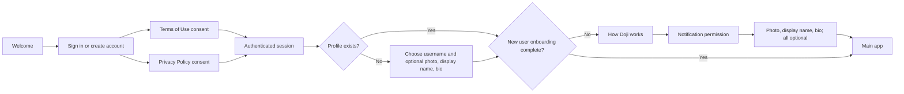
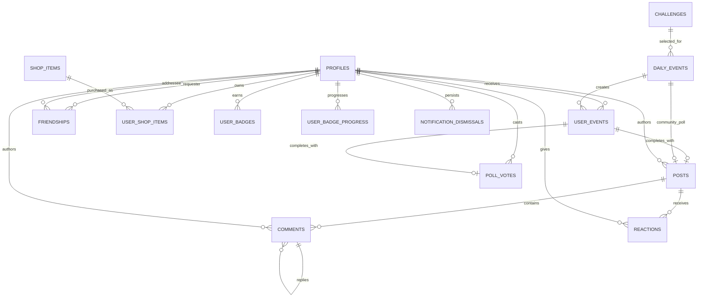
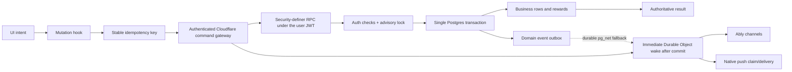

# Doji: authoritative product and system context

## October 9 announcement acceptance deployment (20:20 UTC)

Owner approved the separate employee-only database/runtime deployment. The two additive
announcement functions and scoped employee runtime v17 are deployed; composition is
enabled at the React /connected acceptance entry. The main legacy entry is unchanged.
The release backports only announcement changes onto captured v15, preserving its staff
override and existing health behavior; it does not deploy unrelated local health work.
Hosted session restore, queue reads, realtime connection and new-form rendering passed.
No announcement was created or sent. Live write acceptance and main-entry cutover remain
gated. See docs/ADMIN_ANNOUNCEMENT_CONNECTED_2026-10-09.md for exact release/rollback.

## October 9 connected announcement workflow preparation (LOCAL ONLY)

React announcement new/edit, atomic save/publish/schedule, existing audited cancellation
and exact same-session retry are wired locally behind independent default-off client
and employee-runtime flags. A new fixed employee identity bridge is prepared separately;
existing member functions/grants/behavior remain unchanged in offline regressions.
The loaded form version is pinned; pending intent is memory-only, cleared on identity
loss, and never automatically retried. Existing announcement/audit invalidation and
reconnect reconciliation are reused. No deployment or real announcement was made.
Release/rollback gates: docs/ADMIN_ANNOUNCEMENT_CONNECTED_2026-10-09.md.

## October 9 local announcement editor migration preparation

React preview now covers the complete announcement settings, explicit UTC
scheduling, immutable atomic-command payload preparation and fail-closed draft
hydration. This is local-only: no connected command transport, database deployment,
sending, member behavior or realtime change. Existing production announcement
commands remain authoritative. The authenticated /connected design deployment and
legacy default entry described below are unchanged. Remaining wiring, cancellation
and separate shared-deployment gates are recorded in
docs/WEB_REACT_MIGRATION_2026-10-08.md.

## October 9 approved admin design hosted at /connected

The Home/Team and queue/record presentation described below is now deployed to the
existing authenticated React acceptance entry at https://admin.dojipro.com/connected.
Deployment: d9130763-8f5f-491e-9756-028c7c890e89. This supersedes the LOCAL ONLY
deployment status of those presentation entries, not their scope restrictions.
The default legacy portal is unchanged because React announcement creation/publishing
parity remains gated. Business and main-site deployments, API proxy, security headers,
member app and shared systems are unchanged. All 133 packaged browser tests passed;
hosted read-only Home, Team, business queue/detail and connected queue status verified.
Evidence and rollback are documented in docs/ADMIN_REFERENCE_IMPLEMENTATION_2026-10-09.md.

## October 9 reference-led admin queues and records (LOCAL ONLY)

After accepting Home/Team, the owner approved extending that visual direction.
Core work queues retain area-specific columns, bounded cursor paging and existing
status filters. Full-page records use a shared admin-only layout: main content and
history beside a desktop ownership/context summary, with command forms below.
Business, safety, reports/appeals, ideas, privacy, audit and announcements preserve
their authorized data, warnings and existing actions. Keyboard row activation is
read-only navigation. No command, member, server, realtime or deployment change.
See docs/ADMIN_REFERENCE_IMPLEMENTATION_2026-10-09.md.

## October 9 reference-led admin Home and Team presentation (LOCAL ONLY)

The researched desktop direction is now applied locally to Home and Team & Access.
Home separates the Daily Doji, bounded work snapshot, short attention list and compact
navigation shortcuts. Team browsing no longer reserves space for a permanent editor:
Manage access switches to a focused full-page view within the same /team route.
The directory and command form remain mounted, preserving search/page state and exact
uncertain command intent. Back to team is guarded while a command is busy, uncertain,
rejected pending reconciliation, or awaiting confirmation. This is not a new durable
command store or a guarantee across page reloads. A selected employee's email is fixed
in that editor; granting another account starts from the directory. Existing atomic
role commands, audit reasons, confirmation and reauthorization remain authoritative.
No API, provider, member, event, polling or deployment change is included.
See docs/ADMIN_REFERENCE_IMPLEMENTATION_2026-10-09.md for scope and acceptance.

## October 6 MDT expanded cross-platform diagnostics (LOCAL ONLY; supersedes parity-only scope below)

The owner requested fuller iOS and Android evidence before either next build.
Member-mobile diagnostics now persist a separate random installation ID under
`@doji/diagnostic-installation:v1` and use a new random session ID on process start
and account transitions. These are diagnostic correlation identifiers, not auth,
push, advertising or hardware IDs, and do not identify a named person. Storage
failure falls back to an explicitly memory-only ID; requests never await storage.
Account IDs are compared only in memory, never transmitted by this instrumentation.
Session transitions clear the 24-entry diagnostic timeline; late requests retain
their original context and cannot inherit the new account's timeline.

Handled API events retain code-owned screen templates, allowlisted RPC/table/scale
endpoint labels, random request IDs, concurrent-request counts, first/final retry
evidence, bounded timing with explicit cap indication, UTC request boundaries,
start/settlement lifecycle/network observations, and validated provider response
IDs/status/body-state/size/cache/retry hints. SDK-native device/model, OS, emulator,
battery/memory/storage and app-build facts survive a strict field whitelist when
available. Names, emails, device names, hardware IDs, IPs, SSIDs, URLs/query filters,
credentials and request/response content remain excluded from these API reports.
Native Android cache/Test Lab hints remain Android-only and do not prove root cause.

`expo-network` is pinned to the installed Expo SDK's recommended 57.0.2. It observes
OS network changes and samples state at observer startup/foreground, without active
reachability probes, polling, permissions prompts or gating requests. iOS reachability
is not evidence of server reachability; every snapshot labels its OS-only provenance
and sample age. Missing modules/failed observations leave unknown evidence. A bounded
timeline of lifecycle, navigation, memory warnings and request outcomes is attached to
later incidents; successful retries do not send a separate Sentry event. Other JS
errors receive explicitly processing-time (not request-time) diagnostic context.
Correlation tags are synchronized through the existing SDK's native scope; actual
native crash-envelope acceptance still requires native release/device verification.

No timeout, retry, command payload, auth, query gating, event grouping, rate budget,
performance sample rate, backend, portal or paid setting changes. No replay/screenshots
or bulk log stream enabled. This is not shipped and does not repair/prove the timeout
origin or restore missing historical evidence. New native binaries are required on
both platforms; review store privacy declarations for the new diagnostic identifier
before submission. Native device tests and live Sentry-envelope checks remain release
gates, not passed by local mocks/autolinking checks.

Local validation: 105 suites / 1,287 tests passed across mobile libraries, startup,
auth flows/account isolation and command execution. App TypeScript, scoped ESLint
and whitespace checks passed. Expo autolinking resolves `expo-network` 57.0.2 for
Apple and Android; this is module-discovery evidence, not a native build or device
test. No build, upload, production Sentry probe or deployment was performed.

## October 6 MDT iOS request-diagnostic parity (LOCAL ONLY)

Shared mobile request evidence now includes iOS as well as Android: allowlisted
start/failure AppState, method, fetch invocation count, request phase and existing
body-consumption timing. iOS command errors retain request evidence through error
conversion. Query first-attempt fields remain shallow enough for Sentry's default
normalization; terminal fields stay directly under `contexts.api`. Failure summaries
distinguish observed client deadlines from HTTP responses without claiming an upstream
root cause. Native cache/protocol hints and Test Lab attribution remain Android-only.

No extra requests or body reads, retry/deadline changes, auth changes, persistent
identifiers, network-transition tracking or recovery events are added. Existing
privacy filtering, grouping and alert budgets remain intact. The 182 focused local
tests pass; these are JS/SDK controls, not native iPhone acceptance. This is not in
iOS build 103, does not recover historical missing evidence and is not a timeout
root-cause repair. A separately authorized iOS build/release and device verification
are still required. No backend or portal deployment is included.

## October 6 admin sign-in readiness and cleanup-loop repair

The admin credential form stays hidden until its controller/session restoration
settles, avoiding a visible editable form that late initialization clears or disables.
Username/current-password semantics support password managers; credentials are not
stored. A separately reproduced client cleanup loop was also fixed: failed server
sign-out after local expiry now emits `onSessionCleanupFailed`, not another access
invalidation. The locked screen may show a warning without clearing a new password,
stealing focus, or automatically requesting logout again. Local access stays revoked;
MFA, idle/absolute expiry and explicit server sign-out rules are unchanged. This is
an admin-static/browser repair, not an Edge, database, member or business deployment.
Exact release evidence is in `test-results/admin-signin-cleanup-20261006/` and the
current section of `docs/ADMIN_WORKFLOW_FOUNDATION_2026-10-05.md`.

## October 6 UTC employee workflow LIVE on the main admin portal

Employee endpoint v14 fixes workflow realtime authorization for limited business
reviewers without giving them moderation access. It signs only fresh authorized
staff channels, adds legacy global/moderation topics only for currently authorized
moderation staff, and preserves the 15-minute token lifetime. Auth/provider/MFA/
session modules, member token issuance, Pages Worker/configuration and business
deployments are unchanged. The main admin UI now uses loaded-page summaries
and explicit overdue labels instead of the old report-scoped overview counters.
The owner approved one labelled synthetic business case and temporary employee
for live assignment/denial/realtime testing, followed by access removal. Normal
MFA, claim/replay, permission denials, actual Ably delivery, automatic renewal
across token expiry, reconnect and access revocation passed. The synthetic provider
user is deleted, test access removed and the labelled application closed with
audit retained. Pages `04c55826-80a5-4923-a2fa-33a7d4d4f38b` is live at
`https://admin.dojipro.com/`; the preview redirects there. Owner session restoration
and current six-queue reads passed. No real-case command, member change, paid
feature or applicant email was part of this release. Other case-family mutations
remain locally fixture-tested, not claimed as destructive live acceptance.
See the current promotion section of `docs/ADMIN_WORKFLOW_FOUNDATION_2026-10-05.md`.

## Earlier October 5 MDT / October 6 UTC gated preview record

The owner-approved preview now runs at
`https://admin.dojipro.com/identity/employee-preview/`; the current admin homepage
and member authentication remain unchanged. Additive workflow SQL and four
concurrent indexes are installed; all three workflow gates are enabled. Employee
endpoint v13 enables the explicit workflow flag while preserving the existing
auth/session/provider modules and settings. Admin Pages deployment is
`ad01d00e-e153-45c6-9b46-6a91f4e518a8`; only preview assets and the retired preview
redirect changed. Business/public site deployments are unchanged. No new costs.
Owner-session read checks verified the six-queue inbox, ownership filters,
eligible-assignee reads and business review handoff without changing any cases.
Local release-shaped install/rollback, 165 transport/workflow checks and 87 exact
runtime tests passed. Actual provider hint delivery, reduced-role live acceptance
and full root promotion remain pending; connected status is not delivery proof.
Shared trigger/outbox overhead exists; no physical-isolation/zero-risk claim.
See `docs/ADMIN_WORKFLOW_FOUNDATION_2026-10-05.md` for exact artifacts, rollback and
remaining acceptance. Historical preparation notes below are superseded by this
release status, not evidence that the gates are still disabled.

### Preparation history

The admin workflow audit confirmed missing business entries in the core inbox and
hardcoded Unassigned labels without ownership commands for ideas/appeals. A local,
disabled candidate now adds atomic ownership and a two-source page for business
applications and community ideas. It does not replace report/takedown ownership,
grant decision permissions, or alter member/source commands. Production remains
unchanged. The local independent employee bridge and gated browser request routes
now support these contracts and a bounded, case-authorized assignee directory;
the deployed dispatcher and member contracts are unchanged. A default-off local UI
now connects this two-source workspace to Overview, Inbox, Businesses and Ideas,
with confirmed ownership commands and handoff to existing review screens. Its 21
offline browser scenarios cover the compiled portal, permissions, conflicts,
uncertain retries, lock cleanup and accessibility. The owner subsequently approved
expanded LOCAL backend preparation. A separately disabled six-source inbox now
combines reports, appeals, ideas, business applications, external intake and business
privacy. New appeal/privacy ownership preserves independent appeal review and never
starts privacy execution; reports/intake retain their original ownership stores.
Disabled identifier-only event producers and an employee-MFA channel allowlist are
prepared, including queue-only hints for restriction transitions/dependencies.
The subsequent local UI now consumes the six-source inbox, shows Ready/Waiting,
Mine/Unassigned, assessed deadlines and source-specific review handoffs, and hides
superseded aggregate/queue panels under the same gate. Employee-only capability
signing and targeted staff subscriptions are implemented but disabled in production.
28 offline browser scenarios and 163 workflow/transport checks pass, alongside
existing admin auth and 160 health/browser-source tests. These are not a hosted
all-role end-to-end acceptance or production load qualification. Live provider
delivery, token-revocation behavior, shared impact review and release acceptance
remain gated. No production activation occurred. See `docs/ADMIN_WORKFLOW_FOUNDATION_2026-10-05.md`
for tested scope, performance limits and deployment gates.
The subsequent local qualification populates 30,000 synthetic rows across all six
queues. Before/after partial-index phases each pass 1,260 filtered/keyset reads and
360 absent/disabled/enabled-trigger source updates. A concurrent employee-inbox /
member AAL1 profile-read/report-RPC test and retaining rollback pass. Three additive
queue indexes are LOCAL candidates only; production needs concurrent-index/size/
lock review and separate approval. Some Unassigned paths still scan qualifying
rows; these measurements are not production capacity or a full hosted acceptance.
Owner subsequently approved the gated employee preview with shared-database
additions, preserving the current homepage/member auth and no new costs. Live
read-only preflight found no candidate installation and employee endpoint v11.
Cloudflare deployment access expired; authorization timed out awaiting owner, so
no production change was attempted. A preview-only compiled-import path defect
was corrected locally; 29 offline browser and 165 workflow/transport checks pass.
Resume with fresh Cloudflare authorization and deployment baseline, not root
promotion or real moderation writes.

## October 5 MDT / October 6 UTC: business session continuity

Business access now composes the existing application view in the same document.
A verified returning session is handed to that view in memory, with a canonical
history replacement instead of a page reload and duplicate session read. Unknown
sessions show a neutral opening state; direct application entries likewise hide
signed-out actions until restoration settles. No tokens or account data are stored
in browser storage or embedded in HTML. Hosted WorkOS sign-in/callback and MFA
remain unchanged; this does not complete the custom provider-UI replacement.
The four-file static release was verified live at 2026-10-06T00:22:04Z. All 40
business browser scenarios passed against the exact release artifact; actual
owner-session acceptance remains pending. Backend/member/employee contracts and
other sites were unchanged. See the account-realm release record for rollback.

## October 5: business first-application default-field repair

Owner signup and hosted authentication succeeded, but first application submission
returned HTTP 400. The US country was displayed while absent from the event-only
draft payload. Independent business Save/Submit now snapshots all rendered,
allowlisted form values, covering defaults and silent browser autofill. HTTP 400
application messages preserve entries and no longer incorrectly suggest signing in.
The defect was reproduced before repair; 25 focused browser tests now pass. Only
business static scripts changed; backend, database, member and employee systems did
not. Live asset/access checks passed; owner resubmission acceptance is still pending.

## October 5, 20:10 UTC: email-first business registration

Register now opens a compact, shared-component email form, not a consent-only gate.
The entered email is passed only as WorkOS's documented `login_hint` on the already
validated authorization URL. It is not an identity claim, application draft, or
browser-storage entry. Hosted password setup/email verification and the verified
callback remain authoritative; business details follow authentication. Consent,
Turnstile, PKCE/state, admission caps and all backend/member/employee contracts are
unchanged. Three static account-page assets were released; 22 focused browser
tests and live asset/access-boundary checks passed. Real owner signup remains pending.

## October 5, 19:59 UTC: public business front door

`business.dojipro.com/` serves a public business-focused website (HTTP 200), never
an automatic application redirect or session read. It reuses the main site's
design foundation with clear Sign in/Register links to the respective account
modes. Account pages retain session restoration, legal consent and security checks;
the action dropdown is removed. This was a business Pages presentation-only release:
worker/config/legal assets and all backend/member/employee settings are unchanged.
The account-separation record contains deployment, rollback and 22 passing browser
checks. Real owner signup/recovery remains pending. No paid capability was enabled.

## October 5, 19:12 UTC: business signup enabled for owner acceptance

Following explicit owner approval, the business WorkOS password method and
business-only realm/session/registration/enrollment/read/command/privacy gates
are enabled. Ten-account admission and October 7 23:59:59 UTC expiry remain;
there were zero accounts/reservations after activation. Registration Action
verification/error-denial remains mandatory. Member Supabase Auth and employee
identity/session settings are unchanged, with existing contract fingerprints and
deployment IDs verified. Campaigns, billing and business realtime stay disabled.
The live signup page is open for the owner to accept terms and create/verify a
password-protected business account. Production signup/callback, application and
recovery acceptance remain pending, not passed. The release record documents the
atomic activation, rollback rehearsal, bounded health checks and retaining freeze.
Historical states below are superseded by this activation.

## October 5, 19:04 UTC: business runtime connected, signup still gated

The approved business-only runtime credentials, Edge function and Pages proxy are
installed. Actual WorkOS-signed registration qualification succeeded with the
expected Deny while database admission remains closed. Registration Action errors
also deny. Pages strips only Supabase's infrastructure `__cf_bm` cookie, preserving
the strict business-auth cookie boundary; hosted anonymous/cross-origin checks
return 401/403. The business JWT audience matches its independent client.
Member/employee credentials, contracts and other Pages deployments were checked
unchanged; shared infrastructure still carries residual risk. No polling, member
auth, realtime, push, release-policy or paid feature change occurred. Final bounded
business activation and real owner signup/recovery remain outstanding. See the
account-separation record for exact deployment and evidence; older notes below
describe the preceding disabled preparation, not the latest runtime state.

## October 5: independent business workspace MFA qualified in staging, not deployed

The business-only runtime now prepares and consumes session-bound WorkOS TOTP
challenges inside its encrypted durable session lease. Enrollment is not proof;
assurance requires exact challenge verification and provider factor ownership.
Staging exposed that new factors are absent from the user's factor list until
first verification; the sealed enrollment response binds that first challenge,
and ownership is rechecked after success. A wrong code consumes the challenge
without logging the user out or granting workspace access. An explicit new
attempt is rate-limited; no automatic provider retry occurs.

The independent browser uses the existing business MFA component and the existing
approved-business workspace SQL read. Logout/revocation fences late responses and
clears setup keys/workspace data. Member Supabase Auth and employee MFA/session
code are unchanged. Campaigns, billing and business realtime remain disabled.
Free business-staging enrollment and subsequent fresh-code verification passed
at 17:44 UTC; synthetic users were removed. This is not production signup, reset
email delivery, or owner device acceptance. Production runtime/Pages connection
and independent-directory privacy fulfillment remain release gates. See the
account-separation record for evidence and current local regression results.

## October 5, 16:47 UTC: business database bridge installed, activation disabled

The reviewed enrollment, reads, commands, registration and review overlays are now
installed. Six existing business-only function definitions changed intentionally;
unrelated member/employee contracts, existing grants, RLS and employee settings were
preserved. The transaction rehearsal also verified restoration of those six
definitions. Business enrollment, reads, commands, registration and sessions remain
disabled; no business realm, account or independent principal was seeded.

The dedicated SQL login was prepared and rollback-rehearsed at 16:49 UTC. After
explicit owner approval of its four role memberships and two-connection limit,
installation and TLS/disabled-gate verification passed at 17:02:25 UTC. Existing
contract fingerprints and member/employee isolation guards were preserved. The
credential stays in protected local storage; Edge runtime credentials/configuration,
WorkOS configuration and Pages cutover have not been installed. Signup is not live;
workspace MFA and directory-specific privacy fulfillment remain gates. See the
account-separation release record for exact evidence. Historical preparation notes below
describe earlier checkpoints, not the current bridge deployment state.

## October 5: independent business endpoint installed DISABLED

After explicit shared-configuration approval, `business-portal-v2` version 1 was
installed and source-verified at 16:38 UTC. Only `BUSINESS_V2_ENABLED=false` was
added; no WorkOS key, SQL credential or `BUSINESS_V2_CONFIG` was installed. Direct
session/start/registration requests return empty no-store 503 before initialization.
Existing 16 function sources, credential digests, public/Auth RPCs, RLS policies,
roles and all three Pages deployments were preserved. Supabase incremented existing
function versions once and refreshed some system-secret timestamps; values did not
change. Member authentication remains Supabase and employee behavior is unchanged
by this release. Anonymous boundary/static checks matched before/after; this is
not signed-in device acceptance or proof of zero transient cold starts.
The business website is still the prior deployment, not an independent-auth cutover.
See `docs/ACCOUNT_REALM_SEPARATION_PREPARATION_2026-09-30.md` for evidence and gates.

## October 5: independent business runtime and onboarding assembled locally

The business-only candidate now composes the existing restricted SQL adapter,
encrypted session/flow store, WorkOS verifier/provider, signed registration Action,
Turnstile admission and same-origin Pages proxy. It forwards only business cookies;
employee cookies, browser bearer tokens and region-routing headers are not forwarded.
Registration uses the existing US **business** attestation, not an IP geofence.
Provider signing-key retrieval is bounded/coalesced and fails closed on failed refresh.

`website/build-business-identity.mts` assembles a separate artifact from maintained
TypeScript. Its account page uses the shared dropdown/theme/verification controls
and hosted WorkOS password setup/reset; its application page uses the existing
atomic draft/submit controller. Browser tests cover consent, restored sessions,
conflict-preserved drafts, status rendering and sign-out fencing. No new polling,
member/employee authentication changes, realtime, billing or campaign publishing.
Approved-workspace MFA and independent-directory privacy fulfillment remain gates;
the application-only candidate does not pretend those features are complete.

Read-only production checks October 5 around 15:35 UTC still show business Pages
deployment `b891687f-f7a6-47b3-998d-9c74a27525fc`, no `business-portal-v2` endpoint
and no `BUSINESS_V2_CONFIG`. Existing employee endpoint remains active at version 8.
Shared-project configuration can refresh existing Edge functions; separate owner
approval was requested for an initially disabled business endpoint/configuration,
with existing secret/source preservation, outside-window health checks and rollback.
No production configuration, database or Pages changes were made by this preparation.

## October 5: independent business review compatibility prepared, not deployed

The approved business identity follow-up now has a local review/privacy overlay,
`docs/drafts/portal_identity_business_review_v1.sql`. Staff approval uses the exact
active business principal and identity mapping; a disabled/revoked registry entry
cannot fall back to a legacy Auth row. Existing member/employee identities remain
ineligible. Review keeps the existing atomic command, revision, receipt and audit
contracts and locks the identity before the business account, matching resolution.
Privacy access explicitly identifies the independent directory and the need for a
separate provider export. Legacy Supabase erasure rejects independent principals:
absence of an Auth row is not evidence of WorkOS deletion. The independent
provider-erasure lifecycle remains a cutover gate, not a completed feature.

At 2026-10-05T14:37:55Z, the offline clean-room database suite passed 288 migrations,
13 extended suites and 51 new independent-business review checks, including exact
rollback, rollback-drift rejection, member/Auth preservation and existing privacy
regression. No production mutation or deployment occurred. Live read-only checks
still show the legacy business frontend; WorkOS business callback URLs are unset,
email/password is disabled and its registration Action is unconfigured. Provider
configuration, hosting and lifecycle qualification remain open; this is not an
end-to-end business launch acceptance. Owner subsequently approved the included
WorkOS business verification/reset emails and provider rate limits in place of
the old 30-email cap, conditional on no additional cost. Default emails are already
enabled in WorkOS; no paid add-on or live legacy email-cap change was made. The
ten-account admission limit and expiry remain in place for the candidate.

## October 4 MDT / October 5 UTC: TypeScript source migration complete, no cutover

Owner approved the business identity/dependent approval/privacy follow-up and
conversion of maintained JavaScript source to strict TypeScript. The identity,
build, coverage, database-test, browser-fixture and local-tooling batches now convert all 371
original maintained JavaScript files to strictly checked `.ts`, `.mts` or `.cts`;
the remaining legacy-source inventory is empty. Member authentication stays Supabase;
business WorkOS lifecycle/cutover remains unfinished. The candidate browser now
recognizes the database's real `declined` application state. Unknown provider and
sealed-state data still receive runtime validation, not just type assertions.
Maintained browser TypeScript is compiled during local artifact assembly to the
existing public JavaScript URLs. Coverage measures the maintained sources, not
generated bundles. Shared dropdown/theme, admin health/help, business MFA,
verification/realtime/form rendering, account access/application pages, admin client,
editorial, business-review/privacy, safety-review and employee-setup scripts retain
their existing browser entry points. Native Node execution is separately checked
by strict TypeScript projects; it is not treated as type-checking.
Root Babel/Jest configuration and Jest mocks are also strictly checked. The EAS
preinstall check retains a dependency-free generated `.mjs` artifact because it
runs before dependencies exist. The vendored URI decoder likewise retains its
generated CommonJS package entry. Both artifacts are verified byte-for-byte
against compiler output from maintained TypeScript. Historical operational scripts were
converted and checked, not executed against production.
No production database, portal, Worker, member app or release policy was changed
by this conversion. See `docs/TESTING_AND_RELEASES.md` and the October 5 entry in
`docs/ACCOUNT_REALM_SEPARATION_PREPARATION_2026-09-30.md` for scope and gates.
Final local verification completed October 5 at 08:06:58 UTC: 4,622 Jest tests,
27 offline suites and 697 browser scenarios passed; all 446 runtime sources
have coverage and 17/17 areas meet every 90% threshold. Strict compiler, lint,
source-size and documentation checks passed. This is not hosted CI, production
or device/provider acceptance. Android monitoring remains paused.

## Android Test Lab attribution prepared locally

The next planned Android binary includes the Android-only local Expo module
`modules/doji-test-environment`. It reads Google's documented
`Settings.System` key `firebase.test.lab` without additional permissions, network calls or
settings writes. `lib/androidTestEnvironment.ts` caches a bounded status per
process. The existing Sentry `beforeSend` hook adds `firebase_test_lab` to JS
error events, including sanitized API failures: `detected`, `not_detected`, or
`unknown` (missing module, unavailable read or unexpected value).

This is diagnostic attribution, never an authentication signal or a reason to
drop errors. `not_detected` does not prove a human device; the tag cannot identify
old events or prove that Google testing caused a 504. Native crash envelopes are
not covered by this JS hook. No change to networking, retry budgets, grouping,
privacy stripping, member auth, realtime, backend or iOS behavior. No store build
or deployment is included in this change. See the offline verification controls
in `scripts/android-expo-read-probe/README.md`.

October 3 MDT / October 4 UTC Android diagnostics correction (LOCAL ONLY):
build 26 uses Expo's default fetch, not RN's XHR-backed fetch. The prior RN-only
native hook did not observe Expo's client and excluded the gateway; missing
native hints therefore do not identify the production 504 origin. Local tests
reproduce that blind spot. A version/source-pinned Android plugin now attaches
the passive observer to Expo's fetch builder and accepts gateway read hints,
without replacing the global client factory or altering request/cache/retry
behavior. This is not shipped or a production 504 repair. Earlier RN-only lab
claims must not be generalized to Expo fetch. A separate offline emulator probe
now passes 28 assertions in three runs through real Expo/Hermes/JSI and Sentry
normalization; it has no internet permission and is not a member-app release
candidate or device smoke acceptance. Findings, tests and release gates:
`docs/ANDROID_26_FEED_504_INVESTIGATION_2026-10-03.md`.

October 3, 23:22 UTC Android policy update: after fresh Play confirmation of
Alpha build 26 at 100% rollout and the owner's explicit confirmation that all
current Android users can download it, Android minimum/latest became 1.0.8 (26),
enabled. Live policy/RPC reads passed; iOS remains 1.0.8 (103) unchanged. This is
configuration only, not a 504 root-cause repair or proof of installation. Policy
discovery remains on query mount; fully close/reopen for a fresh read. Evidence
and guarded rollback: `docs/ANDROID_DIAGNOSTIC_BUILD_26_2026-10-02.md`.

October 3, 20:02 UTC iOS policy update: following the owner's explicit instruction
to enforce using their App Store release/availability confirmation, iOS minimum
and latest are now 1.0.8 (103), enabled. Live policy/RPC reads verified this;
Android remains 1.0.8 (23) unchanged. Storefront availability is owner-attested,
not independently verified in the signed-out Apple browser. Policy discovery is
on query mount; ordinary foreground alone is not guaranteed to refresh it. No
client, auth, event, Worker or schema contract changed. Rollback/evidence:
`docs/IOS_URI_SECURITY_BUILD_103_2026-10-02.md`.

October 3 additional Android diagnostics (Android 26 building, not on Play): member-read
failures gain allowlisted start/failure AppState, numeric Android API level, fetch
invocation count, method and JS body-consumption state/timing. No body is read for
logging; existing text/json consumers are observed in place. Late settlements
cannot change saved evidence. Native 504 hint v2 adds protocol, bounded network
send-to-headers duration and bounded prior-response count (redirect/auth follow-ups,
not application retries). Cache-only responses never invent network timing.
Sentry query summaries/tags state the observed failure boundary, not a guessed
provider cause; existing grouping, cooldown and volume caps remain unchanged.
iOS/web, deadlines, retry counts, member Auth and all production services remain
unchanged. Build 25 is immutable and does not contain these follow-up additions;
a new Android binary is required. Build 26 is job
`3e226ceb-ebab-406f-832c-11468eea74a8`; see
`docs/ANDROID_DIAGNOSTIC_BUILD_26_2026-10-02.md` for status and boundaries.

October 2 Android 25 diagnostic candidate (not a confirmed timeout repair): the
owner approved a diagnostic build if native controls could not reproduce the
production 504. An Android-only Expo plugin adds a passive OkHttp response
observer for HTTPS GET/HEAD 504s on the exact Supabase `/rest/v1/` host/path.
Three local-only response headers carry a version, allowlisted native provenance
and cache-only boolean across RN's reason-text-losing bridge. They are never
outgoing headers. Requests, bodies, deadlines, retries, writes and iOS remain
unchanged. `network` proves an HTTP response was received, not which upstream
service generated it. No provider identity is inferred. See
`docs/ANDROID_DIAGNOSTIC_BUILD_25_2026-10-02.md` for build status and limitations.

October 2 Android diagnostic correction (LOCAL ONLY, not in build 24): Android
terminal API events retain first-attempt fields at `contexts.api.first_attempt`
and final-attempt fields directly at `contexts.api`. This avoids Sentry's default
normalization replacing nested array entries with `[Object]`. Android responses
also record `status_text_available`; a 504 with no status text omits
`cache_only_signature` instead of asserting false. RN's Android XHR bridge drops
the native reason phrase, so missing text cannot exclude a native cache-only 504.
No transport, retry, deadline, auth, iOS, or server contract is changed. These
diagnostic repairs do not establish or repair the production 504 origin. Local
native controls live in `scripts/android-network-lab`, isolated from member data.

For a new developer, start with [Developer onboarding](docs/DEVELOPER_ONBOARDING.md)
and the [documentation index](docs/README.md). This document retains chronological
contract/release history; use the dated [current-state guide](docs/CURRENT_STATE_AND_GAPS.md)
to distinguish the latest cutovers from superseded preparation notes below.

October 2 performance repair: the shared relay uses a five-second normal request
budget covering headers and body, a twenty-second recovery budget, and a durable
150-second uncertain-lease recheck. Aborting an HTTP request does not prove the
remote invocation stopped; database leases and publication markers remain unchanged.
The employee-only SQL transport combines fixed transaction setup/identity checks
into one round trip without removing role checks or bound application parameters.
Admin workspace entry waits for session authorization and command-center data,
not hidden archives/audit/operators/health history. Those load on demand; each
still performs server authorization. No member authentication or database change.
See `docs/PERFORMANCE_REPAIR_2026-10-02.md` for release evidence and limitations.

October 2 employee-latency follow-up: the same-origin admin proxy pins only
`employee-portal-v2` requests to `us-west-2`, beside its database, after explicit
owner approval of the loss of automatic regional rerouting. Never replay uncertain
commands in another region. Revert the admin Pages deployment to remove the pin.
Successful employee MFA returns its freshly authorized operator to initial
workspace entry, avoiding one duplicate session read; later refreshes and every
server command still reauthorize. Content-free request timing uses fixed numeric
stages, not identities, cookies, bodies, SQL or credentials. Member Auth, shared
Worker/database and business portal remain unchanged.

October 2 announcement permission candidate (LOCAL ONLY, NOT DEPLOYED):
`docs/drafts/announcement_member_execute_v1.sql` revokes only anonymous EXECUTE
on `claim_active_app_announcement()` and `record_app_announcement_action(uuid,text)`.
Member grants and function definitions are unchanged. Internal authentication
checks already prevent anonymous actions; this candidate also denies invocation
at the database privilege boundary. Local approval does not authorize production
deployment. See `docs/TESTING_AND_RELEASES.md` for regression and rollback checks.

October 1 local comment/reaction recovery follow-up (not built or deployed):
add/edit/delete comment and reaction mutations now keep pending callbacks bound
to the initiating member. Signed-out/stale callbacks cannot optimistically change
data or issue commands; late success/failure after switching accounts cannot
restore old caches or start reconciliation. Empty/prohibited comments never enter
the optimistic cache. Reaction timers check the current member before refreshing;
engagement snapshot reads are shared only within the same member/post/audience
and discard results after logout/account switch. Existing atomic commands,
idempotency keys, Friends/global aggregate boundaries and Supabase member Auth
remain unchanged. See `docs/TESTING_AND_RELEASES.md` for regression scope and gaps.

October 1 local shop recovery follow-up (not built or deployed): purchase/equip
hooks reject signed-out or stale-account invocations. Account-scoped mutation
keys keep pending callbacks bound to the initiating member across rerenders;
late results after switching accounts or logout cannot overwrite the current
profile or trigger the old member's refresh. Optimistic changes require a matching
profile ID. A failed purchase removes its optimistic ownership entry when no
previous ownership cache existed. Manual ownership refresh without a member
makes no request. Atomic server commands, prices, query roots and economy rules
are unchanged. See `docs/TESTING_AND_RELEASES.md` for local evidence and limits.

October 1 local mobile recovery follow-up (not built or deployed): blocked-user
and friend-request lists now use the existing shared read-error/retry feedback.
Failed reads cannot masquerade as empty success; only transient failures may
retain cached rows, while authorization/unknown failures hide them. Scroll-based
pagination waits during active reads or errors; explicit retry uses the failed
next page when applicable and does not cancel an in-flight request. Failed friend
responses remain inline beside the restored list. Existing atomic commands,
query keys, Supabase member authentication and server permissions are unchanged.
See `docs/TESTING_AND_RELEASES.md` for local regression evidence and open gaps.

October 1 independent employee **root-login cutover is live**, superseding the
acceptance-only notes below. `https://admin.dojipro.com/` now uses the verified
WorkOS employee password/MFA and opaque same-origin session; deployment
`38bb97d7-0bf0-4be4-8a76-d6f132051b41`. Owner authenticated successfully with the
existing super-admin identity. Role directory, business reviews, community ideas
and bounded platform-health reads loaded without a mutation. The former preview
bookmark redirects to root. Employee-only password recovery links to the verified
hosted WorkOS flow; no password reset was performed. The accepted preview is
retained as rollback `6d01fb21-b4c7-48aa-9d2f-c3c94022ee1c`, with legacy fallback
`a64aeea7-63d6-431d-ab09-24bdb48db756`. This final deployment changed only admin
Pages assets, not provider settings, databases, shared Worker, member Auth,
business/public deployments or release policies. Member app login remains
Supabase Auth. Business independent-auth rollout and developer onboarding are
not completed by this employee cutover. See the account-separation release record.

October 1, 18:11 UTC employee acceptance release (supersedes the disabled/unmapped
notes below): the independent employee endpoint and a separate live acceptance
page at `https://admin.dojipro.com/identity/employee-preview/` are deployed.
The verified WorkOS owner subject is explicitly bound to the existing staff UUID;
its roles, legacy Supabase Auth row and historical attribution IDs are unchanged.
Employee-only realm, session and RPC gates are enabled. The new SQL transport has
NOINHERIT, two restricted role memberships, a two-connection limit and full TLS
certificate/hostname validation using Supabase's published CA. The same-origin
Pages proxy holds its secret server-side and rejects cross-origin/direct access.
Every pre-existing admin static asset is byte-identical; root login still uses
the previous employee path pending owner MFA/capability acceptance. Business and
public Pages deployments, shared Worker, member Auth and release policy are unchanged.
This is NOT the final root-login cutover or completed business identity launch.
See the account-separation release record for exact evidence and rollback.

October 1 staff-reference rollout: after explicit owner approval, all nine reviewed
staff FKs were migrated to a private legacy/external attribution registry. Existing
actor IDs and historical rows were preserved, with legacy write/delete compatibility.
Twenty-one local DB checks and full moderation/member-deletion regression using an
employee without an Auth account passed. A rolled-back production rehearsal and
atomic application verified unrelated contracts and portal deployments unchanged.
This supersedes the pending-approval/no-FK-change notes below. Independent portal
login remains disabled; no member auth/session or paid-service change occurred.
See the account-separation record for deployment evidence and remaining gates.
October 1 subsequent release: the employee-only application bridge, independent
staff contact/directory/role adapter and durable login admission are installed in
production **disabled**. Thirty-five existing application contracts and two exact
media/realtime authorization cases preserve their atomic command behavior.
Thirty-nine real-DB checks pass; the updated focused transport/provider/browser
suite passes 143 checks. Live rehearsal/application verified existing shared
functions, grants, RLS, FKs, triggers and all Pages deployments unchanged.
The existing admin UI now has a locally built, opt-in same-origin cookie transport
with logout/late-response fencing; it is NOT deployed. No LOGIN credential, owner
mapping or live WorkOS portal login has been enabled. Following explicit approval,
the static employee setup return page is live, its exact WorkOS redirect configured,
and one AuthKit invitation sent to gfahey@dojipro.com (verified pending October 1
at 16:21 UTC). Existing admin login/app assets are unchanged; no account mapping
or developer role was granted. The owner must set their own password and MFA.
Hosted connection,
monitoring credential, account lifecycle and owner acceptance remain release gates.
Member authentication stays on Supabase Auth by standing owner requirement.

October 1 later update supersedes the earlier no-database-migration notes: the
private identity registry and independent employee/business session tables have
been installed in production **disabled and empty**, after a rolled-back rehearsal
and post-commit verification. Existing member/portal RPC definitions, grants,
RLS/table permissions and all Pages deployments are unchanged. No realm, SQL login,
authenticator membership, account or new login path is enabled. Local employee
HTTP orchestration and fixed-query SQL transport now pass 191 combined tests;
12 real local Postgres checks cover durable employee sessions and rollback.
The nine legacy staff-to-Auth foreign keys have not changed; separate approval
has been requested for that shared attribution migration and verified cutover.
Command/media/realtime/lifecycle and hosted portal integration remain unfinished.
See docs/ACCOUNT_REALM_SEPARATION_PREPARATION_2026-09-30.md for exact evidence.

October 1 supersedes the older provider-creation blocker: after the owner's explicit
credential approval, separate employee production WorkOS directory creation and
both employee/business production server keys succeeded. Keys are owner/SYSTEM-only,
Git ignored, and integration remains disabled. Four bounded read-only API/JWKS
checks passed; both directories were empty. Employee public signup is disabled,
employee MFA is Required, and each production JWT audience is pinned to its own
client ID. No paid add-on, invitation, member change, DB migration or portal cutover
occurred. The independent-account rollout still needs durable employee session/
authorization/lifecycle adapters, actor migration and hosted integration/acceptance;
production credentials are no longer a blocker. See the account-separation record.

September 30 follow-up: an unmounted employee WorkOS provider now implements required
TOTP grants with encrypted pending state and exact-session MFA receipts. Refresh
does not renew MFA age. Thirty-two new offline checks and 148 combined identity/
business transport checks pass; the real staging adapter run passes 17 checks in
38 requests, with synthetic sessions revoked afterward. Durable employee browser
flow/session storage, authorization adapters, actor migration and hosted cutover
remain unfinished. Production environment/key creation awaits action-time confirmation;
no live identity, billing, member, portal or database setting changed. See the account
separation preparation record for evidence and exact remaining gates.

September 30 account-directory separation preparation is LOCAL ONLY. The new owner
requirement is three independent same-email member/employee/business accounts,
including passwords, MFA and recovery. Current separate roles still share Auth and
do not meet that requirement. A disabled private identity registry and unconnected
token/session verifier have local tests; provider qualification, command adapters,
account lifecycle tests and production cutover remain gated. No live auth or member
contract changed. See docs/ACCOUNT_REALM_SEPARATION_PREPARATION_2026-09-30.md.

Latest owner authorization includes completing the live independent-identity rollout
with no new costs. Production environment creation was blocked by the tool's
cost-safety review; no employee production directory or key creation was confirmed.
Do not bypass the block or route real staff through staging. Employee adapters,
actor migration and hosted acceptance remain unfinished; approval is not deployment.

The same local candidate now includes disabled business application/workspace read
adapters (32 checks) and verified local concurrent revocation/mapping/read ordering
(14 checks including command races). A disabled save/submit adapter also passes
38 assertions plus 2 source/rollback drift guards; 251 legacy regression assertions
pass through its extracted atomic core. Only the local candidate refactors the
business command wrapper; no live RPC changed. Signup/legal/privacy, employee
adapters and provider lifecycle qualification remain unfinished. Owner-approved
WorkOS staging directories are available; no production identity cutover occurred.

Staging now verifies independent same-email login/reset and required employee TOTP.
Both staging token audiences are pinned to their own client IDs. A local bounded
WorkOS session reader passes 33 offline checks (including stalled response/cancellation) and the hosted MFA/session run passes
12 checks, including revoked-token denial. A disabled local business enrollment
transaction records a new business-only principal/account/legal agreement atomically;
40 checks cover enrollment through draft/submission, retry, isolation and rollback.
Browser login/session wiring, durable MFA evidence, lifecycle/privacy adapters and
production cost/cutover gates remain unfinished. No member or live portal changed.

Local preparation now includes an unmounted business HTTP handler, server-only
WorkOS adapter, browser transport and fixed SQL adapter. Forty-five offline
transport/controller checks pass (116 including verifier/session reader); a later
hosted staging run passed 14 MFA/refresh/revocation checks using 27 bounded requests.
The browser transport is not imported by the deployed portal. The next local-only
increment implements a bounded PostgreSQL session store with short atomic calls,
single-use flows, fenced refresh/logout and crash-lease denial. A separate signed
WorkOS registration callback reserves bounded signup capacity; it is not configured
at the provider. Seventeen focused local checks pass with a real temporary database,
which was removed afterward. Restricted hosted SQL connection, complete signup/mail
controls, browser acceptance, lifecycle/privacy and production cost/cutover gates
remain. No live account or member behavior changed; see the release record above.

September 30 production release status supersedes older local-only notes below:
business signup and onboarding are LIVE at business.dojipro.com. Owner confirmed
the exact business verification callback and US-only initial admission: ten lifetime
account reservations, thirty lifetime/daily service-email reservations, new signup
expires October 7 23:59:59 UTC. No automatic refill. Country is self-declared US at
signup and constrained in the private application table; it is not IP geofencing.
The dedicated business Auth handler, legal agreement/privacy contracts and restricted
employee application/privacy review are live. doji_business is admitted through
authenticator after an effective-grant isolation check. Only the new business Auth
redirect was appended; member/admin URLs and default Site URL remain unchanged.
Versioned terms/privacy are published as business-terms-20260930-v1 and
business-privacy-20260930-v1. Separate owner account signup, inbox delivery and final
application/review test still need owner execution; no synthetic hosted identity or
consent was created. Member contracts/regression reads passed. Business realtime,
campaigns and billing remain OFF. See docs/BUSINESS_LIVE_RELEASE_2026-09-30.md and
docs/BUSINESS_PRIVACY_OPERATIONS_2026-09-30.md for artifacts, limitations and rollback.

September 30 business onboarding privacy candidate (LOCAL ONLY, NOT DEPLOYED):
owner approved account-stage agreement records, removal of initial street-address
collection, and restricted business privacy operations. Signup now requires two
unchecked choices (terms acceptance and privacy acknowledgment) with exact current
versions; a deferred business-only Auth constraint records the agreement in the
same account-creation transaction, including Auth's role/metadata update sequence.
Application acceptance remains separate. Existing submitted address data is not
migrated or erased. Restricted privacy commands require employee AAL2 plus
admin.manage and legal.read, exact business identity and idempotent revisions.
Closure disables only that business boundary; erasure checks holds, grants one
Auth deletion attempt, reconciles ambiguity read-only, and clears primary business
content only after Auth absence. Provider/backup review is separate. No public
privacy endpoint or admin privacy UI is deployed; no automatic erasure/retention
job exists. Production signup, realtime, campaigns and billing remain closed/off.
See docs/BUSINESS_ONBOARDING_IMPLEMENTATION_2026-09-29.md, September 30 section.

September 30 restricted privacy portal continuation (LOCAL ONLY): an independent
default-off businessPrivacyEnabled artifact flag connects six exact employee RPCs
to the shared admin record drawer and select controls. Authorized operators can
record verified requests, page cases/history, review business application access
information, place/release holds, close business access, prepare erasure and record
supported dispositions after confirmation. Closure, erasure preparation, primary
erasure and final completion remain distinct. No browser service-erasure API exists.
Session lock clears protected data and retry keys; ambiguous unchanged commands
retain their key within that session, including drawer close/reopen. The separately
approved local correction read requires an open verified correction case, employee
AAL2, admin.manage + legal.read and exact business identity. It returns current draft
and revision, never a submitted snapshot as write authority. Confirmed corrections
use the existing atomic command with both case and application revisions; historical
snapshots and prior address data remain unchanged. Existing foreground reconciliation
blocks edits when the current draft changes. The SQL candidate, UI and rollback are
local only: no production backend, member, hosted portal or signup change was made.

September 29 portal-only safety drawer repair (LIVE): external-intake history uses
the existing themed timeline and readable labels; the review CTA is right-aligned.
Reconciliation compares rendered/server revisions, reusing bounded queue reads
and an existing exact case read only when the case is off-page. Drafts/focus are
preserved; only a proven newer revision blocks stale confirmation. No member,
backend or session contract changed. See `docs/SAFETY_PORTAL_UI_REPAIR_2026-09-29.md`.

September 28 Android release policy (LIVE at 20:44 UTC): after Play confirmed
1.0.8 (23) available to Alpha and the owner confirmed all Android users have Alpha
access, the owner-authorized minimum/latest became Android 1.0.8 (23). iOS remains
1.0.7 (90), unchanged. This is a policy-row update only, with guarded rollback.
Inspection corrected a prior lifecycle claim: installed clients fetch on mount,
but ordinary foreground does not guarantee policy refresh (global focus refetch
is disabled and this query is absent from explicit reconciliation roots). Fully
close/reopen to discover the requirement. No client change was made here. See
`docs/ANDROID_RECOVERY_BUILD_23_2026-09-28.md` for checks and rollback evidence.

September 28 read recovery/correlation (LOCAL next-build candidate, not deployed):
direct Supabase and scale reads retain bounded, privacy-safe response correlation
and first/final failed-attempt metadata in the existing capped Sentry incident.
No additional telemetry events, polling, retry budget, deadline, session, RLS or
command change. Suggestions, friends, notifications, rankings and shop distinguish
read failures from empty success and preserve only transient-error cached content
with contextual retry; shop ownership must load before purchase/equip controls.
The production 504 source remains unproven and tester devices are not available.
See `docs/MEMBER_READ_RECOVERY_2026-09-28.md` for evidence, tests and release gates.

September 28 query performance repair (LIVE at 03:55 UTC): recipient-first notification
history and bounded friend/self mention matching replace the two measured global
scans. Two additive author/time indexes support the read paths. Existing commands,
grants, RLS, wrappers, notification recipients, rewards and events are unchanged.
See `docs/MEMBER_QUERY_PERFORMANCE_REPAIR_2026-09-28.md` for qualification and the
separate database release, verification and guarded rollback. Migrations
`20260928040000`, `20260928040100`, `20260928040200` are applied. Only the two
function bodies and two indexes changed; no new app build is required. Local 100k-data
tests passed, but production 100k concurrent-user capacity remains unqualified.

September 28 performance repair (UTC; September 27 local evening): same-price
Nano-to-Micro compute upgrade, suggestion-history policy repair `20260928020000`,
and diagnostic-only Worker/email correction are LIVE. Own-history reads use the
existing private admin predicate; profile grants, commands, rewards and events are
unchanged. Retry counts cannot distinguish provider failure from a failed database
publication acknowledgement. Mobile gateway/feed deadline and cancellation repairs
are LOCAL for the next build, not in installed 99/20. No new polling or push behavior.
See `docs/PERFORMANCE_REPAIR_2026-09-28.md` for evidence, rollback and capacity gates.
Micro and arithmetic demand models do not establish 100k concurrent-user readiness.
September 28 free local 100k-data load testing found notification-history global scans
and unbounded comment-mention profile scans; the heavy-load gate failed. No repair
was deployed by that test. See `docs/LOCAL_HEAVY_LOAD_2026-09-28.md` before claiming
scale readiness or planning the next performance batch.

September 27 community-submission presentation repair (LIVE): portal detail and
confirmation share one readable original-submission preview, using the saved kind,
prompt, choices and format rule. Titles are never record identity or inferred type;
the returned detail ID must match the selected submission before review. Unsupported
response details block portal acceptance. This static-only release changes no
submission, challenge, member client, shared backend or session contract. See
`docs/IDEA_SUBMISSION_PRESENTATION_2026-09-27.md`.

September 27 announcement campaign release (LIVE): migration `20260927040000`
and isolated admin Pages `2e4a7cb5-e200-4e45-84a3-11354ee7c7b1` enable dynamic
No reward/Sparks-on-valid-submission campaigns, Shop/Suggest destinations and
non-overlapping enabled windows. Exactly three approved existing RPC bodies change;
all existing grants/RLS/member sessions and the shared Worker stay unchanged.
No announcement was created or published. Device dismissal/reward acceptance and
actual publication remain separate gates. See
`docs/ANNOUNCEMENT_CAMPAIGN_RELEASE_2026-09-27.md` for verification and rollback.

September 27 employee editorial workflows (LIVE): additive staff-only
announcement draft/edit/preview/publish/schedule/cancel and community accept/decline
contracts released under `docs/ADMIN_EDITORIAL_RELEASE_2026-09-27.md`.
Employee+AAL2+operations reads; existing admin.manage gates writes. Idea acceptance
uses existing reward/review-notification triggers and does not schedule a Doji.
Review rationale is member-visible. Publication uses existing claim windows/caps;
cancel stops future claims, not an already-claimed popup. Existing member functions,
grants/RLS, sessions and alarms are unchanged. Frontend editorial flag defaults off
in generic builds and is explicitly enabled in the isolated production admin artifact.
Migration `20260927030000` adds only employee contracts/private metadata/indexes.
No real announcement or idea decision was executed as release acceptance. Device
display and remaining admin-wide policy/acceptance gates are recorded separately.

September 27 member-query fixes (LOCAL, queued for next mobile build): an empty
announcement claim now resolves to `null`, not `undefined`. Upcoming-Doji reads
retain HTTP/SQLSTATE information and distinguish their existing six-second deadline
from lifecycle cancellation, including SDK-wrapped failures. Only bounded diagnostic
metadata goes to Sentry; real failures remain reportable. No portal, server, session,
activation, announcement eligibility/frequency, or deployment change. See
`docs/MEMBER_QUERY_FIXES_NEXT_BUILD_2026-09-27.md`; installed 99/20 do not include this.

September 27 internal-admin completion increment (LOCAL, not deployed): staff-role
commands now share retry/session safety expectations with moderation; Claim next
verifies the authoritative case before its existing atomic command. Appeal history
uses full case context, audit links reject late navigation, and locked sessions cannot
finish pending exports. No member, Worker, database or transport change. Business and
external intake are deferred. See `docs/ADMIN_COMPLETION_2026-09-27.md` for remaining
internal workflows and the separately gated backend proposal.

September 27 production release: the triage hardening, case UI, staff case RPCs and
employee avatar boundary described below are now LIVE. Migration
`20260927020000_employee_case_evidence`, Worker `487ec955-41ed-44d2-a4a1-4e6d0f3f4c7f`,
Pages `17daf056-7d5c-45c9-9512-34cfb2cbcc44`. All 321 existing function/grant
fingerprints, member policies, triggers, sessions and Worker settings/schedules
are preserved. Owner confirmed personal profile/feed/comments and continued
sign-in after release; authenticated live case read succeeds. No actual decision
was submitted. A missing historical post is correctly unavailable; this release
does not add retention/snapshots or reconstruct it. See
docs/PORTAL_TRIAGE_RELEASE_2026-09-27.md for qualified readiness, remaining workflows,
tests, capacity checks and rollback. The following notes describe preparation
history; their former NOT-deployed status is superseded by this release.

September 27 portal case-read preparation (subsequently deployed): additive draft
`get_admin_report_case_v3` returns a maximum of three current post-media slots
(photo, front photo, video), with missing-object state and existing exact-report
authorization/auditing. `get_admin_appeal_case_v1` binds the original decision,
rationale, member notice and account consequence to the appeal; current report
evidence is separate from historical evidence. Existing decisions do not preserve
post/comment/poll content snapshots. Avatar preview authorization is now prepared
and tested locally in a separately approved draft; no hosted Storage policy was
widened. New employee-only gateway routes are prepared,
and the local browser now uses them; deployed callers and report v2 are unchanged. SQL is under
docs/drafts, not the deployment migration queue. Offline synthetic real-role tests
and schema/grant/RLS fingerprints passed. See docs/PORTAL_CASE_READS_PREPARATION_2026-09-27.md.

September 27 local case UI integration (NOT deployed): report/appeal drawers require
the versioned complete case response before enabling decisions. Appeals render the
original decision and account consequence, independently of incomplete queue rows;
current content is not labeled as a historical snapshot. Up to three media slots
use caller-authorized short-lived Storage URLs, explicit unavailable states and
non-autoplay video controls. No raw avatar URL fallback is used. Signed previews
are removed before expiration and on drawer/session cleanup, never persisted.
Existing workspace invalidation/foreground reconciliation also refreshes an open
case, dismisses stale confirmations and rechecks eligibility; no polling is added.
Case-request revisions reject late responses even after reopening the same ID.
Live integration/scale acceptance remain release gates. The approved avatar draft
adds employee-only current-report/preserved-appeal access, with AAL2, active staff,
moderation and restricted-review checks at Storage authorization. An image with
any restricted association cannot be exposed through a duplicate routine case.
Only the employee restrictive policy changes; member policies and bucket publicity
stay unchanged. A partial moderation-history index supports exact saved references.
Known public avatar URLs do not become private, and preserved references are not
immutable snapshots. No retention/cleanup changes. See
docs/PORTAL_AVATAR_EVIDENCE_PREPARATION_2026-09-27.md for tests and rollback.

September 27 portal triage hardening (local, not deployed): lifecycle/realtime
reconciliation revalidates the existing employee session read. Revocation or a
changed role/capability set clears protected browser state and requires fresh
sign-in. Case-level denials coalesce an independent session check rather than
assuming every 403 revokes the employee. No polling or member Auth change is added.
Decision/triage errors remain in the initiating surface; confirmation blocks
duplicate dispatch and cancellation while pending. The latest unchanged command
intent reuses its idempotency key across manual retries within the workspace;
logout clears that memory. Confirmed writes are distinguished from failed follow-up
reads. Full media/appeal contracts and the remaining workflow audit are not fixed
by this frontend batch. See docs/PORTAL_TRIAGE_REPAIR_2026-09-27.md.

September 26 queue-health correction: the portal classifies existing authorized report
deadlines as within target, due within four hours, overdue, or high-risk overdue. The
summary and case rows share deadline classification; any overdue report is visibly red.
Bounded snapshots label incomplete coverage instead of claiming all work is within target.
The legacy server `nearing_target` aggregate includes overdue reports and is presented as
deadline pressure, never as a count of only approaching deadlines. This is portal-only
presentation with no new reads, polling, deadline policy or database changes. The owner
replaced only the portal's Sentry monitoring secret with a dedicated `event:read` token;
the app DSN, build tokens, Worker code/bindings/schedules and member sessions were unchanged.

September 26 employee access cutover is live. `gfahey@dojipro.com` is the explicitly
verified employee super administrator; member and employee Auth identities are distinct
inside the existing shared project. The portal build and gateway default to employee
mode, accept only employee JWTs plus AAL2, and authorize active private employee roles.
The database portal gate rejects legacy personal portal sessions. Personal profile flags
and legacy non-portal member administration contracts are not rewritten by this release.
Employee commands retain atomic audit/events and use private receipt and rate-limit
ledgers. Only status-only comment/poll moderation UPDATEs dispatch to the employee limiter
(30 comments / 10 poll responses per fixed minute, at most two rows per employee).
The original member limiter, ledger, limits, RPCs and RLS remain unchanged. No employee
member profile, paid project, global session-setting change or mobile build was created.
Admin realtime capabilities exclude member feed/leaderboard/user/post channels.
Release checks and rollback: `docs/EMPLOYEE_ACCESS_RELEASE_2026-09-26.md`.
Earlier enrollment/pending-only notes below are historical, superseded by this cutover.

September 26 employee-onboarding repair: owner work-email and TOTP are now verified
(read-only hosted check). The legacy portal was leaving the completed MFA form visible
after employee authorization failed. The portal-only release adds an isolated signup →
check-email → employee password → TOTP → pending-approval flow. Temporary employee
tokens/QR secrets stay in memory, then local logout clears them; setup grants no roles.
Branded employee verification uses existing Resend credentials and the existing bounded
employee resend claim. Member Auth templates/settings, database/RLS, Worker and mobile
are unchanged. Main-root employee email returns route back to setup without persisting
the email session; fresh credentials remain mandatory. Legacy portal employee login
fails before MFA. Authorization migration and workspace cutover remain gated separately.
See `docs/EMPLOYEE_ONBOARDING_REPAIR_2026-09-26.md` for release evidence and limitations.

Approved account-deletion repair (September 26): member standing is not a deletion
gate. The normal Auth hard-delete cascades the profile/content while a transactional
profile-delete trigger preserves case/audit attribution as private opaque UUIDs in
`deleted_member_refs` and `admin_deleted_member_references`. Live history FKs become
nullable, not cascaded. Pending appeals close as `closed_account_deleted`; resolved
findings, reasons and existing audit metadata are not rewritten. Reports survive a
reporter's departure. Existing durable Storage cleanup remains in place. The shared
DeleteAccountAction in Settings and the suspension screen shows progress and an
immediate failure dialog plus adjacent inline feedback; this handset change needs an
app release. No employee-auth cutover is included. Release evidence and rollback limits:
`docs/ACCOUNT_DELETION_REPAIR_2026-09-26.md`.

September 26 current release: owner-only employee enrollment is live at
`https://admin.dojipro.com/employee-setup/` for `gfahey@dojipro.com`. The owner chose
this work address after initial enrollment deployment. Its active Cloudflare route
forwards to the already-verified `faheygs@gmail.com` destination; the employee-only
enrollment allowlist was updated and its saved digest verified. Existing support/privacy
routes, DNS and all member contracts were unchanged. Inbox delivery still needs the
owner's real verification-email check. Migration
`20260926030000_employee_enrollment_foundation` and the two enrollment Edge functions
are deployed; existing portal assets and member function/grant/RLS contracts were
verified unchanged. New identities remain pending with no member or administrator
access. No owner identity or role was created by the agent. The authorization draft,
Worker/mobile integration and administrator login cutover remain undeployed. Shared
infrastructure remains shared. See `docs/EMPLOYEE_ENROLLMENT_RELEASE_2026-09-26.md`.
Hosted enrollment correction: the deployed runtime key variables contain opaque API
keys. Employee-only service requests now put the secret key in apikey, not Bearer;
legacy service JWTs remain supported. The previous mixed headers caused a pre-creation
401. Only employee-register/signin were redeployed; 26 targeted tests and hosted
service-boundary checks pass. Owner signup/inbox verification still requires their retry.

Pre-enrollment implementation history (superseded by the release status above):
Employee-account separation was staged, not deployed. The approved direction is distinct
employee Auth identities in the existing Supabase project (no new paid project), with
pending approval and portal-only permissions. The owner explicitly approved the exact
shared integration scope. Registration/sign-in, portal role validation and the mobile
employee guard are implemented locally; SQL remains outside automatic migrations in
`docs/drafts`. Unit, browser and PostgreSQL fixture tests pass, but full-schema and hosted
Auth/device tests remain required. See `docs/WORKFORCE_IDENTITY_PLAN.md` for remaining
tests, cutover and rollback gates. Current deployed auth contracts below remain
unchanged; local-session logout alone does not prevent same-identity MFA invalidation.
September 26 live preflight found PUBLIC helper grants requiring explicit review and
the staged actor-FK deletion regression. The latter is repaired locally with nullable
Auth links and pre-cascade UUID attribution. The approved local Podman/WSL stack now
passes a production-public-schema restore/migration and member-grant comparison,
real local Auth confirmation/refresh/recovery/MFA/session tests, 11 portal read RPCs,
and reported-evidence role boundaries. Verification-email recovery is bounded by the
same registration budget. The employee evidence function binds authorization to
reported content and a restrictive employee-only Storage policy prevents PUBLIC
policies from widening access. No direct managed Auth-schema grant is required.
The clean combined migration now compares 311 existing function contracts. Full-schema
post moderation commands, idempotent replay, restricted dispositions, appeal reversal,
and former-member-admin deletion pass locally. Administrative employee commands use a
private employee receipt ledger through an ungranted routing view; the member receipt
table, its profile FK, and member commands remain unchanged. Auth BEFORE DELETE also
nulls actor links while preserving their UUIDs, before the profile cascade can recheck
those links. Hosted/device checks and controlled enrollment still block cutover.
The owner accepts existing shared infrastructure now; a separate employee database is
a future separately approved migration, not part of this release or a zero-risk claim.
See `docs/EMPLOYEE_RELEASE_PREFLIGHT_2026-09-26.md`. The owner's separate employee email
is `faheygs@gmail.com`; no production employee identity or admin grant has been created.

Portal health presentation (September 25): Command center and Platform operations use
one admin-only severity model, separating fresh five-minute delivery telemetry, Sentry's
bounded 24-hour unresolved issue query, and recent persisted Doji summaries. Missing,
stale (>3m), or low-sample data needs verification, not healthy/zero. Signal labels
distinguish no recent traffic, limited samples, stale/missing readings and Sentry
connection failures. Past missed delivery targets
remain visible after recovery; feature success rates and resolved/unreported Sentry errors
are explicitly outside coverage. See the portal presentation thresholds in
`docs/REALTIME_ARCHITECTURE.md`. This presentation uses existing read contracts, adds no
network polling or service, and changes no mobile behavior, member authorization, alert
policy, or release enforcement.

Last verified: August 18, 2026

This is the primary map of what Doji is, how the product flows, who owns each
piece of state, and how the mobile client, Postgres, Cloudflare, Ably, Expo Push,
and Supabase Realtime connect. Read this before changing a screen, query, RPC,
event, notification, or infrastructure component.

Detailed transport guarantees live in
[`docs/REALTIME_ARCHITECTURE.md`](docs/REALTIME_ARCHITECTURE.md). If these files
disagree, fix both in the same change. The current code and migrations remain the
executable source of truth.

## Product in one paragraph

Doji is a social daily-challenge app. One shared challenge goes live for eligible
users at the same instant. A user has exactly 10 minutes, authorized by the
database clock, to participate. Completing the Doji unlocks that day's social
experience and protects the user's streak. Posts, shared poll results, comments,
replies, reactions, mentions, friendships, leaderboards, Sparks, badges, profile
presentation, and shop cosmetics update live. A missed user remains locked unless
an allowed buy-in reopens participation. Submitting any challenge type returns the
user directly to the feed; there is no success interstitial.

## Product contracts that must not regress

- Portal/member isolation is a standing owner requirement. Routine portal changes
  stay within portal-only code and deployment boundaries; they must not alter mobile
  sessions, member authorization, delivery, or performance. Existing infrastructure
  is shared, so any necessary shared backend/database change requires a separately
  explained impact review, explicit approval, member regression checks, and a rollback
  plan. Intentional audited moderation commands are the narrow authorized exception,
  not permission for portal UI/monitoring work to affect members. See `AGENTS.md`.

- Challenge authorization uses server time, never the phone clock.
- The live participation window is exactly 10 minutes.
- Challenge pre-live, activation, and close are durable one-shot events, not recurring
  polling jobs or client schedules.
- Exactly 20 minutes before activation, the server advances to a challenge-free
  pre-live state. The prior occurrence stays durable but leaves the active feed
  because every feed read is keyed by the authoritative occurrence. The app shows the coming-soon banner
  from that authoritative state; it does not reveal the challenge early.
- A completed write and its realtime/push events commit together.
- The transactional domain-event outbox is the only notification producer. Retired
  direct `pg_net` push endpoints and recurring dispatch/expiry workers do not exist
  in the runtime. APNs/FCM is primary delivery; Expo may only be selected as a
  transport fallback by the same authoritative outbox relay for an older install.
- A failed submission cannot create a completion notification.
- Retrying the same command cannot create a second post, vote, reaction, comment,
  reward, or notification.
- A user has at most one active reaction per post. Their first reaction notifies
  the applicable owner/friends; changing, removing, or re-adding it does not
  create another alert. A comment heart notifies the comment author once per
  reacting user, and self-hearts never notify.
- Users do not need to restart or manually refresh to see committed activity.
- The feed is unlocked only after the current user completes today's Doji
  (`completed` or paid `late`).
- Poll and Would You Rather challenges use one community post. Generic polls may
  include an `Other` answer; Would You Rather has exactly two choices and never
  offers `Other`. Aggregate results are global; social alerts and the Friends view
  are limited to accepted friends.
- Selecting a person opens their profile. The relationship control handles add,
  accept, sent, and unfriend states; its adjacent menu contains block and report.
  Neither duplicates “View profile.”
- Friend-request and acceptance controls update every mounted viewer-relative row
  optimistically, roll back on command failure, and then reconcile from the atomic
  friendship RPC plus private realtime invalidation.
- Whenever a name or username is shown, show that user's avatar and equipped frame.
  Displayed identities are profile links across posts, comments, reactions, voters,
  friends, rankings, and notifications; navigation never leaves the prior person's
  profile visible while the requested identity loads.
- Protected-app navigation has one outer Stack whose anchored root is the five-tab
  navigator. Feed, leaderboard, friends, suggest, and the current-user profile are tab
  roots; member profiles, post detail, notifications, settings, shop, legal, admin,
  and challenge pages are Stack screens. Ordinary page opens push and Back pops the
  actual stack. A `returnTo` value is only a cold/deep-link fallback when no in-memory
  history exists; it must never override a valid Back entry.
- Friend search history is device-local and account-scoped. An empty search shows up
  to ten recent profile selections with individual and clear-all controls; typing
  switches immediately to live search, and opening a result clears the active query.
- Blocking immediately removes the person and their content from the viewer's UI
  and removes the friendship. It does not create moderation work; only an explicit
  report action enters the admin queue.
- A post's three-dot control opens a neutral options surface. Reporting begins only
  after the member chooses the clearly labeled Report post action; opening the
  overflow must never itself enter or submit the reporting flow.
- A banned account keeps its authenticated session but cannot enter onboarding or
  the app. It is routed exclusively to the branded ban screen with Contact Support
  and Sign Out actions; a live ban takes effect as soon as the owner profile updates.
- Cleared or dismissed notifications are durable account state and never return
  after reinstall or sign-in on another device.
- Light and dark themes must both meet contrast and state-visibility requirements.
- Corrective errors are persistent and contextual: field validation sits under the
  affected field, while command/permission failures render within the active form,
  sheet, card, or page. Global top toasts are reserved for brief success confirmation,
  never for an error the user must understand or fix.
- Text-entry screens use `AppKeyboardAwareScrollView`; native modal forms use
  `AppKeyboardViewport` plus the same `AppKeyboardToolbar` configuration. Focused
  fields remain visible without screen-local keyboard-height padding, and keyboard
  movement and toolbar spacing stay synchronized.

## End-to-end user journey


```mermaid
flowchart LR
  A[Welcome] --> B[Sign in or create account]
  B --> C[Terms of Use consent]
  B --> D[Privacy Policy consent]
  C --> E[Authenticated session]
  D --> E
  E --> F{Profile exists?}
  F -- No --> G[Choose username and optional photo, display name, bio]
  F -- Yes --> H{New user onboarding complete?}
  G --> H
  H -- No --> I[How Doji works]
  I --> J[Notification permission]
  J --> K[Photo, display name, bio; all optional]
  K --> L[Main app]
  H -- Yes --> L
```

Product requirement: account creation presents two independent, initially
unchecked consents—Terms of Use and Privacy Policy. Each label links to its own
readable document. A self-declared date of birth is required before credentials;
username is required during profile setup, while photo, display name, and bio are
optional. The date is evaluated at both the Auth boundary and profile transaction,
then retained only in the private `age_assurances` audit record with the versioned
13-plus result, method, and assessment timestamp. It is never part of a public
profile or realtime event. There is no “skip for now” detour.

Routing is enforced in `app/_layout.tsx`, `hooks/useAuthGate.ts`,
`lib/authRoute.ts`, and `lib/onboardingGate.ts`. The root layout owns session
restoration, profile hydration, protected route groups, fonts, theme, keyboard
provider, push-token registration, notification deep links, and global toasts.
After authentication, protected-route selection waits for the initial owner
profile read to finish: a session whose profile is still hydrating is not treated
as a new account. The initial owner read retries transient transport failures while
remaining fail-closed for ban/onboarding authority. Each attempt has a 10-second
deadline so the legitimate activation burst cannot turn a successful server response
into a false account failure; exhausted cold-start attempts emit a bounded Sentry
operational incident. Refreshing a profile already
verified during the session keeps the app mounted during a temporary network/provider
failure; a presentation refresh can never become a full-screen account lockout.

Member comment snapshots are bounded `SECURITY DEFINER` reads with an explicit authenticated
caller check and safe profile projection. This isolates the member contract from changing
operator-table RLS and private authorization-helper grants. Reporter-relative hiding calls
the narrow `has_pending_own_comment_report` predicate, which returns only a boolean for the
current member and keeps report rows admin-only.

## Daily Doji lifecycle

```mermaid
sequenceDiagram
  participant Alarm as Cloudflare Durable Object
  participant DB as Supabase Postgres
  participant Relay as Cloudflare Durable Object / Edge relay
  participant Live as Ably and Expo Push
  participant App as Mobile app

  Alarm->>DB: begin_daily_event_prelive(event_id)
  DB->>DB: stamp prelive_at; write doji.pre_live event
  Live-->>App: Doji coming soon
  Alarm->>DB: activate_daily_event(event_id) 20 minutes later
  DB->>DB: stamp fires_at and closes_at
  DB->>DB: write one global identifier event
  DB-->>Alarm: committed activation
  DB->>Relay: wake outbox relay; plan only occupied push partitions
  Relay->>Live: publish sockets and claim push delivery
  Live-->>App: Doji is live
  App->>DB: get_current_doji_state()
  App->>DB: atomic idempotent submission RPC
  DB->>DB: complete occurrence, content, rewards, badge progress, events
  DB-->>App: authoritative success
  App->>App: navigate directly to feed
  Alarm->>DB: close_daily_event(event_id)
  DB->>DB: resolve misses/shields and queue close events
  Alarm->>Alarm: register the next one-shot event
```

After an ambiguous submission response, the client checks the authorized committed
receipt before showing failure. A committed post navigates directly to the feed; the
client never compensates with a second direct insert.

`schedule-daily-challenge` prepares/registers the first or next future event; it is
not a recurring dispatcher. `DojiEventAlarm` wakes exactly at pre-live, activation,
and close.
An idempotent re-registration also re-arms the matching Durable Object alarm because
stored phase state can outlive a failed or consumed invocation. Occurrences and their
content are retained outside the active feed and removed only by explicit retention
policy, never by the activation-critical transaction.
Postgres owns `fires_at`, `closes_at`, `expires_at`, eligibility, and final status.

Per-user status flow:

```text
pending -> completed
pending -> missed -> buy_in_open -> late
```

- `completed`: submitted inside the normal window.
- `missed`: normal window closed without completion.
- `buy_in_open`: the user spent Sparks and may submit without the original
  10-minute restriction; payment routes directly into the response flow.
- `late`: completed through the buy-in path; it unlocks the feed.

Users created that day retain the existing server-owned signup-day exception and may
complete their assigned Doji for free until that exception's deadline. Everyone else
receives the normal 10-minute server window. After a normal miss, only a successful
Sparks buy-in reopens that occurrence. A paid occurrence remains available until
completion or until a newer Doji supersedes it; the original 10-minute cutoff is not
applied again.

Client gating rules are centralized in `lib/participationGate.ts`. Screens must not
reimplement status or time logic. `hooks/useUserEvent.ts` reads
`get_current_doji_state`, synchronizes the server-clock offset, and returns the
authoritative occurrence.

## Challenge types and completion

| Type             | User action                                            | Authoritative completion  |
| ---------------- | ------------------------------------------------------ | ------------------------- |
| Photo            | Capture/upload required media and optional caption     | `complete_doji_with_post` |
| Task             | Perform the task and submit the requested proof/answer | `complete_doji_with_post` |
| Format/question  | Submit the requested text/media format                 | `complete_doji_with_post` |
| Poll             | Select an option or `Other` with required custom text  | `submit_poll_vote`        |
| Would You Rather | Select exactly one of two choices; no `Other`          | `submit_poll_vote`        |

Uploads may finish before the command, but participation is not complete until the
atomic RPC commits. The client uses stable occurrence command IDs and single-flight
guards. It may optimistically unlock navigation, but it rolls back on failure and
immediately refetches authoritative state on success. Retrying the same occurrence
command reuses and upserts the exact actor-owned, server-reserved object path before
replaying the same idempotent RPC; an uploaded object from an ambiguous prior attempt
must not turn the retry into a duplicate-object failure.

## Social feed behavior

The feed has Friends and Everyone audiences.

- Normal posts belong to a user and an occurrence.
- Friends shows accepted friends plus the viewer.
- Everyone shows the wider authorized community.
- Poll/WYR has one ownerless community post per daily event, not one post per voter.
- A community poll appears in Friends only after the viewer or a friend votes.
- Community result totals update for all viewers in realtime.
- Friend result details use the authoritative `get_poll_snapshot_for_feed` RPC and
  respect friendship/RLS visibility.
- Comments in Friends are filtered to the viewer's friend network; Everyone may
  show the wider authorized conversation.
- An opened thread uses `get_comment_thread_snapshot`; comments, safe author
  presentation, audience filtering, block filtering, like counts, and the viewer's
  like state arrive in one bounded Postgres read rather than a client waterfall.
- Reactions, comments, replies, and poll-vote likes update the open card/thread and
  all related counters immediately.
- Card counters always come from the complete audience-scoped post snapshot. Infinite
  comment pages are partial transport state and must never be summed as a total.
- The actor sees a reaction or newly submitted comment through optimistic cache
  state before the RPC completes or an in-flight read acknowledges cancellation.
  The stable comment command ID is replaced by the
  authoritative row without duplication; failure restores the prior cache and draft.
- Feed queries are scoped to the authoritative current `daily_event_id`, never the
  device's local calendar. Pre-live immediately changes the active cache identity;
  the prior occurrence's posts, comments, and reactions remain durable but are no
  longer returned by active-feed reads. No launch transaction deletes social rows.

The unlocked feed uses `get_feed_page_snapshot` so a page, safe profile presentation,
scoped social counts, and the viewer's reaction arrive from one Postgres snapshot.
The key files are `hooks/useFeed.ts`, `lib/feedQueries.ts`, `lib/feedAudience.ts`,
`components/feed/PollResultCard.tsx`, and the feed components.

## State and data ownership

| State                                                                   | Owner                                         | Client access pattern                          |
| ----------------------------------------------------------------------- | --------------------------------------------- | ---------------------------------------------- |
| Session and current full profile                                        | Supabase Auth/Postgres, hydrated into Zustand | `stores/useAuthStore.ts`; owner-only RPCs      |
| Feed, profiles, friends, comments, reactions, badges, leaderboard, shop | Postgres                                      | TanStack Query authorized reads                |
| Challenge eligibility and timing                                        | Postgres                                      | Authoritative RPC + server-clock offset        |
| Draft text, selected option, open sheet, animation                      | Screen/component                              | Local React state                              |
| Realtime events                                                         | Transactional outbox                          | ID-only invalidation hints; never trusted rows |
| Background alerts                                                       | Native APNs/FCM; Expo migration fallback      | Same committed outbox event as socket delivery |
| Media                                                                   | Supabase Storage                              | User-scoped paths and storage policies         |

Zustand is not a second database. TanStack Query caches server state but does not
own it. Socket handlers invalidate/refetch queries; they do not invent replacement
rows from untrusted event payloads.
Ably and Supabase may both signal one commit; `queryInvalidationBatcher` coalesces
their affected query roots for 80 ms and performs one active-query reconciliation.
Mutation completion joins that same batch, so an optimistic interaction plus its two
socket hints cannot create three cache scans or cancel/restart an in-flight read.
High-volume public events additionally map to the exact query families they change:
a comment heart refreshes the open comment thread, not the feed, poll totals, voter
pages, and reaction sheets. Unknown events do not trigger a catch-all refetch.
Mounted cards reconcile `feed.reaction.*` and `feed.comment*` through the bounded,
audience-aware `get_post_engagement_snapshot_v2` read and the exact open thread.
Friends snapshots scan only the bounded friend graph; Everyone snapshots sum fixed
counter shards and subtract blocked actors. A recipient notification carrying a
`postId` also refreshes that mounted post as an ordering safety net because the
private alert can precede the coalesced post-channel hint. Other cached audiences are
marked stale rather than overwritten with totals from the wrong scope. Counter-only
updates to `posts` never publish a second feed-wide event.

The last authorized home/feed, occurrence, poll result, and notification reads are
persisted locally for stale-while-revalidate startup. Cached content remains visible
and interactive while Postgres reconciles in the background; refresh indicators must
never cover the screen or block touch. Realtime invalidation does not cancel an
already-running authoritative fetch.

Public profile reads use the explicit allowlist in `lib/profileFields.ts`. Full
profile/account fields are owner-only through `get_own_profile` and
`update_own_profile`. Never restore `profiles(*)` to public or embedded queries.
Android image-library selection uses the system Photo Picker without requesting broad
media-library access. Because Android may destroy `MainActivity` while its crop UI is
open, both onboarding and profile editing recover `ImagePicker.getPendingResultAsync`
and pass the recovered URI through the same upload path as an immediate result.
Post media uses server-reserved, user/occurrence-scoped object paths and resumable
TUS uploads. Completion accepts only reserved objects from the same idempotent command.
Storage may return or resume an object before completion through a narrow SELECT policy
covering only the authenticated owner's exact uncommitted reservation; after the post
commits, the normal authorized post-media read contract takes over.
Uncommitted objects are removed after 24 hours. A deleted/moderated post durably queues
its physical objects for removal; committed reservation metadata expires after the post
is gone and 30 days have elapsed, without deleting media still referenced by a post.
The `post-media` bucket is private. Feed queries return authorized social records and
stable private object references without waiting for Storage. Only visible unlocked
cards resolve short-lived signed URLs, and concurrently mounted cards coalesce their
paths into one bounded signing request. The query cache may persist stable object
references, but never signed bearer URLs. Detail, moderation, and command-receipt reads
use the same bounded signer. Existing cache/query rows render immediately and visible
cards resolve their own media behind a card-local skeleton. Only a genuinely new
realtime head insert enters the readiness queue; at most two new posts decode at once,
and the post becomes eligible for "New posts" only after that one post is ready.
Readiness verifies the authorized derivative but seeds the stable cache from the exact
downloaded encoded bytes. A cached image is immutable and is never decoded and then
re-encoded back into its own cache key; cache-generation bumps discard legacy copies.
An invisible audience is never prefetched while current media is hydrating. A shared
skeleton covers the media surface until the authorized native image reports that it
displayed, preventing a black rebind frame without exposing stale or newly unauthorized
bytes.
Native image cache keys use the immutable authorized object path rather than
the rotating signed URL, so a reopened app reuses downloaded photos after it
refreshes authorization. After the current account's feed read authorizes the
object reference, cards first consult that stable native disk key and may render
the cached local file immediately while a fresh short-lived signed URL is obtained
in parallel. The background URL refresh does not reset the displayed-ready state.
Query snapshots flush when the app backgrounds, and
a slow local-cache read may hydrate after the bounded splash handoff instead
of being discarded.
Native phone-alert responses are captured before auth/profile restoration completes,
held until the protected root navigator is mounted, and cleared from the operating
system only after the canonical destination route is accepted. Comment alerts retain
their comment identifier through provider delivery so phone alerts and Activity Center
items resolve through the same route contract. Post-related notification routes open
the exact authorized current-post screen and open its comments sheet when applicable;
they never search or reposition the paginated feed. Feed cards remain feed interactions
and do not navigate to detail when tapped. A profile exposes only that account's post
for the authoritative current Doji; tapping that preview opens the same post screen.
When pre-live advances the feed occurrence, the prior preview and route are unavailable.
Camera and library photos are decoded once before the approval preview, their longest
edge is bounded to 2048 pixels, and the resulting orientation-baked JPEG is the exact
file uploaded. Main preview/feed/moderation images use full-frame containment; only
small thumbnail and avatar surfaces intentionally crop with `cover`.
The same bounded stale-while-revalidate contract covers recent comments,
comment-like/reaction voter lists, profiles, friend state, leaderboards,
badges, poll detail, and shop ownership. Infinite reads persist only their
first page, recent query count and serialized size are capped, mutations and
search drafts are excluded, and foreground/realtime reconciliation includes
comment-like voter lists.

Challenge suggestions are untrusted UGC. The database owns their canonical hash,
allowed kind, per-field size limits, option cardinality, answer-rule shape, and content
filtering. A client-provided hash is accepted only as a backwards-compatible RPC
argument and is never authoritative.

## Core data relationships


```mermaid
erDiagram
  PROFILES ||--o{ USER_EVENTS : receives
  DAILY_EVENTS ||--o{ USER_EVENTS : creates
  CHALLENGES ||--o{ DAILY_EVENTS : selected_for
  USER_EVENTS ||--o| POSTS : completes_with
  DAILY_EVENTS ||--o| POSTS : community_poll
  PROFILES ||--o{ POSTS : authors
  PROFILES ||--o{ POLL_VOTES : casts
  USER_EVENTS ||--o| POLL_VOTES : completes_with
  POSTS ||--o{ COMMENTS : contains
  COMMENTS ||--o{ COMMENTS : replies
  POSTS ||--o{ REACTIONS : receives
  PROFILES ||--o{ COMMENTS : authors
  PROFILES ||--o{ REACTIONS : gives
  PROFILES ||--o{ FRIENDSHIPS : requester
  PROFILES ||--o{ FRIENDSHIPS : addressee
  PROFILES ||--o{ USER_SHOP_ITEMS : owns
  SHOP_ITEMS ||--o{ USER_SHOP_ITEMS : purchased_as
  PROFILES ||--o{ USER_BADGES : earns
  PROFILES ||--o{ USER_BADGE_PROGRESS : progresses
  PROFILES ||--o{ NOTIFICATION_DISMISSALS : persists
```

Important uniqueness rules belong in Postgres, not only the client: one completion
per user occurrence, one poll vote per user/challenge occurrence, one reaction
state per user/post, one owned shop item per user/item, durable command receipts,
and stable notification delivery claims.

## Write path: one command, one transaction


```mermaid
flowchart LR
  UI[UI intent] --> Hook[Mutation hook]
  Hook --> Key[Stable idempotency key]
  Key --> Gateway[Authenticated Cloudflare command gateway]
  Gateway --> RPC[Security-definer RPC under the user JWT]
  RPC --> Lock[Auth checks + advisory lock]
  Lock --> Tx[Single Postgres transaction]
  Tx --> Rows[Business rows and rewards]
  Tx --> Outbox[Domain event outbox]
  Rows --> Result[Authoritative result]
  Gateway --> Relay[Immediate Durable Object wake after commit]
  Outbox -. durable pg_net fallback .-> Relay
  Relay --> Ably[Ably channels]
  Relay --> Push[Native push claim/delivery]
```

Never replace an atomic RPC with multiple client writes. Mutation retries are off by
default. A command may retry only if the same stable idempotency key is reused.
Validation, authorization, uniqueness, and business-rule errors are not retried.
Production clients require `EXPO_PUBLIC_COMMAND_GATEWAY_URL`. The gateway exposes an
explicit RPC allowlist, forwards the caller's Supabase JWT so database authorization
and `auth.uid()` remain unchanged, and wakes the relay only after PostgREST confirms
the transaction committed. Successful commands pass through the singleton 250 ms
Durable Object coalescer so a burst does not create one relay drain per tap. A failed
immediate wake never converts a committed command into a client error: the transactional
statement trigger independently wakes the same idempotent relay as its recovery path.

Representative commands:

| Domain              | Commands                                                                                                                       |
| ------------------- | ------------------------------------------------------------------------------------------------------------------------------ |
| Profile/auth        | `create_own_profile`, `get_own_profile`, `update_own_profile`, `register_native_push_endpoint`, `unregister_push_installation` |
| Participation       | `get_current_doji_state`, `complete_doji_with_post`, `submit_poll_vote`, `buy_in_today`                                        |
| Conversation        | `toggle_post_reaction`, `submit_comment`, `edit_comment`, `delete_comment`, `toggle_comment_like`, `toggle_poll_vote_like`     |
| Friend graph/safety | `request_friendship`, `respond_to_friendship`, `remove_friendship`, `block_user`, `unblock_user`, `submit_content_report`      |
| Economy             | `purchase_shop_item`, `equip_shop_item`                                                                                        |
| Notifications       | `dismiss_notification`, `clear_notification_history`, `mark_notification_center_opened`, `mark_notification_attention_seen`    |
| Suggestions/admin   | `submit_challenge_suggestion`, `review_challenge_suggestion`, `moderate_report`                                                |

## Realtime read path

Ably is the only handset socket transport. Postgres is still authoritative: each
committed command writes its domain event in the same transaction, and reconnect or
foreground reconciliation refetches authorized state if any event was missed.

1. The mutation commits application rows and outbox rows together. The command gateway
   immediately wakes the singleton relay object, which starts the first bounded drain
   in the request lifetime. Its 30-second alarm is crash recovery, not normal dispatch.
2. The relay claims critical activation and realtime-only rows ahead of push-only
   backlog and drains bounded pages with durable retry state. Postgres leases and
   delivery keys make every continuation idempotent.
3. Ably atomically publishes each ordered channel batch of ID-only events. The relay
   durably marks realtime publication before slower push delivery begins.
4. `hooks/useDomainRealtime.ts` deduplicates event IDs and invalidates targeted
   TanStack Query keys.
5. `components/QueryLifecycle.tsx` reconciles all server-owned surfaces whenever
   the app returns to the foreground.
6. Ably connect/recovery runs the shared `lib/reconcileQueries.ts` catch-up.

Audience query caches remain independent and render immediately when toggled. Returning
to an audience or reconnecting the network always starts one background authoritative
read, even inside the normal stale window, so a missed socket hint cannot strand a
Friends feed on an older membership snapshot. This is lifecycle-triggered reconciliation,
not recurring polling.

The mobile client does not subscribe to Supabase Postgres Changes. Running two socket
transports for the same commit duplicated invalidation and reconnect work, while
Postgres Changes performs per-subscriber authorization and does not provide a more
authoritative row than the follow-up RLS query. Older builds may remain in the
Supabase publication during migration, but current correctness never depends on it.

Channels:

- `doji:global`: pre-live, activation, and close.
- `feed:public`: coalesced membership hints for every non-demo post eligible for the
  authoritative Everyone feed, regardless of friend-alert visibility.
- `post:{postId}`: reactions, comments, comment likes, poll votes, and vote likes
  for a mounted, unlocked card or open thread. List virtualization bounds active
  subscriptions instead of sending every engagement event to every handset. Initial
  attachment rewinds ten seconds of identifier-only hints to close the feed-read to
  channel-attach race; normal reconnect uses Ably continuity plus reconciliation.
  Subscription references are counted, and the channel detaches/releases after its
  final mounted consumer leaves so virtualization also bounds transport resources.
  `realtime-token` authorizes each mounted UUID through the caller's post RLS and
  grants an exact 15-minute capability; authenticated clients never receive a
  blanket `post:*` capability. The mobile Ably client is account-bound and closes on
  identity changes. Mounted posts share an 80 ms initial authorization batch, with at
  most one trailing pass for posts added after an in-flight snapshot, and the capability is
  verified before subscription. If Ably rejects an attach because the installed
  token is stale, mobile invalidates its local grant, reauthorizes once, releases
  the terminally failed channel object, and attaches a fresh channel. If Postgres
  then omits the post, the client stops retrying and immediately reconciles the
  authoritative feed; expected access loss is not reported as a transport outage.
  Recoverable handset transport loss, including provider channel-attach timeouts, is
  also breadcrumb-only: resilient subscriptions retry with bounded jitter and
  foreground reconciliation repairs authoritative reads.
  Realtime authorization sends the current Supabase access token explicitly. A 401
  triggers one Auth refresh and one read-only token retry before normal channel
  recovery continues. Authenticated command requests use the same single refresh
  retry; their desired-state/idempotency contracts keep that recovery safe.
  Unexpected authentication, capability, protocol, and provider failures remain
  reportable production incidents.
- Public identity, avatar, frame, title, badge, and public-stat events fan out on
  the owner/friend private channels; there is no all-account profile channel.
- `leaderboard:global`: XP/rank and rendered-profile-field invalidation only; reactions,
  streak bookkeeping, and unrelated counters do not refresh a focused leaderboard.
- `user:{id}:events`: private occurrence, account, store ownership, friendship,
  block, badge, suggestion, and notification changes.
- `moderation:global`: admin-only report queue.

Accepted friend circles are capped at 500 accounts. That product bound is
enforced atomically in Postgres. Posts, completions, community reactions, and
community comments enqueue one durable fanout command; the relay expands the
bounded circle after the interactive transaction commits. This keeps writes,
reads, and notifications bounded even if total registrations grow far beyond
100,000. A community reaction trigger must never scan friendships or call recipient
authorization inline. Outgoing pending requests are capped at 100 per account.

## Live-data coverage

| Change                         | What updates immediately                                                                                                     |
| ------------------------------ | ---------------------------------------------------------------------------------------------------------------------------- |
| Doji pre-live/activation/close | Feed reset, coming-soon/live banner, current occurrence, feed gate, bell, background push                                    |
| Completion or buy-in           | Current occurrence, feed gate, profile, XP/Sparks, leaderboard                                                               |
| Post                           | Feed, post detail, profile post grid, friends' alert history                                                                 |
| Poll vote                      | Community totals, friend results, voter avatars, feed, participant alerts                                                    |
| Reaction                       | Card counts, voter sheet, post detail, friend/owner alert history                                                            |
| Comment/reply/like             | Open thread, counters, feed card, mention/reply/owner alerts                                                                 |
| Profile presentation           | Every visible avatar/name/frame/title across feed, friends, leaderboard, comments, reactions, poll voters, and notifications |
| Sparks/account fields          | Current user's profile header, shop affordability, purchase state                                                            |
| Shop purchase/equip            | Owned inventory, Sparks, current-user preview, public equipped cosmetic                                                      |
| Badge progress/unlock          | Owner progress/celebration and public profile badges                                                                         |
| XP/streak/level                | Profile stats, leaderboard, celebration state                                                                                |
| Friendship/block               | Friend lists/counts, requests, feed audience, profiles, bell                                                                 |
| Dismiss/clear notification     | Bell list/count across devices and reinstalls                                                                                |
| Suggestion/moderation          | Submitter status/bell and admin queues                                                                                       |

## Notifications

Pre-live Activity Center dismissal (September 26 client repair): challenge cards
retain their existing scheduled-start display/countdown. Clear and individual
Dismiss compare receipts with the current phase's server timestamp (`prelive_at`,
then `activated_at`), not the future scheduled `sortAt`. Activation advances the
same item's activity timestamp, so dismissing pre-live does not hide the later live
notice. Legacy payloads without phase timestamps retain the existing comparison.
Unread uses that same phase timestamp; seeing pre-live clears its badge until live
activation is observed. History actions keep optimistic UI, but commands and local
receipt persistence run in order per mounted member account. A failed intent rolls
back only itself. Bootstrap rebases pending intents; account change/unmount abandons
queued work and ignores late callbacks. Explicit actor/token guards prevent a queued
notification action or auth retry from using another account. No cross-account
placeholder data is retained. The existing atomic RPCs, push policy, portal and auth
settings are unchanged. This repair requires a new mobile build and physical-device
verification; it is not yet released. See `docs/NOTIFICATION_REPAIR_2026-09-26.md`.

The in-app bell is durable activity history, not a mirror of whatever iOS happened
to display. Per-category preferences control push delivery; they do not erase
history. Foreground OS banners and notification-derived app toasts are suppressed;
the live bell and actionable feed banner update instead. Background/killed clients use native push, with Expo retained during endpoint migration. Tapping an alert is
resolved through `lib/notificationHref.ts` and canonical routes in `lib/routes.ts`.
Post-backed alerts open the exact `app/(app)/post/[id]` route rather than searching the
currently selected/paginated feed; comment, reply, mention, and comment-like alerts
open that post's comments sheet immediately.
Clearing history optimistically filters the retained query snapshot immediately,
then persists through the atomic clear RPC; a failed authoritative write rolls the
UI back. Pending friend requests remain because they are actionable account state.
The device-alert switch is the permission action itself; there is no duplicate
permission button. Unread bell and app-icon badges follow durable unread activity by
default and are not exposed as a separate preference.
Turning the device-alert switch off persists the master `push_enabled` opt-out and
unregisters that installation's token. Turning it on requests OS permission when
needed, registers the token, and persists the opt-in. Both push relays enforce the
master setting before any category preference; bell history remains available.
On Android, the `doji-live`, `direct-activity`, and `reviews-account` notification
channels are created before any permission or token request. Direct FCM and the Expo
migration fallback select the same category channel; the Android 13 permission prompt
and native token must never depend on a channel that has not yet been registered locally.
Endpoint registration records notification contract version 2. During rollout, contract
1 installations continue receiving the legacy `doji-alerts` channel so a backend deploy
cannot make alerts disappear on an older installed Android build.

Server-backed screens use shared, non-interactive skeletons only when there is no
cached content to show. Background refreshes keep the last successful content visible
and must never place a loading overlay above usable controls.
Feed cold loads use the active challenge shape: a poll/Would You Rather occurrence has
one shared-card placeholder, while photo/video and text/task/format occurrences render
five scrollable per-person post placeholders.
Post photos stay hidden behind a full-frame themed skeleton until the native image has
actually displayed. Cold-load and pagination records are never held behind page-wide
media preparation. A newly arriving media post alone is authorized, downloaded,
decoded, and cached before it can appear or count behind the "New posts" affordance.
A bounded exceptional fallback prevents one corrupt object from disappearing forever,
and decoded native references are explicitly released after the cache write.

Native dialogs and sheets remain mounted while their `visible` prop transitions to
false so iOS/Android can finish dismissal and release the presentation layer. Route
changes initiated inside a native sheet run after its dismissal callback; never hard-
unmount a visible native modal or leave an invisible backdrop intercepting touches.
Bottom-sheet closing motion is bounded to the shared 180 ms content duration; do not
use a settling spring to decide when the native modal may finally unmount.

Ordinary Stack children pop their real navigation history before consulting a
`returnTo` fallback. Member profiles and post detail are never hidden tabs. Native and
in-app notification taps push their destination above the current tab root, so Back
returns exactly once to the page from which the destination was opened.

Community poll notification rule: global aggregate data does not imply global social
noise. Only accepted friends receive participation, reaction, and comment alerts for
shared poll content. Normal posts alert the appropriate post owner, replier, mentioned
user, or accepted friend. A single action must not alert the same recipient twice.
The bounded Activity Center snapshot carries `is_shared_post` for post-backed items.
Shared Doji copy says "today's Doji"; only individually owned photo/text content says
"your post". The handset must not infer ownership or issue a second post lookup.
Comment replies use a flattened one-level thread. `parent_id` always identifies the
top-level root, while `reply_to_comment_id` identifies the exact comment/user being
answered. The server resolves this atomically; the UI shows the target as an
`@username` prefix and never creates deeper visual indentation.

Phone alerts are a strict server allowlist: Doji activation, friend requests, explicit
mentions/direct comment replies, and challenge-review/account actions. These alerts are
handed to APNs/FCM immediately and use stable platform collapse identities. Friend
completions, posts, reactions, ordinary comments, comment likes, accepted friendships,
badges, XP/streak changes, and poll activity remain realtime Activity Center items only.
The database downgrades unapproved producer payloads and the relay independently refuses
them, so a client or trigger flag cannot expand the phone-alert contract. Foreground
devices use the live Activity Center and never show a redundant OS banner.
`notification_attention_state` stores bounded server-owned subject visibility receipts.
Receipts are written only when the matching row/content is actually visible or its push
is opened. The final endpoint claim suppresses stale retries for an already-seen daily
event, friendship request, comment, or suggestion. Daily-event suppression is measured
against the authoritative `daily_events.activated_at`; seeing the pre-live countdown
cannot suppress the later live alert. A successful receipt also dismisses
the matching delivered OS notification on that handset; it never removes Activity Center
history.
The Activity Center groups reactions by post, friend participation by Doji, and
comment likes by comment. Group dismissal stores its timestamp, so only genuinely new
activity after that timestamp can make the same group visible again.
Friend-scoped Activity Center rows are prospective: completion, shared-poll reaction,
and shared-poll comment timestamps must be at or after that friendship's `accepted_at`.
Accepting someone never makes their earlier activity appear as new.

Push delivery is claimed server-side using immutable event/recipient/installation keys. Native
APNs/FCM endpoints are private per-installation records and atomically transferred on
account change. The five most recent active installations are independently delivered
and independently idempotent; no account silently receives alerts on only its newest
phone. Direct APNs and FCM are the scale paths and the unique Expo token is a
temporary migration fallback. A failed handset refresh of that optional Expo token is
kept as a Sentry breadcrumb; native endpoint registration failures remain reportable.
Native endpoint synchronization is single-flight and serializes registration with
unregistration. A successful registration stores only a local fingerprint and timestamp,
so unchanged foregrounds avoid another database write while a six-hour reconciliation,
token rotation, release/build change, account change, or preference transition still
refreshes the authoritative endpoint. Transient gateway/provider failures retry after
bounded one-, three-, and ten-second jittered delays; superseded account/preference runs
stop retrying, and only an exhausted sequence becomes a Sentry incident.
An iOS production release requires APNs
key/team/bundle secrets; an Android production release requires FCM
project/client-email/private-key secrets. A platform is not enabled publicly until
its native provider is configured and verified on its exact release build.
The FCM sender validates the project ID, service-account email, and PEM envelope before
building an OAuth request or provider URL. Push telemetry stores only bounded provider
codes and safe local error categories; raw provider bodies and credential values are
never persisted.
The Firebase Android app and its auto-created Android API key must include the SHA-1
fingerprint of Google Play's active deployment certificate for
`com.doit.challengeapp`. Do not substitute the Play hybrid/post-quantum certificate
or upload-key certificate: the installed Play build is signed by the deployment
certificate, and a mismatched application restriction causes Firebase Installations
to reject FCM token registration even though Android notification permission is granted.
All APNs senders resolve one service-role-only shared provider JWT. A database lease
allows exactly one Edge isolate to rotate it after 45 minutes while every other isolate
and both push functions reuse the same token; the permanent Apple signing key remains
only in Edge secrets. Provider credential rejections degrade operational health and are
deduplicated into the `apns-provider-credentials` alert family.
The first claim is terminal before provider handoff; conflicts never reopen it, and
an ambiguous provider timeout is not resent. Provider tickets and outcomes are telemetry
only and cannot authorize delivery. This intentionally favors a rare missed OS alert
over any possibility of a notification storm because Postgres, Ably, and foreground
reconciliation remain authoritative.
The relay carries the immutable outbox creation time and rejects Doji pushes older
than two minutes and other pushes older than five minutes. APNs, FCM, and Expo expiry
is fixed to the original action deadline; a retry can never give an old action a new
lifetime. Realtime health email requires a representative five-minute sample unless
one event exceeds 30 seconds, and each issue family has a rolling 60-minute cooldown.
When the durable outbox is caught up, slow publication is labelled as a relay/publication
path issue; retries can also follow a failed database acknowledgement after successful
provider publication. Neither condition proves provider failure or lost writes. Failed health reads
report only a bounded provider surface, failure class, attempt count, and HTTP status;
response bodies, credentials, and application content are excluded.
App correctness never depends on OS push delivery; foreground/reconnect reconciliation
must still reveal the committed state.
Nested outbox inserts issue one post-commit relay wake per database transaction.
`INSERT ... ON CONFLICT DO UPDATE` statements that create no new outbox row do not
wake the relay again. This `pg_net` path is the durable fallback for commands that did
not traverse the gateway. Every POST wake starts the singleton's in-memory-deduplicated
drain immediately and installs a 30-second recovery alarm before returning. Concurrent
wakes share that drain and set an in-memory rerun latch. The active drain must take
another claim page before it can clear its recovery alarm; it rechecks the latch after
the asynchronous alarm cleanup as well, closing the finishing-drain race that could
otherwise acknowledge and strand a new event. It processes up to eight bounded relay
pages, then immediately continues or arms the database-provided future wake. Relay calls
use a five-second normal upstream budget and a twenty-second recovery budget so a
stalled first invocation does not block the singleton for twenty seconds while
recovery can tolerate cold starts. Both headers and body are bounded. A failed
invocation preserves a durable 150-second lease-expiry recheck even if the next
claim is empty. Each accepted wake returns a drain correlation ID and logs
wake-to-request latency (not database-claim latency), page duration, and sanitized
failure stage/status. Neither a transport abort nor an empty claim proves the
remote invocation stopped; existing leases/publication markers remain authoritative.
The existing once-per-minute operational health check submits one recovery wake only
when durable outbox work is overdue. This repairs failed wake or relay periods after
service recovery; it is not the primary delivery trigger or a challenge timer.
Friend-scoped realtime invalidations are batch-published to at most 100 Ably channels
per HTTP call. Ambient social fanout does not create push-delivery work; its Activity
Center state remains query-backed and its identifier events only invalidate authorized
reads.
Realtime token authorization relies on PostgREST's bearer-token verification and uses
one bounded database RPC for caller identity, administrator, and mounted-post
capabilities. Initially visible subscriptions collect for 80 ms before one shared
authorization, with at most one trailing pass for later additions. Mobile token requests
remain serialized with a 20-second transport timeout so an older token cannot win the
race. A rejected JWT receives one explicit session refresh and retry. The Edge function
logs database/provider durations and returns a structured,
retryable 503 instead of an unhandled 500 when an upstream is unavailable.
The shared Ably transport connects immediately on first use. Recovered connections
coalesce authoritative Postgres repair for only 100-500 ms; retry backoff remains
jittered, but normal cold starts never wait on randomized connection delay.
Profile presentation/stats and badge-progress changes also use identifier-only friend
batch fanout, so shop/profile/gamification writes do not synchronously expand friends.
Push-recipient reads begin concurrently and are not awaited before an Ably batch is
published. `realtime_published_at` measures socket latency from the later of
`created_at` and `available_at`; phone-alert work never sits in front of the live-data
service objective. `realtime_publish_attempts` retains the exact outbox attempt that
first reached Ably, allowing health alerts to distinguish a wake/Edge pickup delay from
a provider publication retry after the queue has recovered.
User-visible channel rows are claimed before `internal:friend-fanout` expansion jobs.
After ordered Ably publication, no-push rows from the claimed page are completed by one
set-based lease command; the relay never serializes one completion RPC per realtime
event. Internal fanout uses the same bulk completion after its bounded batch work,
while push-bearing events retain their per-event durable delivery state machine.
Independent channels drain with 16 bounded workers per 100-row claim. Relay logs retain
per-page examined/published/failure counts and duration, while publication logs retain
p50/p95/max queue-to-Ably latency. The command gateway returns `Server-Timing` for the
database command and relay wake and logs the same content-free measurements.
Profile invalidations may coalesce only within their originating database transaction
using `txid_current()` in the idempotency key. Separate committed actions always create
separate invalidations.

Lazy occurrence creation computes the authoritative participation deadline before the
insert. A first open after that deadline persists `missed`, not `pending`; a narrowly
scoped migration and every later current-state read also reconcile legacy expired
pending rows. Signup-day grace, completed, late, and paid buy-in states are unchanged.

Native endpoint registration v1/v2 remains compatible with installed clients. Optional
v3 registration records app version, native build number, platform, and release channel
on the same private endpoint row for aggregate service-role rollout reporting; telemetry
failure can never authorize or block a participation command.

## Economy, profiles, and gamification

- Sparks are server-owned. Rewards use idempotent ledger entries; purchases and
  buy-ins are atomic debits. Client constants in `constants/sparks.ts` describe UI
  values but the database authorizes balances and awards.
- The dedicated Apple reviewer account may receive one idempotent, ledger-backed
  `app_review_credit` so App Review can exercise the normal missed-Doji buy-in flow.
  The credit targets only `@reviewer`; it does not bypass participation or alter the
  public economy.
- Deliberate operator-approved balance credits use the `admin_grant` ledger reason,
  a stable one-time reference, and `award_sparks_once`. Operators never edit
  `profiles.sparks` directly, and the helper remains unavailable to app clients.
- Shop catalog rows define current items/prices. Ownership is permanent. Purchase
  and equip are distinct concepts, though purchase may equip immediately.
- Equipped theme affects the owner UI. Equipped avatar frame/title are public
  presentation and must propagate to every other active user immediately.
- XP, levels, weekly XP, streaks, badge progress, badge tiers, Sparks rewards, and
  streak shields are server-owned consequences of committed actions.
- Badge tiers are lifetime achievements. Their thresholds come from `badge_tiers` and
  are evaluated against one canonical metric function: best streak, completions, XP,
  level, cumulative reactions given, current reactions received across retained posts,
  poll votes, accepted friends, and submitted/selected ideas. Relevant writes evaluate
  only their affected category; a backfill repairs missing legitimate tiers.
- Beloved is cumulative across the account's posts, not per-day: Bronze 100, Silver 500,
  Gold 1,000. Once a tier is legitimately earned it is not removed by a later unreact.
- Celebration UI observes authoritative profile/badge changes; it does not award
  anything itself.

## Friend graph, UGC safety, and moderation

Friendships are mutual accepted relationships, not follows. User-generated content
must preserve Apple's required protections:

- content filtering before submission plus server-side validation;
- report actions on objectionable content;
- block actions on abusive users;
- blocking hides the content immediately without creating a moderation report;
- blocking is bidirectional for posts, comments, reactions, alerts, and profile
  access. A blocked viewer sees only “This user has blocked you” on the blocker’s
  profile. The global leaderboard remains competition-neutral and includes every
  non-banned profile regardless of blocks or obsolete demo markers; the friends board
  still follows the accepted-friend graph. Both leaderboard audiences always include
  the signed-in viewer; bounded reads return the top result window plus the viewer's
  authoritative row when they rank outside that window;
- the top profile-strip Reactions value always means reactions that profile has given,
  for both owner and member views. Reactions received remain the separate Beloved badge
  metric;
- persistent admin report queue and developer response workflow;
- Terms of Use acceptance before account creation;
- separate Privacy Policy consent and document;
- signup asks for a self-declared birth date before credentials. The client blocks
  under-13 progression, the Supabase before-user-created hook rejects missing or
  ineligible dates before an auth row exists, and `create_own_profile` performs the
  final timezone-aware check. The asserted date is retained in the access-restricted
  `age_assurances` audit record and removed from duplicate auth metadata afterward;
- action on valid objectionable-content reports within 24 hours.

Reports and blocks are separate safety actions. Both use their atomic RPCs and
reconcile the feed/friend graph and any open profile immediately, but only an explicit
report creates moderation work. The member reporting flow uses progressive disclosure:
the first screen selects a broad safety category, the second selects a specific concern,
and the completion screen offers Block as a separate action. Post reports preserve the
whole post as evidence (media plus caption); comments and custom poll responses remain
independent targets. Profile entry points first distinguish the current profile photo
from account-level behavior, so an account report can never accidentally remove an
avatar. Installed clients retain the legacy `submit_content_report` RPC while new
clients use `submit_policy_report`; both remain atomic and idempotent. Policy-report
retries serialize on the reporter and command ID before reading the durable receipt.
The reporter immediately loses the exact pending post, comment, or custom poll
response through optimistic cache repair plus authoritative snapshot filters, and a
private identifier-only event reconciles other mounted views. High-risk leaf
reasons route directly to restricted review, while broad categories alone never infer
an emergency; approved emergency leaves quarantine the exact content row atomically
with report insertion. Admin report reads retain the exact target, category, and leaf reason,
show the member selection as an allegation, and may suggest a matching policy without
making the operator's decision. They also expose bounded related-report and prior-
enforcement counts instead of unrestricted account history. The same protected read
returns bounded case context from authoritative rows: current content state, original
audience, content timestamp, Daily Doji title, and stable content reference. The portal
labels member visibility as content state. A report's History view is an operational
timeline: it shows the current owner, priority, queue, assignment/escalation/decision
events, and a derived report-received event. Repeated AAL2 evidence opens are collapsed
into a separate access count and last-access summary; their immutable individual rows
remain available in `admin_audit_log` and the portal Audit Log rather than overwhelming
the triage timeline. Admin report and
challenge-suggestion queues use
bounded, admin-only security-definer snapshots with explicit safe profile fields;
viewer-relative profile policies cannot hide or break review evidence. Queue screens
preserve cached rows during background reconciliation and distinguish initial loading,
empty, retryable error, and populated states. Report cards distinguish reporter,
reported account, evidence, and classified, reversible actions. `posts`, `comments`,
and `poll_votes` retain a server-owned `moderation_status`; a routine removal changes
only the reported row to `removed` instead of deleting it, writes an immutable
`moderation_decisions` record, issues a warning and plain-language member notice, and
remains restorable by appeal. Serious or emergency cases change the item to
`quarantined` and the report to the `restricted_safety` queue without recording a final
violation. A finalized content/profile-photo removal also creates a targeted
`reviews_account` OS push from the same transactional outbox event; tapping it opens
the private Account Status screen. Level 2 and Level 3 finalized removals additionally
send one transactional email to the affected member's verified Auth address through Resend.
The relay fetches the durable member notice by decision ID so realtime payloads remain
identifier-only, and uses the decision ID as the provider idempotency key. Level 1
removals do not email. Quarantine is an investigative state, so it sends neither the
member push nor email until an authorized reviewer records a final outcome. Member
Account Status reads only the signed-in user's decisions and notices. Its private
read contract returns the account outcome separately from the content action, so a
routine removal is shown as an account `warning` without implying suspension or ban.
Restricted safety review requires both `moderation.write` and `legal.read` and uses
`admin_decide_report_v3` to record the final content disposition plus a separate
`warning`, 1/3/7/30-day `temporary_restriction`, or `permanent_ban`. Temporary
restrictions are enforced at table-write boundaries and expire from server time.
Permanent suspension retains content in `removed` state and captures prior visibility
in `moderation_account_content_states`; it never deletes evidence, social rows, or
push endpoints. An approved appeal reverses the account action, restores access, and
restores the captured content states in the same transaction.
One appeal is allowed per eligible decision and `admin_review_moderation_appeal` rejects
the original decision-maker as reviewer. The legacy mobile moderation command and old
destructive portal command fail closed; staff decisions belong in the AAL2 web portal.
The active admin snapshot contains only operational work. Closed moderation cases use
the separate bounded, keyset-paged resolved archive so history cannot crowd urgent work
or make the command center unbounded. Archived case detail is read-only and includes
the final decision, account consequence, member notice, push/email delivery state, and
appeal state while preserving the same audited evidence-access boundary. Retained post
media remains readable to that AAL2 case reader after resolution; the member feed still
honors the content's removed/quarantined state. An authorized operator may reopen a
finalized, unappealed case for follow-up review through one idempotent command. Reopening
changes only report workflow state, assigns the review, and appends an audit event—it
does not restore content, reverse the decision, issue another notice, or change the
account consequence. Returning that follow-up review to the archive is a second audited
state transition. Appeals remain the path that can reverse enforcement.
The command-center snapshot keeps deadline pressure and restricted-safety workload as
separate metrics: `urgent_deadlines` counts all pending reports approaching the review
target, while `restricted_safety_open` alone drives the Legal requests indicator.

## UI and interaction system

- Theme tokens live in `constants/theme.ts` and `contexts/ThemeContext`.
- Authenticated appearance is account-scoped. A signed-out or account-transition
  frame always uses Doji's default theme; cached colors from one member must never
  render for another account or on authentication/onboarding surfaces.
- `AppThemeHost` synchronizes the selected Doji appearance with React Navigation,
  native color scheme, and the native root-window background. Expo is configured
  for automatic native appearance so light and dark transitions never reveal a
  stale opposite-theme surface.
- Shared primitives live in `components/ui`; do not create screen-local versions of
  buttons, inputs, search fields, cards, avatars, dialogs, sheets, or typography
  without a real exception. `SearchField` owns the standard icon, focus, clear, and
  theme states. `AppDialog` owns app confirmations and choice prompts; native system
  UI is reserved for operating-system permissions and other OS-owned surfaces.
- Every password field uses the shared `Input` secure-entry mode, which owns an
  accessible show/hide control. Do not recreate password visibility state per screen.
- Native clients read the small server-owned `mobile_release_policy` contract on
  startup and normal foreground reconciliation. An enabled policy compares both the
  semantic app version and native build number, opens the platform's official store,
  reminds users about optional releases no more than once per 24 hours, and can make a
  minimum-supported release non-dismissible. Keep a platform policy disabled until
  that exact store release is genuinely available to users.
- Native push registration v3 records semantic version, native build, platform, release
  channel, and notification contract without making delivery depend on telemetry. The
  same content-free release identity tags Sentry and command timing, while v1/v2 RPC
  fallback keeps older deployed backends and clients compatible.
- `Avatar`/`AvatarStack` resolve equipped frames consistently.
- Full-screen app surfaces use `react-native-safe-area-context`, never React Native's
  iOS-only `SafeAreaView`, so status-bar cutouts and gesture/three-button navigation do
  not cover content on Android. The Android launcher uses a transparent, padded adaptive
  foreground layer; the status-bar notification glyph is a separate monochrome asset.
- The bottom tab navigator owns the native bottom inset exactly once. Tab-root screens
  apply only top/left/right safe-area edges; the bar adds the measured bottom inset to
  both its height and bottom padding so gesture and three-button Android navigation do
  not create a blank strip above the icons.
- Android is edge-to-edge and resizable without a portrait activity lock so Android 16,
  tablets, foldables, cutouts, and multi-window modes can use the available window. The
  iPhone product remains portrait-only through its iOS-specific orientation contract.
- Every app-owned `FlatList` explicitly disables native clipped-subview removal. Fabric
  list windowing remains bounded through `windowSize` and render-batch controls, while
  Android must not detach and reinsert clipped native children during rapid tree updates.
- Native modal surfaces that contain gesture-handler rows own a full-screen
  `GestureHandlerRootView`; Android notification rows force that root active so horizontal
  dismissal and vertical scrolling can coexist outside the app window's root view.
- Input screens use `AppTextInput`, `AppKeyboardAwareScrollView`,
  `AppKeyboardStickyFooter`, `AppKeyboardToolbar`, or `KeyboardSafeSheet` as
  appropriate.
- Focus must auto-scroll the entire field above both keyboard and toolbar.
- The toolbar and keyboard animate together; do not add JS-delayed keyboard bars.
- A closed keyboard toolbar clears the device bottom safe-area and disables pointer
  events so no floating remnant can outlive a dismissed sheet or block the active page.
- Up/down toolbar controls follow visual field order. Done dismisses the keyboard.
- Ten-minute timers derive every tick from the synchronized server clock and the
  occurrence's authoritative expiry; backgrounding never pauses or extends a window.
- Sheets and inactive tab roots must not remain touchable above the active screen.
- Bottom sheets use the shared `AppSheetModal` presence lifecycle: backdrop and surface
  animate in together and Reduce Motion is honored. Ordinary sheets unmount immediately
  on close; never retain a visible native window for a JavaScript exit animation.
  Report handoffs explicitly retain a `visible=false` native owner until iOS `onDismiss`
  acknowledges closure before opening the next sheet or navigating.
- Cold server reads use `SkeletonSwap` to preserve final layout and crossfade into
  content. Cached content remains mounted during reconciliation; background refreshes
  never restore a skeleton or a touch-blocking loading layer.
- Photo/video proof capture launches the operating system's camera UI so physical lens,
  focus, exposure, flash, and zoom controls come from the phone. The server-authorized
  challenge deadline remains decisive while that UI is open. Captured proof is encoded
  at up to 2048 px and JPEG quality 0.92 before the existing resumable upload.
- Shop item cards lead with the item name and consistently formatted Sparks price;
  previews and owned/equipped state follow beneath that header.
- Admin review sheets use a tall, scrollable detail body with persistent moderation
  actions so long prompts and answer sets remain fully inspectable.
- Child routes use the outer Stack's push/pop history. Nested Profile -> Post -> Profile
  flows therefore unwind one screen per Back action; explicit `returnTo` is reserved
  for direct/cold entry with no stack history. Settings children return to Settings.
- Buttons meet minimum touch targets and expose accessibility role, label, state,
  and disabled behavior.
- Mutations should feel immediate through safe optimistic UI, then reconcile to the
  server. Avoid technical “offline,” “server confirmation,” or retry explanations
  unless user action is truly required.
- Comment hearts update their icon and count optimistically, reject overlapping taps
  for the same comment, roll back on failure, and accept the RPC's authoritative count.
  Counter maintenance emits no duplicate comment-update socket event.

## Screen map

| Area          | Route                                                               | Responsibility                                                                   |
| ------------- | ------------------------------------------------------------------- | -------------------------------------------------------------------------------- |
| Auth          | `app/(auth)`                                                        | Welcome, sign in/up, legal documents, username                                   |
| Onboarding    | `app/(onboarding)`                                                  | How it works and notification permission after the one-page auth profile setup   |
| Feed          | `app/(app)/(tabs)/index.tsx`                                        | Header, live banner, Friends/Everyone feed, gate, stable scrolling               |
| Doji          | `challenge.tsx`, `camera.tsx`, `poll.tsx`, `task.tsx`, `format.tsx` | Type-specific participation and buy-in entry                                     |
| Leaderboard   | `app/(app)/rank`                                                    | Weekly/all-time and Friends/Everyone rankings                                    |
| Friends       | `app/(app)/friends`                                                 | List, search, requests, remove/block actions                                     |
| Suggestions   | `suggest-challenge.tsx`                                             | Submit community challenge ideas                                                 |
| Profile       | `app/(app)/profile`                                                 | Stats, Sparks, badges, current Doji post, settings, edit, appearance, shop        |
| Member        | `app/(app)/member/[username].tsx`                                   | Public profile, current Doji post, and social actions                             |
| Notifications | `app/(app)/notifications.tsx`                                       | Durable bell history, dismiss/clear actions                                      |
| Post detail   | `app/(app)/post/[id]`                                               | Focused content and threaded conversation                                        |
| Admin         | `app/(app)/admin`                                                   | Reports and challenge suggestions                                                |

Main tabs are Feed, Leaderboard, Friends, Suggest, and Profile. Participation,
notifications, member profiles, post detail, and admin are pushed routes, not tabs.

## Repository map

| Path                            | Role                                                              |
| ------------------------------- | ----------------------------------------------------------------- |
| `app/`                          | Expo Router screens and navigation composition                    |
| `components/`                   | Reusable visual/interaction components                            |
| `hooks/`                        | Authorized reads and atomic mutations                             |
| `lib/`                          | Pure product rules, clients, routing, idempotency, reconciliation |
| `stores/`                       | Minimal cross-screen client state                                 |
| `types/database.ts`             | Client database/RPC types                                         |
| `supabase/migrations/`          | Authoritative schema, RLS, RPCs, triggers, outbox producers       |
| `supabase/functions/`           | Privileged edge integrations                                      |
| `infra/doji-orchestrator/`      | Durable alarms, coalesced relay wakeups, retries, health recovery |
| `docs/REALTIME_ARCHITECTURE.md` | Realtime guarantees, channels, deployment, monitoring             |
| `docs/QA_CHECKLIST.md`          | Release/device test matrix                                        |
| `docs/PRODUCT_BACKLOG.md`       | Persistent future work and unresolved regression checks           |
| `docs/APP_STORE_RELEASE.md`     | Apple review and submission evidence                              |

## Engineering rules

1. Read this file and the realtime architecture before cross-domain work.
2. Search for the existing shared component, hook, rule, and RPC before adding one.
3. Keep business authorization in Postgres; keep reusable display rules in `lib/`.
4. Use explicit public profile fields and RLS-authorized reads.
5. Use atomic, idempotent commands for writes; never sequence related client writes.
6. Emit ID-only committed events and reconcile authoritative data.
7. Add every new server-owned query family to reconnect/foreground reconciliation.
8. Add both owner and observer realtime handling when a public presentation changes.
9. Add durable notification history and push preference mapping together.
10. Use `utils/time.ts`/the server-clock helpers for database timestamps.
11. Update this map when a product contract, data flow, route, command, or channel changes.

Database bootstrap and grants are release contracts, not dashboard assumptions. A
fresh project must apply every migration without a pre-created reviewer account; the
optional Apple reviewer profile is added only when its Auth identity exists. Release
preparation that credits the reviewer account must fail closed when that
profile is absent and must use an idempotent Sparks ledger entry rather than directly
editing its balance. Default function execution is closed, anonymous users cannot
execute `security definer`
functions, and each mobile RPC is explicitly granted to `authenticated`. RLS policies
cache `auth.uid()`, `auth.role()`, and `auth.jwt()` once per statement so authorization
does not add a per-row function call to bounded reads. Security-definer helpers called
by authenticated RLS policies retain explicit `authenticated` execute grants; revoking
those grants makes the policy fail closed.

Google Play uses a separate `google-reviewer@doji.app` Auth identity. Its profile is
provisioned by migration as a non-banned `is_demo_account` with completed onboarding,
so it can exercise production flows while remaining excluded from normal discovery,
feed-author, profile, and leaderboard surfaces. Platform review identities use explicit
`review_account_provisioned` age/legal audit methods; consumer accounts must still pass
the normal 13+ gate and separately accept the current Terms and Privacy Policy.

## Performance contract

- Cold start may render an account-scoped cached profile and first feed page while the
  authoritative reads reconcile. Query-cache hydration and font loading are bounded,
  and all startup consumers share one persisted-session restoration request. The native
  splash releases independently of network/auth completion into a pixel-matched React
  loading surface with the same bundled logo, 100-point size, centered placement, and
  white background. The transition therefore remains visually continuous while a stalled
  auth-storage lock still cannot trap the app or flash onboarding; a genuine timeout moves
  to the separate retry surface.
  A delayed session result continues to be observed and recovers automatically.
- Realtime reads are single-flight and non-cancelling. A burst is batched and receives
  at most one trailing catch-up; raw global Postgres Changes subscriptions are forbidden.
- Feed, poll totals, poll voters, comments, leaderboard, bell history, friends, friend
  requests, blocked users, reaction voters, and comment likes are bounded snapshots or
  keyset-paged reads. Count-only surfaces use count RPCs. New collections must not return
  unbounded history.
- `get_post_detail` owns post-detail authorization and the nested safe-profile contract;
  clients do not hydrate wildcard relations or emulate block rules locally.
- Search input is debounced and backed by an indexed contains-search path. Background
  prefetch and cache serialization wait until interactions finish.
- Cached content remains visible during refresh. Pull-to-refresh has a bounded visible
  indicator while reconciliation may safely finish behind the UI.
- The feed defaults new accounts to Everyone and persists an explicit Friends/Everyone
  choice per account. Each audience keeps its own TanStack Query/cache identity. Realtime
  rows insert immediately only while the viewer is at the top; while scrolled, authorized
  existing rows remain anchored and a New posts control commits withheld head inserts.
  Rows removed by Postgres authorization (block, moderation, deletion) are never retained.
- Visible post cards may prefetch only the bounded first page of comment and reaction
  detail after interactions settle. Those detail reads retain audience-scoped cache keys,
  server authorization, keyset pagination, and stale-while-revalidate rendering.
- Product announcements are server-owned in `app_announcements` with per-account durable
  receipts. `claim_active_app_announcement` atomically enforces scheduling, priority,
  impression caps, and cooldowns; clients defer prompts during challenge participation
  and record CTA/dismissal through the idempotent server command.
- A 100k activation must remain bounded: neither pre-live nor activation scans accounts.
  Activation creates 128 fixed push-shard rows and one global identifier event.
  User occurrences materialize lazily inside the authoritative current-state command.
  A singleton Cloudflare Durable Object alarm drains active shards with bounded
  concurrency in 500-account keyset pages, claims each bounded active installation
  independently, and retries resumable continuations only inside the launch lifetime.
  Unfinished shards at expiry raise an operational incident. Expo is migration fallback only because
  its 600/s project cap cannot meet the 100k freshness target. Never restore per-account
  activation outbox rows.
- Shared poll, community engagement, and occurrence participation totals use 128 write
  shards. Global invalidations are coalesced, and high-volume public channels are only
  subscribed while their owning screen is focused.
- Reaction responses and engagement snapshots read those fixed shards; never restore a
  full reaction-table regroup on the mutation or realtime path. Friend-scoped poll
  totals refresh from friend activity, not from every stranger's global vote signal.
- `EXPO_PUBLIC_SCALE_READ_URL` enables the Cloudflare scale-read tier for bounded feed,
  locked-feed, public-profile, engagement, and poll-summary RPCs without changing TanStack
  Query keys or screen behavior. The Worker verifies the Supabase access token, isolates
  short-lived cache entries by account, coalesces identical reads, preserves the caller JWT
  for the existing RLS/security-definer authorization contract, and fails closed instead of
  falling back into a database stampede. Purchased capacity and representative load evidence
  are still required before a 100k claim.
- The private administrator portal reuses the production Supabase and Cloudflare stack;
  it does not need a second database or a browser-held service-role key. Exact-origin
  `/portal/admin/*` Worker routes require Supabase
  `aal2`, forward the caller JWT to bounded admin RPCs, return no consumer email or
  age-assurance fields, and are never edge cached. `admin_operator_roles` owns portal
  roles, while `admin_audit_log` is append-only. Audit browsing uses the separate
  `get_admin_audit_page_v2` keyset-paged contract; category and bounded text search
  execute on the server rather than against only the browser's current page. Raw access
  events remain immutable, but the operational view excludes repetitive evidence opens
  by default and the access view groups adjacent identical opens for readability. The
  matching export contract returns at most 5,000 safe raw rows and reports truncation.
  The browser receives safe actor identity, request correlation, bounded metadata, and
  entity identifiers so every report row can load its authoritative case without
  exposing private consumer fields.
  Existing reports, community ideas with their exact submitted options and safe
  submitter identity, coarse delivery health, the next event, release
  policies, and server announcements may be read; unfinished business, sponsorship,
  legal-intake, billing, and evidence-vault domains are not fabricated. Trust & Safety
  is the first writable portal domain: AAL2 moderation operators may read one bounded
  report case, claim/release it, change priority, classify it by policy and severity,
  record no violation, remove only the reported item with a warning and notice, or
  quarantine it into restricted review through narrow atomic idempotent RPCs. The portal
  does not combine routine content action with a blanket account ban. Appeals prefer a
  different AAL2 reviewer; a non-super-admin operator may never review their own
  decision. The AAL2 `super_admin` remains Doji's final operational authority and may
  uphold or reverse their own prior decision when no separate reviewer is available;
  the required fresh rationale and `superAdminOverride` audit metadata make that path
  explicit. Reversal restores the content/profile photo and warning state atomically.
  When the signed-in operator lacks authority, the portal hides the unusable
  rationale/actions and names the exact review requirement instead of presenting a
  dead form. Every command writes an audit row.
  Case History presents those workflow actions separately from evidence-access audit
  events, while the underlying append-only access rows remain intact.
  Finalized removals create the durable in-app notice and a targeted account-category
  push. Level 2 and Level 3 removals also create one idempotent email delivery; the relay resolves
  the verified Auth recipient server-side, and no email address enters portal or
  realtime payloads. Restricted quarantine stays silent because it is not a finding.
  Transactional member notices and protected administrator alerts share the server-only
  Doji email renderer: responsive HTML and a complete plain-text alternative carry a
  visible decision/incident status, bounded safe facts, explicit next steps, and stable
  references. Member email never contains reporter identity, restricted evidence, or
  internal rationale. New-report administrator email receives the exact report target,
  category, leaf concern, bounded reporter note, and identifiers but no evidence body;
  it uses the report ID as the provider idempotency key. Operational email keeps the
  existing rolling-hour database claim and uses that claim as its provider idempotency
  key. Styling never adds another notification producer or changes delivery eligibility.
  Protected post evidence is signed for five minutes
  only after the case read authorizes it. Relative Storage paths are normalized against
  the `/storage/v1` API boundary, and preview failures render an explicit unavailable
  state instead of a broken image. Other portal writes remain disabled until they
  receive equivalent permission-scoped audited commands. A separate AAL2
  `operations.read` platform-health route combines the existing authoritative
  operational-health snapshot with sanitized unresolved production issue groups from
  Sentry. Its organization token is held only by the Worker, must be read-only with
  `event:read`, and is never returned to or configured in the browser. The page anchors
  the current delivery window to the registered Daily Doji and links only to safe HTTPS
  Sentry issue pages. The protected service monitor also refreshes one event-scoped
  snapshot after each production Doji closes. It derives realtime, outbox, push-fanout,
  participation, and post counts from authoritative Postgres rows, continues updating
  briefly while late work settles, and finalizes the record thirty minutes after close.
  AAL2 operations readers receive only a bounded recent history; browser roles have no
  write access to the snapshot table. Optional read failures remain visible as stale or
  unavailable states and never render as authoritative zeroes. A one-minute Worker-memory
  Sentry snapshot coalesces simultaneous operator reads without adding a database or paid
  service and without allowing public/edge caching. Live refresh reuses the existing short-lived Ably endpoint
  through a separate AAL2-only admin capability RPC and subscribes only to
  `moderation:global` and `doji:global`; normal mobile token issuance never consults
  portal-role tables. Identifier events are
  coalesced into an authoritative snapshot read and reconnect always reconciles.
  An authorized operator without MFA completes a one-time TOTP enrollment after
  password sign-in: the browser requests a Supabase QR/secret, keeps the pre-AAL2
  session and secret only in memory, verifies the six-digit authenticator code, and
  enters the portal only after the refreshed JWT reports `aal2`. SMS/email factors
  are not presented by this rollout, so the portal has no messaging-provider cost.
  The browser enforces a 30-minute idle limit and an eight-hour absolute admin-session
  limit in addition to Supabase token expiry. Portal lock/sign-out and mobile sign-out both
  use Supabase local-session scope; the operator browser cannot revoke the same identity's
  handset or other-device refresh tokens. The React Native client pauses automatic token
  refresh while backgrounded and resumes it on foreground activation. Only AAL2
  `super_admin` users receive the
  Access & roles capability. They may grant or revoke one allowlisted role for an existing,
  non-banned Doji account through `admin_set_operator_role_v1`; the command is atomic,
  idempotent, rationale-required, prevents loss of the last super admin, preserves the
  founder authority contract, and appends an immutable audit event. Delegated roles keep
  their existing least-privilege moderation, restricted-safety, or operations boundaries.
- `EXPO_PUBLIC_MEDIA_TRANSFORMS_ENABLED=true` selects authorized CDN-rendered 1440x1920
  3:4 feed images and 360-pixel thumbnails. New photo submissions are center-cropped once
  to the same 3:4 frame before approval and the exact approved JPEG is uploaded without a
  second client transform. Stable original object paths remain the source of
  truth and cache identity includes the versioned variant, so signed-URL rotation never
  redownloads an unchanged representation while a changed derivative cannot reuse stale
  lower-quality bytes. Leave the flag off until Storage transforms are enabled.
- Social write budgets are enforced in Postgres per actor/action. Reconnect attempts and
  authoritative catch-up are jittered. Bounded retention continues until caught up,
  and the one-minute operational health contract reports overdue outbox work and stale
  push shards. Degraded health and final durable-alarm retries send a protected Resend-backed
  admin email; private hourly receipts deduplicate each issue family.
- `npm run test:scale-bursts` must pass the 30-, 60-, and 120-second modeled budgets.
  The configured rates describe capacity that must be purchased and load-proven before
  a large launch; they do not claim the current free tiers provide it.

## Validation and release

Before a client build:

```powershell
npx tsc --noEmit
npm run lint
npm test -- --runInBand
npm run test:scale-bursts
npx supabase db lint --linked
```

The administrator portal additionally runs `npm run test:admin-portal`. Its production-
bundle browser suite mocks only the protected network boundary and covers password/MFA
gating, role-scoped workflows, queue and decision interactions, audit export, stale-data
states, keyboard accessibility, and desktop/tablet/mobile geometry without writing to
production.

Database contract tests under `supabase/tests` additionally require a compatible
local PostgreSQL/pgTAP environment. A successful unit test run does not replace the
physical two-device matrix: activation, close boundary, two-user participation,
feed visibility, poll totals, reaction/comment/reply/mention delivery, notification
deduplication, profile/frame propagation, Sparks, badges, background/reconnect, and
reinstall-persistent dismissals must all be verified on the release build.

Required production monitoring is listed in the realtime architecture. The health monitor
repairs alarm drift and wakes recoverable outbox work without paging. It pages only terminal
provider/outbox/fanout failures immediately, or sustained realtime/outbox degradation after
three consecutive checks. Active fanout is planned from occupied recipient partitions (up to
128), and the durable fanout owner terminalizes and alerts unfinished work at launch expiry.

### Portal-only audit remediation (2026-09-25)

The portal session read uses additive `get_admin_portal_session_v3` capabilities;
narrow-role sign-in no longer requires operations.read. Existing member and admin
write permissions remain authoritative and unchanged. Active reports, appeals and
suggestions use `get_admin_work_queue_page_v1`: server-filtered, oldest-first keyset
pages (25 UI / 50 RPC maximum), with loaded-count labels. Legal/business-only roles
do not acquire moderation access implicitly. Lock/expiry erases case/search/audit
state and rejects responses from the previous session, including 401 retries.

Portal health uses `get_admin_operational_health_read_v1`, not the snapshot-writing
operational-health Edge endpoint. Authorization is checked before each cache read;
30-second single-flight aggregate caching bounds repeated portal health load.
See `docs/PORTAL_ISOLATION_RELEASE_2026-09-25.md` for scope, tests and rollback.

### Member reporting and failure recovery (2026-09-26, local implementation)

- The signed-in layout owns one `ReportFlowProvider`, keyed by member identity,
  above removable feed rows. Post, comment, poll-response and profile entry points
  open that host. Optimistic hiding cannot destroy submission feedback. iOS native
  sheets finish dismissal before handing off to the host.
- Pending and failed report feedback lives in the sheet's fixed footer. Close/back
  and repeated submit are guarded while submitting; success requires the command
  response. Optional blocking remains a separate deliberate action.
- The latest unresolved report intent retains its idempotency key across manual
  retry and sheet close/reopen for the lifetime of that signed-in host. A changed
  target/reason/notes is a new intent. Keys are not persisted across process death.
  Rollback only restores the exact optimistic cache version, never newer or evicted
  data, and never another identity's cache. Ambiguous failures reconcile authorized
  feed reads because the server may already have committed the report.
- Comments retain cached data on transient refresh errors with a visible retry
  notice; initial-load errors and explicit authorization failures do not expose
  cached comments. Scale reads retain HTTP status, cancel obsolete work, and use
  an eight-second request/body deadline without falling back to direct reads.
- Terminal handled query/command/mutation failures use sanitized API telemetry;
  SQLSTATE codes remain strings. Expected auth/validation/rate-limit/offline states
  are breadcrumbs, not incidents. Unexpected failures are deduplicated per error,
  cooled down per operation for 60 seconds and limited to ten events/minute/device.
  These events exclude raw errors, full query keys, private text, identities,
  request metadata and ambient breadcrumbs. Existing Sentry release identity stays.
  This consumes the existing monitoring allocation; no paid plan or quota is changed.
- These are member-client changes, not a portal deployment or a database repair.
  Physical-device verification, monitoring-budget review and an isolated release
  remain required. See `docs/MEMBER_RELIABILITY_REPAIR_2026-09-26.md`.

### Approved push-registration backend release (2026-09-26)

- `register_push_token(text)` skips the caller's profile UPDATE when the normalized
  Expo fallback token is unchanged. This avoids redundant profile-trigger work;
  `profiles.updated_at` no longer advances merely for unchanged-token reconciliation.
- Authentication, minimum token validation, missing-profile errors, token ownership
  transfer and transaction advisory locking remain unchanged. Native v1/v2/v3
  registration still refreshes endpoint freshness and release/contract metadata.
- Migration `20260926050000` is live as a separately approved backend release.
  All other public function definitions, permissions, RLS, triggers and database
  role settings were verified unchanged. No Worker, portal, Auth setting, session,
  push-provider configuration or update-policy deployment accompanied it.
- Full-chain synthetic tests and bounded live read canaries passed; this is not
  proof that the historical peak-load incident is resolved. Evidence and tested
  rollback: `docs/PUSH_REGISTRATION_RELEASE_2026-09-26.md`.
- Mobile build preparation uses an explicit `.easignore` upload allowlist; portal,
  backend and local test/deployment artifacts must not enter mobile build archives.

### Announcement campaign contract (released 2026-09-27)

- Prepared SQL is deployed as `20260927040000_announcement_campaigns`. Publication
  remains separately gated. See `docs/ANNOUNCEMENT_CAMPAIGN_RELEASE_2026-09-27.md`
  for qualification and rollback.
- Per-announcement No reward or configurable 1–10,000 Sparks on a valid new idea
  submission, once per member/campaign. No CTA/impression requirement; invalid,
  duplicate, preexisting or out-of-window submissions earn nothing. Existing
  15-Sparks approval is independent. Shop supports no reward, not invented purchase rules.
- A partial exclusion constraint prevents overlapping enabled windows; adjacent
  scheduled windows are allowed. Published terms are immutable through staff commands.
- Completion is private server-owned attribution in the existing atomic submission
  transaction; unique attribution precedes the existing Sparks helper. No client
  balance writes, session changes or new polling. Generic builds default campaign
  controls off; the reviewed production artifact explicitly enables them.
- No production announcement was published and no Worker/mobile build was deployed
  for this preparation. Native dismissal/receipt-failure qualification remains open.

### Reversible community idea triage (released 2026-09-27)

- Staff may open every idea record and inspect its prompt/options, submitter,
  timestamps, current review, pool eligibility, scheduling guard and audit history.
  Accept, Decline and Reopen require a reason, confirmation, current version and
  an idempotency key through the existing employee-only editorial command.
- A reversal deactivates the linked challenge for future selection; reacceptance
  reuses that challenge and its options. Past events/participation and earned
  Sparks are preserved. Original selection time and once-only approval/campaign
  rewards cannot be reset by cycling statuses.
- Scheduled or otherwise unclosed linked events, unverifiable legacy links and
  withdrawal of the last eligible pool item block the command. Scheduler contention
  fails fast on its existing prepare-next advisory lock; no scheduler change.
- Three legacy links were recovered from exact original command receipts. Three
  older accepted records lack those receipts and remain protected pending verified
  association; matching text alone is not sufficient evidence.
- Migration 20260927050000, one portal gateway allowlist entry and the isolated
  portal artifact were released separately. No member build, authentication/RLS,
  session lifecycle, push configuration or announcement publication changed.
  See docs/COMMUNITY_IDEA_RETRIAGE_RELEASE_2026-09-27.md for evidence and rollback.

### Reserved Other in community polls (2026-10-05)

- The live atomic editorial approval command filters exact case-insensitive `Other`
  choices, including JavaScript trim whitespace, only when first creating a general
  poll from a suggestion. It retains order, requires at least two real choices,
  and appends exactly one `is_other=true` write-in at position 99.
- Original suggestion options and audit evidence remain intact. Existing linked
  challenges, re-review, WYR choices, rewards, permissions, scheduling and voting
  behavior are unchanged. Neither of the owner's two queued ideas was approved.
- The local mobile form removes reserved entries on blur and filters the submit
  payload even without blur. That UI change is not shipped; the live approval
  safeguard also protects submissions from older clients.
- See `docs/POLL_RESERVED_OTHER_RELEASE_2026-10-05.md` for checks and rollback.

### Android 21 incident follow-up (prepared 2026-09-28; not released)

- Current user-event, release-policy, leaderboard, paged friends and badge progress
  reads use `runMemberRead` to retain HTTP status and local abort provenance.
  Existing 6/8-second deadlines, keys, limits and single TanStack transient retry
  stay unchanged. No polling or extra retry loop; late cancelled responses cannot
  populate the cache or update the server clock. Actual server failures stay visible.
- This mobile-only candidate changes no Worker, database, portal, push scheduling,
  billing or release policy. Android enforcement remains paused. The historical
  acknowledgement 504 is not proven fixed. See
  `docs/ANDROID_21_INCIDENT_FOLLOWUP_2026-09-28.md` for evidence and qualification.
- Follow-up: suggestion history, owned shop items, reaction-given count and reaction voters/prefetch use
  the same member-read boundary without changing queries, writes or pagination.
  Foreground push registration uses `retryPushRegistration` to recognize exact
  Firebase transient token failures within the existing four-attempt budget.
  Cancelled/inapplicable runs stop; terminal failures remain visible; working
  endpoint receipts are not erased on token-refresh failure. Candidate only.
- Expanded audit: `runMemberRead` and `runAbortableQuery` share one status-aware
  read boundary, including existing callers and nested/prefetched reads. It
  disables SDK retries so the caller owns the existing bounded retry policy,
  bounds observation of auth/body waits, and rejects obsolete results. Custom
  fetch retains caller cancellation through body consumption and prevents expired
  dispatch after token lookup. Session policy and atomic write contracts are
  unchanged. Notification bootstrap remains an atomic non-replayed merge, with
  bounded observation and existing local fallback; username checks show a
  recoverable timeout instead of remaining busy. Queued, not released; inventory,
  exceptions and qualification: `docs/MEMBER_READ_AUDIT_NEXT_BUILD_2026-09-28.md`.

### External removal intake candidate (2026-09-28; NOT deployed)

- Public no-account intake records a private allegation, not a member report or
  automatic takedown. Private status uses a random secret stored only as a hash.
  Category and specific reason reuse the existing 34-leaf reporting taxonomy.
  Postgres derives moderation/restricted_safety routing and normal/high/critical
  priority. NCII has a 48-hour removal-review target; other leaves have the existing
  24-hour internal review target (not a universal legal deadline). Clarification or
  reopening cannot reset receipt time. No uploads or automatic fetching of links.
- Staff review uses the existing portal drawer and employee MFA/permissions. A
  separately approved bridge prepares exact-ID, fingerprint-checked, idempotent
  creation of one classification-matched report with no member reporter. Only staff
  confirmation enters existing moderation; only critical leaves invoke existing
  quarantine. Account sanctions are separate. Ordinary cases require moderation.read;
  restricted cases additionally require legal.read, including exact-ID/receipt retries.
  Both use their corresponding existing portal queue and shared side drawer.
  Public category/reason/relationship dropdowns consume the same `portal-select.js`
  implementation and `portal.css` as the portals, not page-local replacements.
  Public intake loads only that component, never portal Auth/session runtime.
- Three guarded shared trigger exceptions cover employee insert authorization,
  NULL-reporter event suppression and duplicate generic-email suppression. Existing
  member report behavior and guarded rollback passed offline tests. No member session,
  query/RLS, challenge/push schedule or Worker changes are part of this candidate.
- A durable minimal operator-email queue targets the owner-selected inbox. Provider
  acceptance is not delivery. Wakeup configuration and recovery scheduling remain
  disabled/uninstalled. Existing infrastructure allowances still require verification.
- The owner-approved Cloudflare switch affects only this prepared intake email path.
  Its REST sender/recipient are fixed, and verified-destination checks fail closed.
  Bounded retries are at-least-once (an ambiguous send can duplicate an email), not
  Cloudflare-guaranteed idempotency. Delivered/queued/bounce/suppression outcomes are
  distinct. September 29: the saved dedicated credential passed a hosted-runtime
  labelled canary, and `safety-removal-alerts` v2 is deployed **disabled**. Temporary
  service-only verification code was removed; all 11 existing Edge functions and
  secret digests are unchanged. Intake SQL/wakeup and full activation remain gated.
  Existing Resend paths are unchanged. See `docs/CLOUDFLARE_SAFETY_EMAIL_2026-09-28.md`.
- See `docs/EXTERNAL_TAKEDOWN_INTAKE_2026-09-28.md` for tested scope, rollback and
  unresolved launch gates, especially media access revocation and operating coverage.
- `website/prepare-safety-site.mts` creates a disabled, hashed public discovery
  review overlay (not a complete Pages deployment). Reporting links and Support
  routing are artifact-only; existing legal article text remains unchanged. Merge
  only after comparing to a full live-site baseline so business/admin routes and
  security headers are preserved. No activation/deployment command is included.
- Separately owner-approved exact-media repair is preparation only, not connected
  to live moderation. Tested primitives preserve a private byte-verified copy before
  Storage API deletion; origin deletion is distinct from CDN revocation. Appeal
  ownership, cleanup/hold concurrency and employee evidence integration are still
  release gates. See `docs/MODERATION_MEDIA_REPAIR_2026-09-28.md`; do not deploy the
  partial ledger or infer live behavior from passing primitive/local HTTP tests.
- September 29 media qualification (still **not deployed**): decision capture,
  appeal/no-violation deferred restoration, exact restored-avatar ownership,
  multiple holds, multi-file post gating and newer-avatar preservation passed
  35 rollback-only database assertions; byte/dispatcher fault suites passed
  24/13 scenarios. Current and just-expired leases block reversal. Existing atomic
  commands retain ownership of authorization/audit. A hosted neutral-file canary
  verified observed public/signed URL denial after 75 seconds; public cache briefly
  still served the image immediately after deletion. Test objects were cleaned up.
  Automatic critical-report quarantine, cleanup/deletion races, staff evidence,
  per-object revocation/closure and runtime qualification remain launch gates.
- September 29 continuation, still local/not deployed: exact-path cleanup reservations
  and a service cleanup primitive passed 15 offline scenarios; the combined database
  suite now passes 69 assertions. The real account-deletion/maintenance callers are
  NOT wired yet. Employee-only preserved-media reads require MFA, exact archive proof,
  and restricted authorization when any duplicate report is restricted. Existing
  audited case readers add a separate manifest tied to the current report decision or
  exact appealed decision. The portal reuses its existing drawer/gallery and expiring
  previews; 14 mocked/local browser tests pass. Hosted employee signing, cleanup caller
  integration/fairness/runtime, concurrency, media revocation/closure, and launch E2E
  remain gates. Public intake is disabled; member sessions and production are unchanged.

### September 29 release candidate qualification (supersedes prior preparation notes)

The owner confirmed urgent-report/weekend coverage and backup. The fully scoped media
candidate now wires guarded account/maintenance cleanup, cancellation on account
deletion, later old-URL checks, strict intake closure and employee evidence into the
existing atomic decision/appeal workflow. 135 admin browser tests passed, alongside
real concurrent PostgreSQL checks, actual local Storage/employee signing and 100 MiB
HTTP/runtime qualification. These separately approved production contracts are now
installed; free domain-scoped Turnstile and public intake are enabled. See the final
release record `docs/SAFETY_LAUNCH_2026-09-29.md`, which supersedes preparation notes.

Release artifacts live under `test-results/safety-launch-20260929`. Guarded SQL installs
capture disabled; cleanup callers must be deployed and enabled before capture, with
at least seven minutes for prior Edge invocations to drain. Private evidence and
holds must survive rollback: never restore raw cleanup while holds exist. Two narrowly
scoped five-minute due-work recovery jobs are for staff alerts/media only, never Doji
activation or member polling. The hosted synthetic public receipt, first-attempt
delivered administrator alert, restricted queue read and private status lookup passed.
Authenticated portal browser review/closure of that synthetic case completed after
the owner's sign-in at 16:37 UTC September 29. Public private-code lookup showed
Review completed; staff-attributed history and no linked report were verified.
No real member/content moderation was used as a test.
Queued email outcomes still require operator/provider-log follow-up; inbox acceptance
is not proof of reading. The new private bucket inherits the unchanged global 50 MB
spend-cap limit. Original, signed and transformed synthetic URLs were denied after
90 seconds on the observed hosted path; no global/browser-cache recall is claimed.

### September 29 admin consistency follow-up

Admin audit details reuse the right-side record drawer; case tabs expose keyboard
navigation and selected/panel semantics. Operational metadata uses admin theme
tokens, editorial actions are right-aligned, and audit exports retain contextual
feedback cleared on portal lock. No backend/member contract or read cadence changes.
Qualification/release evidence: `docs/PORTAL_CONSISTENCY_2026-09-29.md`.

September 29 business prototype refinement is local only: right-side campaign/Doji
records, exact draft edits and simulated revisions, structured answer rules, saved
setup resume and explicit empty/example reporting. Shared shell/admin runtime and all
production services are unchanged. No business identity, real submission, sponsorship
or billing exists yet. See `docs/BUSINESS_PORTAL_REFINEMENT_2026-09-29.md` for remaining gates.

September 29 business application foundation is prepared offline only, not deployed:
`docs/drafts/business_applications_v1.sql` models separate business identities,
private draft/submission snapshots, applicant-safe feedback, employee-MFA review,
atomic receipt/version checks and approval-scoped organization ownership. Reopening
approval suspends workspace access; no campaign, billing or member access is granted.
Defaults are disabled and the role is not granted to API authenticator. Existing
member/employee contracts are unchanged. 81 offline PostgreSQL checks passed;
real concurrent/Auth/transport/UI/cost and release gates remain. See
`docs/BUSINESS_APPLICATION_FOUNDATION_2026-09-29.md` before connecting or deploying.

Business onboarding continuation (local only): a separate disabled pilot admission
RPC/Edge handler reserves bounded account/email capacity and rejects member/employee,
disabled and soft-deleted identities. Candidate applicant form and staff review
drawer share structured fields, exact revisions, durable retry keys and the existing
dropdown/theme components. No production admin transport or business realtime
integration is enabled. Offline evidence now
includes 118 SQL assertions and six actual overlapping transaction scenarios, plus
handler/client/browser tests. No production deployment/cost or member behavior change.
See `docs/BUSINESS_ONBOARDING_IMPLEMENTATION_2026-09-29.md` for remaining gates.

Business account-access continuation remains local/default-off. Create-account,
resend, explicit email confirmation, password recovery and TOTP setup/re-entry now
use shared portal components. Business-only signed one-hour link envelopes are
redeemed by the gated Edge handler only after exact business identity admission;
opening a link alone does not consume it. A separate BUSINESS_LINK_SIGNING_KEY is
required before any future mail enablement. Sessions/secrets remain memory-only,
recovery retains existing MFA, and logout is local to the business session. Approved
organization summary access uses the existing candidate AAL2 RPC; billing/campaigns
remain disabled. Twelve real synthetic Auth 2.197.0 checks and 28 local Chrome tests
passed, including independent member-session survival. This is not hosted email or
production integration qualification. No member hook, Worker or deployed app changed.

The local business-admin candidate now uses the existing employee session and three
fixed direct RPC mappings, separately gated by `businessApplicationsEnabled` (off
by default). Visible queues are bounded to 25 records; exact submitted details open
in the shared right drawer. Review retries preserve receipt identity, stale revisions
preserve notes while blocking decisions, and lock discards protected/late data.
The 84-check portal regression run passed, including four business drawer layouts.
This is local/mock qualification, not production release. Private business realtime,
mail/Ably capacity and explicit shared-backend deployment approval remain gates.

Private business realtime preparation is now local and default-off. A dedicated
caller-JWT capability RPC/Edge issuer grants only the exact applicant topic with a
ten-minute TTL and atomic 24-per-hour per-identity issuance budget. Candidate SQL
producers have a separate off-switch; identifier-only envelopes bind the actual
applicant/application. Candidate relay validation is additive and gated, separating
business batches from member/staff batches; no shared Worker or member-token changes.
The applicant client reconciles authorized reads on hints, attachment, reconnect,
channel discontinuity and foreground, coalesces with one trailing read, retains
dirty drafts, and closes/fences subscriptions on hidden/logout. No polling/history
or new staff moderation capability. 141 SQL assertions, eight concurrency scenarios,
37 offline realtime contracts, 31 business browser checks and existing member relay
checks passed. Hosted role/token delivery and provider allowance checks still gate
release; nothing enabled or deployed. See the onboarding implementation record for
exact evidence, staff-reviewer limitation and record-preserving rollback.

Business applicant read-recovery follow-up is local only: an initial failed read
cannot expose an editable new application; a successful empty read can. Explicit
loading/last-check/failure feedback preserves dirty controls, focus and consent on
refresh. Malformed successful RPC responses fail closed instead of becoming empty
records. Existing revision guards, receipts, local logout and coalesced foreground
reads remain unchanged; no polling, backend or member change. 24 client/state,
37 offline realtime and 34 local browser checks passed. Authenticated provider
inspection found Ably Standard usage is additionally billed, so hosted business
realtime stays off under the no-new-cost requirement. Resend free headroom is only
a point-in-time shared observation. See the onboarding implementation release gates.

Business signup-to-review HTTP qualification remains local/unreleased. Real Auth
2.197.0/PostgREST 14.16 exposed stale-version `40001` retry amplification in the
candidate; its three branches now use PT409/HTTP 409, with matching applicant and
optional staff-module handling. Atomic receipts/locks/authorization are unchanged;
no member or existing deployed RPC changed. The complete local flow passed 26
Auth/HTTP checks, including actual employee MFA, requested changes, approval/reopen,
live-token denial after revocation and member-session survival. Realtime stayed off
and produced no business work. Hosted configuration, legal/pilot decisions and
separate release approval still gate launch. See the onboarding record for source
hashes, 409 timings, regressions and the distinction from historical mobile 504s.

Owner clarified and approved local public business signup/onboarding preparation;
there is no invite-only pilot email list. The additive, uninstalled public admission
draft now uses server-validated hostname/action-bound Turnstile proof, explicit
registration open/expiry, atomic lifetime account/email and daily email reservations,
and fixed-size hashed request counters. Separate public mode never falls back to
the old invitation gate. Signed email confirmation, business-only identity and
staff approval/MFA remain required before workspace access. Signup closure does
not close existing business signin. Public settings and deployment artifact default
off; campaigns/billing/realtime remain off. The signup-to-review/recovery flow has
local real Auth/HTTP qualification, not hosted provider proof. Business-only build
excludes the demo and uses its own CSP; marketing candidate links now target real
access/application pages. Approved legal versions, fresh shared allowance/abuse
review, hostname/provider configuration, controlled delivery canary and separate
production deployment approval still gate launch. Do not claim rate limits cap all
shared Auth/Edge/provider costs or alter member hooks/captcha/sessions. See
docs/BUSINESS_ONBOARDING_IMPLEMENTATION_2026-09-29.md for evidence and rollback.

Owner subsequently approved public business hosting with signup closed. A separate
static-only `doji-business` Pages project and `business.dojipro.com` connection are
live and HTTPS-verified, without account/application code or backend deployment. This is a
holding page, not public onboarding availability. Legal drafts remain unpublished.
See docs/BUSINESS_CLOSED_HOSTING_2026-09-29.md for exact deployment and verification.

October 3 iOS security candidate: the owner approved replacing the bundled URI
decoder with upstream 0.5.0, using a narrow CommonJS/plus-semantics adapter for
Router 57's existing query-string dependency. No route, Auth, RPC, event, retry or
reconciliation contract changes. Isolated iOS103 replaces102 for public-review
preparation; exact-device smoke and remaining build-tool advisory disposition
stay gated. Android26 is immutable and does not contain this patch. See
docs/IOS_URI_SECURITY_BUILD_103_2026-10-02.md for tests and source boundaries.

October 4 Android local-only POST diagnostic repair: native HTTP 504 observation
also covers the fixed Supabase RPC and command-gateway POST route families.
Android command errors preserve bounded native/phase/deadline context through
error conversion. Atomic RPCs, auth, request bodies, retry budgets, iOS and shared
services are unchanged. This is not a deployed release or an identified repair
of the production 504 origin. See
docs/ANDROID_27_POST_504_INVESTIGATION_2026-10-04.md for evidence and limitations.

# October 5: approved independent-business privacy completion (installed disabled)

The business-only privacy candidate adds owner-operated, exact-case WorkOS identity
export and erasure. Existing employee-MFA privacy review must prepare an unheld
erasure case before the operator can claim it. One durable execution authorizes at
most one provider DELETE; uncertain outcomes require exact-user GET reconciliation.
The primary-erasure transaction clears business application/snapshot/free-text and
retry-result data, removes exact business sessions/membership, and tombstones only
the business principal. Agreement/audit evidence remains for reviewed retention.
Identity-profile export is explicitly partial: staff combine it with the application
case export and separately assess provider security records/backups before closure.
No browser/API role receives privacy-operator access. No timer or automatic erasure
is introduced. Supabase member accounts, employee accounts, push and realtime remain
unchanged. The additive SQL was deployed and verified at 18:27 UTC with its
execution gate disabled. The updated callback runtime remains local, and business
signup is not live. Exact installation evidence is recorded in the account-realm
preparation document.

## October 5: business applicant journey (live at 21:41 UTC)

The later business runtime/signup cutover supersedes the earlier disabled-launch
snapshot above. Business registration and existing-account access now lead to a
state-aware business home, not a permanently disabled application form. The
October 5 presentation release adds account/details/review progress, an explicit
check-answers step, a server-confirmed receipt (reference and submitted time),
print/save, applicant-safe activity, reviewer response and next-step guidance.
Draft, pending, changes-requested, approved and declined states have distinct copy.
Returning pending applicants see the same receipt without resubmitting. Approval
still requires the existing authenticator check to open the restricted workspace;
campaign publishing and billing remain disabled. No review-time SLA is invented.

This release changes only five business presentation assets. Business Worker,
public configuration and auth contracts are byte-identical; admin/main website
deployments are unchanged. Live Pages ID: `0f3f7070-ecce-4b8b-9dd0-36dbf658c978`;
rollback ID: `4a8fd4ca-2ccb-45a3-a7c2-53151c0dc3e8`. Evidence is under
`test-results/business-journey-20261005/`. Thirty synthetic browser tests, focused
model/artifact/controller tests, website/tooling typechecks, lint and size checks
passed; an existing pending application was verified read-only in live Chrome.

Email receipts are NOT live. The separately owner-approved local email candidate
is `docs/drafts/business_email_outbox_v1.sql` with freeze rollback and a pure
message-preparation module in `infra/business-email-candidate/`. Its offline
database tests pass, including existing member RPC/grant/RLS preservation. Both
capture and sending default off; no sender, provider integration, schedule or
production SQL was deployed. See the account-realm preparation document for gates.

### October 5: local admin sign-in journey candidate (not deployed)

The admin presentation candidate adds explicit sign-in/verification/workspace
progress, session-restoration busy state, password visibility control, actionable
MFA failure guidance, invitation/access help, and a compact phone sign-in layout.
The existing employee transport, mandatory MFA and server permissions remain the
authority. Passwords, one-time codes and enrollment material are cleared from the
UI after use and on lock. Locking still erases sensitive drafts and case data;
the UI now states this instead of implying that unsaved work survives a lock.
Workspace navigation focuses its heading for keyboard/screen-reader orientation.
No new reads, polling, provider configuration or production deployment is included.

This is not completion of Doji-owned authentication everywhere. Employee password
recovery/invitation setup still uses the existing hosted WorkOS path. Business
hosted authentication also remains unchanged. Those flows require their own
provider-backed implementation and realm-isolation/recovery regression checks;
the business email queue remains local-only and sending-gated as described above.

### October 6: admin queue navigation scope

The combined staff review workspace belongs only to Command center and Work queue.
Businesses, Community ideas, Trust & safety and Restricted safety retain their own
domain tables, filters and review actions, without a duplicate all-area inbox.
Cross-area ownership management remains available in the combined workspace.
Leaving those main pages invalidates pending inbox reads and clears hidden rows;
domain navigation and hints do not load the combined inbox. Returning performs a
fresh bounded authorized read. No server permissions, auth or member behavior change.

### October 6: consistent admin queue presentation

Admin review tables share a bounded fixed-height shell, centered loading/empty/error
states, scrollable records and bottom-right Previous/Next controls. Business
applications and external/privacy requests use tables with click/keyboard row
opening. Cursor-backed queues retain prior page cursors locally; filters and lock
reset pagination, without new total-count queries or polling. Page summaries are
explicitly page-scoped, not global counts. Business privacy support is a separate,
explained expandable section for verified data-access/correction/closure requests.
External removal drawers expose existing outcome actions near the top, including
Close request; this still prepares the existing `not_actionable` command requiring
rationale, requester response and confirmation. Completed removal keeps its evidence
requirements; read-only staff are told why actions are unavailable. No case is
automatically closed, no deadline history erased and no permission bypass added.

### October 6: admin navigation and unified safety — initial local qualification

Owner approved local preparation/testing of a shared employee-only safety read,
with deployment explicitly gated. Command center now has review-area shortcuts;
My work defaults/resets to server-filtered `mine` and does not duplicate the dashboard.
Team/unassigned views are deliberate filters. Hidden legacy inbox reads are skipped.
Announcements empty rows fill their viewport; Audit log uses the shared centered
spinner and busy pagination. Repetitive page-count prose is removed from the main view.

`docs/drafts/staff_safety_queue_v1.sql` adds disabled-by-default
`get_admin_safety_work_page_v1` through the verified independent employee bridge.
It filters area, open/closed status, kind and ownership BEFORE merging bounded report,
appeal and external-intake sources using timestamp+typed-ID keysets. The portal's
separate `unifiedSafetyEnabled` flag selects one table per area and suppresses old
in-app/external list reads; existing exact detail/decision commands remain in use.
Source attribution is on rows; restricted permission boundaries remain enforced.
No member Auth, member RPC, RLS, Worker, notification or release-policy change.
Production shared infrastructure is still shared; local tests do not establish zero risk.

### October 6: unified safety release — LIVE, 14:45 UTC

After separate owner approval, the additive employee-only safety read and bridge
were installed default-off, exact employee runtime v15 verified, then the safety
gate enabled and admin UI released. Final admin deployment is
`07c321f6-0987-45c0-bfa0-a925dd798ea3`. The signed-in browser verified personal
assignments, no duplicate dashboard inbox, single per-area safety tables and
mixed-source closed history; no real case/ownership/decision was changed.
Cache-safe workflow imports and admin script/CSS URLs use content-derived revision
`f1afa7052e620457`, fixing stale-module/style mixing discovered in live acceptance.
Member contracts/auth, all other Edge deployments, Worker, business/public sites,
credentials, notification and release-policy settings were preserved. Incomplete
platform-health coverage is separate, not resolved by this UI/read release.
See `docs/ADMIN_WORKFLOW_FOUNDATION_2026-10-05.md` for test evidence and exact
rollback order: old admin artifact, saved employee v14, then additive SQL inverse.

### October 6: platform operations health — local, not deployed

The portal health candidate separates severity from monitoring coverage, loads
bounded event history on Command center, and distinguishes quiet traffic, loading,
stale/missing readings and service failures. Sentry issue groups require review,
not an unsupported current-outage claim. Existing event/reconnect/foreground
reconciliation is coalesced and serialized; no new polling or shared deployment.
The complete service-health event feed is still a separately gated requirement.
See `docs/PLATFORM_OPERATIONS_HEALTH_2026-10-06.md` for scope and remaining work.

Owner subsequently approved local shared health-event preparation/testing. The
default-off candidate adds employee-operations-only source/revision invalidations
for delivery observations and admin Doji summaries, version-aware cache reads and
targeted visible-page reconciliation. Member access is denied; existing collector
response/recovery and member RPC/RLS definitions remain unchanged. Offline SQL,
rollback, collector failures, browser races and scoped member regressions passed.
No deployment or new polling. Shared outbox capacity/free-tier headroom and exact
live qualification remain release gates; Sentry/provider-wide immediate monitoring
is still incomplete. See the same health record for bounds, evidence and rollback.

### October 6: platform-health UI released; shared feed blocked on cost gate

Admin-only deployment `5f9c93d5-c72f-4693-b22a-dd32257e8ab8`, revision
`fc05ff9ee7be87fc`, now serves the health presentation/reconciliation changes.
All 14 exact-package browser checks passed; live asset hashes and unchanged backend,
business/public deployment fingerprints were verified. The proxy is byte-preserved.
Authenticated live Operations layout/read acceptance passed after owner sign-in;
the screen explicitly reports limited visibility. Exact rollback is retained in
`test-results/admin-unified-safety-cache-20261006-v2/site`.
Owner approved shared-health deployment conditionally, but Ably's authenticated
current package is $29/month plus usage, so the no-additional-cost condition is not
established. Shared SQL/collector/runtime were not deployed; browser health events
remain disabled. No new billing or plan changes. Full immediate service monitoring
is not complete; see the health release record for the remaining gates.

### Admin full-workspace record navigation (October 6)

Live October 7 03:16 UTC: admin deployment
`9f87f318-80a0-4700-9096-b567411c4066`, revision `44f8a4109ab0852d`.
Exact-package browser checks and live asset/contract verification passed. The
business/public sites and mobile builds were not deployed. Evidence/rollback:
`docs/ADMIN_WORKFLOW_FOUNDATION_2026-10-05.md`.

Admin safety reports/appeals, removal requests, community ideas, announcements,
business applications/privacy and audit details use the main workspace rather
than a right-edge drawer. The shared `record-pages.mts` presenter keeps each
controller's existing authorized reads, command validation, confirmations,
idempotency and cleanup. Queue DOM remains mounted but hidden while a record is
open; Back to queue/browser Back restores its filters, cursor and opener focus
without issuing an additional queue read. Existing realtime/foreground
reconciliation remains authoritative and can update those mounted queues.
Sidebar navigation closes the current record through its controller; pending
commands block page departure. Lock/expiry clears protected data as before.
No protected record is serialized into browser history or storage: the temporary
history entry contains only a random navigation token and is not a shareable URL.
Small confirmations/creation and ownership dialogs retain their existing role.
Record action footers reserve layout space; moved submit buttons retain their
original form association and native validation. Read-only permissions remain
unchanged. Lazy business-review assets now share the admin workflow cache revision.
This is admin UI only: no member-app, database/RLS/RPC, shared Worker, relay, push,
business-site authentication or health-feed activation. Start review plus atomic
auto-assignment is a separate, still-gated shared-system proposal.

### Push registration foreground lifecycle — October 8, 2026 (local preparation)

The iOS 1.0.9 (104) incident exposed registration attempts continuing while the
app was backgrounded. Its client-deadline evidence does not establish an HTTP
504 or a server root cause. The following mobile-only correction is implemented
locally; it is not in the released binaries and does not authorize a build.

- Native endpoint registration is foreground/account-bound on both iOS and
  Android. Inactive/background, account replacement, push disablement, or hook
  disposal cancels that run, including token waits, registration HTTP/body waits
  and bounded retry backoff. Late native results cannot resume obsolete work.
- Foreground entry reconciles once through the existing single-flight/serialized
  registration path. Duplicate active events share current work. Existing token
  rotation, six-hour confirmed-receipt policy, v3/v2/v1 missing-RPC fallback and
  retry budgets remain; no polling, new background task or token cache is added.
- Only the three native registration commands opt into the lifecycle signal.
  Account identity is checked before authenticated dispatch/refresh/retry. The
  installed React Native AbortController drops abort reasons, so a local WeakMap
  preserves first-abort classification without changing the global polyfill.
- Cancellation is a local interruption, not remote rollback or confirmed success.
  No receipt/profile token is written from an unconfirmed response; foreground
  reconciliation replays the existing idempotent desired-state command when
  necessary. Registration/unregistration and receipt storage remain client-side
  serialized; abort alone cannot guarantee server commit ordering.
- Genuine observed HTTP rejections/deadlines remain reportable. Lifecycle-only
  interruptions record bounded local diagnostic context, not a timeout incident.
  No Sentry rule, sampling, mute or resolution setting changes.
- Permission setup returns `deferred` when registration is interrupted. Settings
  offers retry without falsely declaring OS permission denied or alerts enabled;
  onboarding does not complete from that result. Explicit opt-in can register
  while the saved master switch is off, without changing it before success.

No database, Worker, provider configuration, portal, auth-provider, challenge
window, participation or notification-delivery contract changes. Physical-device
acceptance (foreground/background/resume, opt-in, rotation and sign-out) remains
required on future exact candidate builds; automated tests are not device proof.

Local validation: 39 related Jest suites / 946 tests passed, including the
installed React Native abort polyfill, cancellation during token/auth/fetch/body
and backoff, foreground resumption, account/logout races, receipt/fallback policy,
real HTTP/deadline preservation, Settings/onboarding, auth and member commands.
Mobile `tsc --noEmit`, scoped ESLint and scoped whitespace checks passed. No build,
upload, deployment, production mutation or Sentry configuration change was made.

### Push recovery correlation and source maps — October 8, 2026 (local only)

Owner explicitly approved narrowly filtered recovery logs to the existing Sentry
project. After a reported native-registration API incident, a subsequent confirmed
server acknowledgement can emit one info-level Sentry Log with the original event
ID, existing pseudonymous diagnostic installation/session IDs, app/build/platform
and elapsed recovery time. This is not another error issue and does not change
alert rules, sampling, issue resolution or muting. No names, member IDs, tokens,
request bodies or arbitrary messages are allowed. `beforeSendLog` drops other
logs and rebuilds attributes from a whitelist; it also refuses records with
ambient scope attributes because this SDK serializes those after the callback.
Native/console log collection is not enabled.

Correlation is in memory for the current diagnostic session only, expires after
24 hours, and never bridges an account change or process restart. At most three
recovery records are attempted in any rolling hour per running process. Routine
success, cached receipts and cancelled/unconfirmed requests do not establish
recovery. A pending incident bypasses a previously confirmed receipt on the next
normal foreground registration attempt so only a new server acknowledgement can
clear it; there is no polling or new retry budget. Logs are best-effort SDK delivery,
not durable proof of ingestion or notification delivery. No log is proof of no error.

Authenticated Sentry inspection of event `997e12597a43431dada72dab52b4ba91`
(iOS 1.0.9/104, issue 7780087517) confirmed uploaded source maps but missing event
Debug IDs. Both frozen 1.0.9 source manifests lacked the Metro config. Added the
TypeScript `metro.config.cts` using Sentry's Expo defaults, with replay disabled,
and included it in the EAS allowlist and tooling typecheck. Local iOS and Android
exports contain matching runtime/map Debug IDs and round-trip the error-capture
position to `lib/apiFailureTelemetry.ts`. This is not native compilation or live
Sentry symbolication proof; an exact future binary/event must verify those.
Do not upload different maps for the already released binaries.

Read-only capacity checks: Sentry Developer Logs usage was 0 B / 5 GB at $0,
with no payment method; no billing/settings change. Expo Starter included build
credit was fully used ($45/$45), leaving $0. No paid/cloud builds were started.
Existing no-additional-cost constraint remains. Bundle proof is local under
`test-results/push-recovery-20261008`; these working-checkout exports are not
frozen release candidates and do not select the next version/build numbers.

Final local validation: 40 unique related Jest suites / 965 tests passed,
including both-platform event-ID correlation, rolling log limits, account/TTL
expiry, privacy filtering, cache bypass and interrupted/unconfirmed responses.
App and tooling TypeScript checks, scoped ESLint and whitespace checks passed.
The two source-map export proofs were generated with uploads disabled. Physical
device acceptance and a symbolicated event from each next native build remain
outstanding; no production recovery logs have been sent by these local tests.

Owner requested preparation only after reviewing the exhausted Expo credit.
The next-build overlay is staged with SHA-256 verification against both frozen
1.0.9 baselines; see `docs/NEXT_MOBILE_BUILD_2026-10-08.md`. This is not an EAS
queue entry or automatic job. Keep each platform's existing upload allowlist
and add only Metro configuration. Build/version selection, fresh capacity checks,
exact-candidate checks and physical acceptance remain future release gates.

### Next-build support and recovery polish — October 8, 2026 (local only)

Owner approved preparing the pending poll “Other” form cleanup, a member support
entry point and a focused interruption/recovery pass for the next mobile builds.
Settings now links to Report a problem. Its selectable preview and user-initiated
share/email draft contain only app version/build/platform and existing pseudonymous
diagnostic installation/session IDs. No new identity, request body, token, account
identifier, automatic email, backend support ticket or automatic telemetry is
created. The preview resets on account/focus changes; the account is rechecked
before opening an external composer. Opening or dismissing it is not submission.
References describe the current session, not necessarily an earlier incident.

Concrete recovery fixes distinguish temporary post-read failures from removal and
offer manual retry, preserving authorized cached content only for transient errors.
Delayed notification acknowledgement is guarded against account changes,
backgrounding and unmount; cleanup/acknowledgement rejections are observed locally.
Existing atomic commands, participation rules and retry budgets stay unchanged.
Poll suggestions discard reserved “Other” inputs even when submitting without
blur; would-you-rather options are unchanged. The previously deployed approval
guard remains authoritative; no new server change is included.

The v2 offline overlay preserves the frozen iOS104/Android29 baselines and excludes
portal/backend changes. 54 selected suites / 1,171 tests, app/tooling TypeScript,
scoped lint, size guard and both local JS/source-map exports passed. Native/device
acceptance remains outstanding. See `docs/NEXT_MOBILE_BUILD_2026-10-08.md` for the
v2 package and exact-build gates. No cloud build, upload, release or cost occurred.

### React web migration foundation — October 8, 2026

The owner requested React web applications: Next.js for the public site and Vite
for the independent admin/business portals, using shared MUI components and
TanStack Query. The local `web/` npm workspace has its own dependency lock and
strict TypeScript/test/build gates. It is excluded from member compilation/test
discovery and remains excluded by the EAS mobile-only upload allowlist.

This is an unconnected migration preview, not a production replacement. Current
`website/` builds, portal transports, legal routes and deployments remain unchanged.
The first slice contains branded shared components, an announcement design preview,
a business front door and a statically rendered public homepage. Production auth,
commands and realtime adapters plus complete route parity remain outstanding.
Existing Ably authorization/invalidation contracts must be reused; no Socket.IO,
new socket connection, polling, email sending or feature-gate enablement was added.

See `docs/WEB_REACT_MIGRATION_2026-10-08.md` for the route/adapter inventory and
independent cutover/rollback gates. The announcement preview does not bypass the
existing required-reason or separate draft/publish commands. A true single-command
publish flow requires a separately approved shared-system change.

The owner subsequently approved local preparation/testing only of the employee atomic
announcement command. The candidate in
`docs/drafts/employee_announcement_compose_v1.sql` composes existing draft/publish
commands in one server transaction, uses a labelled system audit summary, and preserves
permissions, idempotency and member eligibility. It has no production migration, gateway
route or frontend activation. Deployment and independent employee bridge integration
remain gated; see the migration record for its contract, tests and rollback.

The owner then redirected implementation to the whole-platform migration and deferred
individual workflow redesign. The local UI exploration now includes all 12 admin
navigation areas, distinct overview/My work, full-page synthetic record layouts, a
business workspace preview separate from its public homepage, and a shared public/
business marketing hero. All data remains illustrative and disconnected. The atomic
announcement candidate is parked; it is not a migration prerequisite. Existing
production auth, workflows and deployments remain authoritative.

The local React Platform health exploration now includes explicitly synthetic overview
metrics, bounded per-Doji graphs, service coverage details, issue inspection and history.
Disconnected/stale scenarios never assert current health. This adds no monitoring source,
production read, polling, socket, backend or member behavior change. See the web migration
record for existing telemetry boundaries and the separately gated live integration work.

The next local migration slice adds a separate employee React integration entry. It wraps
the existing same-origin WorkOS employee transport, memory-only session caches, validated
staff queue reads and the existing authorized staff event channels. Foreground/reconnect
refreshes invalidate reads; event payloads never supply records. Idle expiry, logout and
permission changes clear private state and close session-owned sockets. Tests intercept
all provider/API access. The default preview and live deployments remain unchanged; this
candidate is not complete workflow parity or production acceptance. Health/business event
gates, member authentication, shared services and the parked announcement command are
unchanged. See the web migration record for the remaining per-surface release checks.

The local employee React candidate now includes a full-page business application read
and self-assignment through the existing atomic staff ownership command. It uses exact
identity/source/ownership versions, explicit idempotent retries, session fencing and
authorized read invalidation; opening a record always reconciles ownership. Business
decisions now use the existing atomic review command with capability checks, confirmation,
strict receipts and identical uncertain retries. Pending decisions require self-assignment
in the UI; this does not replace the server's independent decision permissions. Other record
families remain incomplete. Business ownership now also supports field-free release and
manager-authorized reassignment through the same atomic command, using a bounded eligible
reviewer directory and immutable uncertain retries. The web migration uses standard MUI
components with a shared Doji brand theme: orange/violet, light/dark surfaces, typography
and accessible white-on-deep-orange primary actions. The owner explicitly superseded the
literal default-styles rule while retaining standard MUI controls and behavior, including
a verification-code TextField instead of six custom slots. No live case, production artifact,
database, member behavior or email gate changed. See the web migration record for tests
and the remaining cutover requirements.

The local employee React candidate also connects Operations to existing bounded health
and 12-summary history reads. It preserves health assessment thresholds, missing/stale
evidence, permissions, source observation times and app-issue counting semantics. The
session-scoped operations cache reconciles on entry, foreground/online return and existing
socket recovery; no health feed, provider channel or polling is enabled. Graphs and issue
tables use projected authorized data only. Production cutover remains incomplete and gated;
see the migration record's current blocker list. No member/shared service change is included.

The local candidate now opens external safety requests as full-page records and reuses
the existing native safety command for claim and confirmed workflow outcomes. Ownership,
restricted permissions, expected revisions, bounded projection and immutable uncertain
retries are preserved. Exact-content linking and report/appeal decisions still need porting;
this is not a production moderation replacement. Community MUI charts replace custom SVGs,
load only with Operations, and preserve missing readings. No production deployment,
shared command, email, member behavior or provider gate changed.

Report and appeal rows in the local React candidate now open authorized full-page records.
Report assignment is read from native triage; appeal assignment uses the existing staff
ownership read. The appeal displays its exact original decision separately from current
content and explicitly identifies missing historical snapshots. The next local slice adds
bounded authorized storage references to the session-only cache; signed media URLs stay
in transient component state, require explicit inspection and expire locally. Existing
report, appeal and assignment command adapters now have local tests, but are not release
qualified. An offline replay of 289 migrations confirmed that an identical restricted
decision retry changes restriction start and end times. No production occurrence is
asserted. The owner separately approved the repair, which deployed at 2026-10-09 03:44 UTC
after isolated retry/member regressions and a live transactional rollback rehearsal. Only
the report-decision and appeal-review wrappers changed; 418 other function definitions,
grants, policies and receipt routing were verified unchanged. Whole-command locks and
early receipt returns prevent repeated expiry/restoration effects; new receipts bind the
request payload with SHA-256. No live case was modified. The React portal migration itself
is still unreleased; its remaining parity and artifact gates apply.

The local React employee candidate now includes Community Ideas detail, field-free claim
and release, and confirmed existing editorial decisions. Version changes block stale forms;
unconfirmed requests retain their exact retry intent. Audit browsing is an authorized
25-row read with search, categories and validated cursors. Both use shared default-MUI
loading/table controls; empty or failed later pages can return to their prior page.
Idea manager reassignment now uses the existing case-scoped eligible directory and atomic
ownership command. It requires employee-management authority and fresh ownership/version
agreement; an uncertain result retains the selected target and request key. These additions
are not deployed and do not alter server commands, member behavior or email gates. See the
web migration record for tests, bundle limits and remaining independent-surface cutovers.

The local employee candidate now adds the bounded independent employee directory and
confirmed role changes through existing employee-only commands. Uncertain changes retain
the original payload/key; confirmed changes reauthorize before reconciling private caches.
Audit details are full-page authorized projections. Explicit CSV export preserves the
existing 5,000-event cap and column contract, reports truncation, neutralizes spreadsheet
formulas and discards late results after logout or permission changes. No member account,
role, session or production artifact changed. Remaining cutover work stays documented.

The local React candidate now supports server-filtered closed safety queues and bounded
Community Ideas history (all/pending/accepted/declined). Status filters survive a record
round trip; returning reconciles the first page. My work remains current-employee open
assignments. Audit records can open known related reports/appeals through fresh authorized
reads, with restricted evidence still gated independently. This adds no command, polling,
provider setting or production deployment. The migration record retains the remaining
workflow and per-surface release gates.

The local React employee candidate now opens business privacy requests as full-page
records. The dedicated queue uses the existing state-filtered privacy page
read, ordered by assessed deadline and ID, with at most 25 records. Details show the
actual staff assignee, assessed deadline, retention hold and paged case history of up
to 30 revisions. Legal-read and employee-management permissions are both required.
Raw case fields such as cleanup email are not retained. My work opens the same
authorized record. Explicit claim/release/reassignment uses existing atomic staff commands;
claiming requires no outcome fields. Confirmed privacy actions support holds, business
access closure, erasure preparation, access/closure/erasure completion and denial through
the existing privacy command. Preparation is not deletion, and completion sends no email.
Verified privacy request creation and explicit protected application access are now
connected locally. Current-draft correction checks both application and case revisions,
retains the recorded address and preserves submitted snapshots and agreements. Correction
completion requires the recorded correction in loaded case history. WorkOS-held identity
exports and actual requester delivery remain separate; no complete export is implied.
The production portal stays authoritative pending cutover qualification.
The UI coordinates active decisions with the current assignee and rechecks before sending;
ownership is not an added atomic authorization precondition in the existing privacy RPC.
Unknown outcomes retain identical payloads and request keys for explicit retry, even if
later reads fail. Successful receipts are not replayed merely because refresh fails.
No production, database, provider, email or member behavior changes with this addition.

React report and appeal records now show local case history from the existing authorized
case response. Report workflow is capped at 50 returned events and paged locally; evidence
access is a separate summary. Appeal history is bound to the original decision, with missing
reviewer/date information stated explicitly. Opaque audit metadata is not retained.
Access-counter changes preserve typed outcomes; real workflow, evidence, ownership and
decision changes still block stale forms. This is local migration work, not a live release.

React moderation ownership now has field-free Start review and release controls. Open
appeals also support manager reassignment through existing eligible-reviewer reads and
atomic revision-checked ownership commands. Reports keep their native claim/release policy;
arbitrary report transfer is not a new UI permission. Fresh case checks prevent stale
dispatch. Exact uncertain retries remain available at record level after changed ownership
or failed reads, and a confirmed receipt is never replayed because refresh failed.
No server, production, member or provider change accompanies these local controls.

React external requests now connect locally to exact-content inspection and atomic report
creation through the existing employee contracts. Assigned reviewers verify an exact ID,
review a bounded text-only target and explicitly confirm ordinary review versus restricted
quarantine consequences. Raw media references are not retained or fetched. Case revision
and fingerprint are rechecked; the server's locked validation stays authoritative. Unknown
receipts retain the exact request/key across failed or changed reads. Linked moderation
records reauthorize independently and return to the external request. This is migration
preparation, not a production deployment or new member/server behavior.

The connected React admin now lands on a role-filtered Overview navigation hub rather
than redirecting to My work. It adds no aggregate query or duplicate queue; My work
remains the signed-in employee's assigned cases. Announcement list and full-page detail
use existing editorial reads with operations permission, 25-row server keyset paging,
and explicit field projection. They remain read-only in this candidate. Creation,
editing, publishing and cancellation still use the production portal; the prepared
atomic compose command is not deployed. Display state is not proof of member delivery.

October 9 hosted acceptance: the connected React admin is available at
`https://admin.dojipro.com/connected`, alongside the unchanged production homepage.
Deployment `7669938e-8f03-4de7-a841-4c14af5c8b94` preserves the existing proxy and all
provider configuration. Owner-session read-only route checks passed; queue realtime
connected. Announcement writes and default-entry cutover remain incomplete. Business
React and the public Next.js site were not released. See the migration record for exact
artifacts, rollback and the existing health-feed limitations.

October 9 local design revision makes React Overview a portal home with a greeting,
Daily Doji card, three scoped counts, up to four attention links and permission-filtered
quick access. Its existing staff inbox read remains bounded to 25 oldest open items;
My work remains personal assignments. Operations readers additionally use the existing
command-center snapshot with limit=1, projecting only next_event and generated_at.
Event labels describe that server snapshot, not live activation inferred from a clock.
Team & access uses searchable employee cards and a persistent role editor, not a table.
The existing verified-account role command, confirmation, audit and uncertain-intent
guards are unchanged; no invitation is sent. Shared MUI branding remains centralized.
There is no new server contract or member behavior. The hosted acceptance entry above
is unchanged. See docs/ADMIN_MUI_DESIGN_AUDIT_2026-10-09.md.
