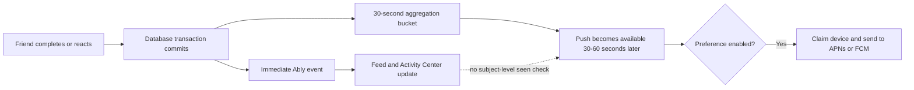
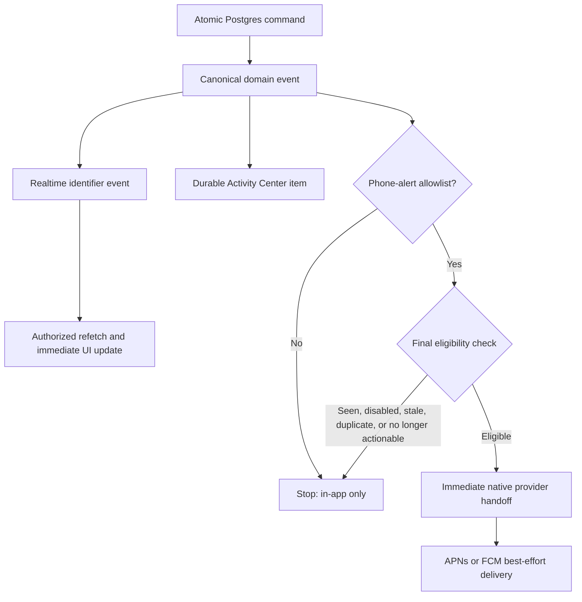

# Instagram-grade notifications for Doji

## Executive conclusion

Instagram's advantage is not that every social event becomes a faster push. Its
public engineering material describes a system that treats a notification as a
candidate: Meta decides who should receive it, when it should be sent, and what it
should contain; low-value candidates can be dropped, and candidates that resemble
recently sent notifications are demoted before a final quality bar decides whether
anything leaves the system.[^1] For Instagram's digest notifications, Meta also
models whether a person is likely to see the content organically and sends fewer
pushes to highly active people when the push has little incremental value.[^2]

That is the key design lesson for Doji:

> The database event is truth. The in-app activity is immediate. A phone alert is
> an optional interruption, not a copy of every event.

Doji already has most of the difficult delivery foundation: transactional domain
events, idempotent claims, direct APNs and FCM delivery, collapse identifiers,
expirations, foreground suppression, and realtime invalidation. The reported
duplicate-after-viewing behavior is caused by a product-policy layer in front of
that foundation. Friend completions, reactions, and comment likes deliberately
create a push that waits 30–60 seconds. The push is then sent without checking
whether the recipient has already seen the relevant Doji, post, or comment.

The recommended correction is deterministic and does not require Instagram-scale
machine learning:

1. Keep every eligible activity realtime in Doji's in-app Activity Center.
2. Restrict phone alerts to four user-facing categories: **Doji Live**, **Friend
   Requests**, **Mentions & Replies**, and **Reviews & Account**.
3. Hand those four categories to APNs or FCM immediately after commit and final
   eligibility checks. Do not deliberately batch or delay them.
4. Stop generating OS pushes for completions, ordinary comments, reactions,
   comment likes, friend acceptances, badges, XP, streaks, and poll activity.
5. Persist exact, server-owned seen receipts and check them before a retry or
   delayed provider handoff. Continue suppressing foreground banners and remove a
   matching delivered alert when the user opens its subject.

This produces the experience people perceive as Instagram-like: the app updates
immediately, high-value direct events interrupt immediately, ambient social proof
stays in the app, and a notification the person has already consumed does not show
up later merely because a batching timer expired.

## What Instagram publicly confirms

### Notification events go through selection, not automatic delivery

Meta states that Instagram uses models to decide **who** should get a notification,
**when** to send it, and **what** content to include. Its 2025 system applies a
diversity layer to each candidate's existing relevance score. It compares the
candidate with recently sent notifications across dimensions including content,
author, notification type, and product surface, then demotes repetitive candidates.
A final quality bar selects the top candidate that survives.[^1]

This is materially different from “event happened, therefore enqueue a push.” The
push delivery stream is a curated subset of product activity.

### Instagram tries to measure incremental value, not merely click probability

For daily digest pushes, Meta found that a click-through model still sent many
notifications to highly active people who would have viewed the content without a
push. It introduced uplift modeling to estimate the incremental effect of sending
versus not sending. Candidates below the sending threshold are dropped during the
send flow. Meta reports that this reduced volume substantially without reducing
engagement.[^2]

This is the closest public description of the exact problem Doji is experiencing.
If the person has already consumed the underlying activity organically, a later
push offers little or no incremental value and feels like spam.

### Realtime signals influence the send decision

Meta has described notification filtering that evaluates realtime signals each time
a candidate is generated, including whether the person previously clicked similar
notifications. The engineering constraint is to return the send decision quickly
enough to remain useful.[^3] Instagram's broader ranking infrastructure also treats
“important” notifications as a ranked surface rather than a hard-coded list.[^4]

For Doji, this supports a final eligibility decision close to provider handoff. It
does not support creating a push irrevocably and waiting a minute before checking
anything else.

### Realtime application state and phone push are separate transports

Meta's published Instagram Messaging architecture uses MQTT for realtime updates
and maintains an independent client cache.[^5] Older Meta mobile infrastructure
material describes the same general snapshot-plus-delta model: the client gets a
snapshot, receives ordered deltas over a low-bandwidth realtime channel, and keeps
durable storage synchronization independent from live delivery.[^6]

The exact Instagram Activity/notification-bell backend is not public. Still, the
published pattern supports a clear inference: the live in-app experience is driven
by synchronized application state, while OS push is a separate re-engagement
surface. Push is not the authority for what happened.

### User attention is treated as a scarce resource

Instagram exposes controls that can silence push, including Sleep Mode, and shows a
summary after the quiet period rather than interrupting throughout it.[^7] Meta's
newer diversity system explicitly identifies repetitive notifications from the same
author or product surface as a spam risk and reports that reducing daily volume can
improve engagement.[^1]

The lesson is not to label a delayed message “grouped.” The lesson is to reduce the
number of interruptions and let the in-app surface carry the complete record.

## What Meta does not disclose

Meta does not publicly document Instagram's complete notification schema, exact
read-receipt model, thresholds, rate limits, provider TTLs, per-device cancellation
logic, or all rules that distinguish immediate/direct notifications from ranked
re-engagement notifications. It would therefore be inaccurate to claim that
Instagram uses a particular `has_seen` table or a specific delay window.

The recommendations in this report combine three things:

- behavior Meta explicitly documents: candidate filtering, activity-aware uplift,
  recent-send diversity, quality thresholds, realtime sync, and user controls;
- behavior Apple and Google require or enable at the device boundary; and
- a direct audit of Doji's checked-in notification implementation.

## Why Doji currently produces the unwanted alert

The current implementation creates two paths for the same ambient social action:



Repository evidence:

- [`20260812186000_group_friend_participation_pushes.sql`](../supabase/migrations/20260812186000_group_friend_participation_pushes.sql)
  explicitly says friend participation is visible in-app immediately while the OS
  push is delivered 30–60 seconds later.
- [`20260812187000_group_reaction_and_like_pushes.sql`](../supabase/migrations/20260812187000_group_reaction_and_like_pushes.sql)
  applies the same delayed pattern to reactions and comment likes.
- [`relay-domain-events/index.ts`](../supabase/functions/relay-domain-events/index.ts)
  checks `sendPush`, token availability, user preferences, freshness, and idempotent
  delivery claims, but it does not check whether the target user has seen the
  relevant daily event, post, comment, or notification before claiming the device.
- [`useNativeNotifications.ts`](../hooks/useNativeNotifications.ts) correctly hides
  banners and sounds while the app is foregrounded. That cannot prevent the later
  push when the person views the activity, leaves the app, and the delayed bucket
  becomes eligible afterward.
- [`notificationPreferences.ts`](../lib/notificationPreferences.ts) currently enables
  a broad set of push categories by default, while the settings UI exposes nine
  category rows. The policy is much wider than the proposed four phone-alert types.

This is not primarily an APNs/FCM latency bug. The one-minute wait is created by
Doji's own database schedule. Provider delay can add more time, but it is not the
source of the deterministic delay observed in the reported flow.

### Why collapse IDs do not solve it

Doji already provides stable collapse identifiers. Apple and Google use them to
replace pending notifications in the same group, not to decide that the underlying
activity was already consumed. FCM explicitly states that, when a device is offline,
a newer message with the same collapse key replaces an older pending message.[^8]
APNs similarly supports a collapse identifier and expiry, but accepted delivery is
best effort and may still be delayed.[^9]

Collapse prevents a stack of equivalent pending alerts. It does not recall an alert
after provider acceptance, and it does not replace the need for a server-side send
decision.

## The Doji target model

### One event, three independent outcomes



The event and Activity Center entry are durable. The realtime event makes current
screens update. The phone alert is optional and can be dropped without losing truth.

### Phone-alert allowlist

| Category | Phone alert | Timing | In-app Activity Center | Recommended copy |
|---|---:|---|---:|---|
| Doji Live | Yes | Immediate | Yes | “Today's Doji is live — you have 10 minutes.” |
| Friend Request | Yes | Immediate | Yes | “Heather sent you a friend request.” |
| Mention or direct reply | Yes | Immediate | Yes | “Jonathan mentioned you in a comment.” |
| Challenge review, moderation, or account decision | Yes | Immediate | Yes | “Your challenge suggestion was approved.” |
| Friend completed or posted | No | Realtime in app | Yes | “Heather completed today's Doji.” |
| Reaction | No | Realtime in app | Yes | “Kira reacted ❤️ to your post.” |
| Ordinary comment that is not a mention/reply | No | Realtime in app | Yes | “Todd commented on your post.” |
| Comment like | No | Realtime in app | Yes | “Brooke liked your comment.” |
| Friend accepted | No | Realtime in app | Yes | “You and Shannon are now friends.” |
| Badge, XP, streak, poll activity | No | Realtime in app | Yes | Product-specific in-app copy |

“Immediate” means no intentional Doji batching window. The relay should attempt
provider handoff as soon as the committed event is claimable. It does not mean the
operating system can guarantee zero-latency display.

### Final eligibility check

Immediately before claiming a device endpoint, the server should evaluate:

1. The event type is in a hard server allowlist. A database trigger requesting
   `sendPush` must not be sufficient by itself.
2. The account master switch and the applicable category are enabled.
3. The target and actor are still eligible and not blocked.
4. The underlying state is still actionable: a friend request remains pending, a
   mention still exists and is visible, and a review decision has not been
   superseded.
5. A durable seen receipt does not cover the event.
6. The delivery key has not already reached a terminal provider outcome.
7. The alert has not expired.

If any check fails, the relay completes the push branch as **suppressed** with a
reason. It must not treat suppression as an infrastructure failure, and it must not
delete the Activity Center entry.

## Seen-state design

The existing `notification_center_state.last_opened_at` is account-wide and cannot
prove that a particular post or comment was visible. The replacement should be
subject-scoped and monotonic.

Recommended logical record:

```text
notification_attention_state
  user_id
  scope_kind        daily_event | post | comment | notification
  scope_id
  seen_through_at   server-bounded timestamp
  updated_at
  primary key (user_id, scope_kind, scope_id)
```

Rules:

- The client records a receipt only after the relevant content is actually visible
  or the matching Activity Center row is visible. Opening the app or an unrelated
  screen is insufficient.
- The write uses one authenticated, atomic, idempotent RPC and stores
  `greatest(existing, incoming)` after bounding client time to server time.
- The client batches adjacent visibility receipts into one small RPC; it must not
  write on every scroll frame.
- The relay suppresses when `seen_through_at >= event.occurred_at` for the event's
  exact subject.
- Records receive bounded retention, such as 30 days, and drain through the existing
  maintenance path.
- Reconnect and foreground reconciliation remain authoritative. A missed realtime
  signal never makes push responsible for correctness.

For the new immediate phone-alert list, this check primarily protects retry,
backlog, and multi-device races. In the common foreground case, the current client
notification handler already suppresses the OS banner while the in-app event updates.

### The unavoidable provider race

Once APNs or FCM accepts an alert, the backend cannot reliably recall it before it
reaches the device. Both services may store or delay accepted notifications because
of connectivity, power state, throttling, or operating-system policy. Apple calls
remote delivery best effort and does not guarantee timely delivery.[^10] FCM likewise
distinguishes “accepted for delivery” from “delivered to the device.”[^8]

Doji should therefore use four defenses:

1. Make the send decision immediately rather than intentionally waiting a minute.
2. Use short, category-appropriate TTLs and stable collapse IDs.
3. Suppress presentation in the foreground.
4. When a subject is opened, remove any matching delivered notification from the
   device's notification center. Apple provides APIs to remove delivered requests;
   Android notifications can be updated or canceled by their stable IDs.[^11]

These measures make the race small and self-cleaning. No system, including
Instagram, can promise that a provider-accepted push is physically retractable on
every offline or power-constrained device.

## Device policy

### iOS

- Use **Time Sensitive** only for Doji Live because the participation opportunity
  is happening now and expires within ten minutes. Apple specifically reserves this
  level for information relevant in the moment and warns against overstating
  urgency.[^12]
- Use **Active** for friend requests, mentions/replies, and review/account decisions.
  A genuine account-security event may separately qualify as Time Sensitive.
- Keep foreground banners and sound disabled; update the open surface or bell
  instead. Apple explicitly recommends subtle in-app updates rather than redundant
  foreground notifications.[^13]
- Use stable `apns-collapse-id` and `thread-id` values derived from the durable
  subject, plus a real expiration timestamp.

### Android

- Use high FCM transport priority for these low-volume, user-visible, immediate
  alerts. Google warns that high priority must result in a visible notification or
  FCM may deprioritize future messages.[^14]
- Split the current single `doji-alerts` channel into user-meaningful channels:
  **Doji Live** at high importance, **Direct Activity** at default importance, and
  **Reviews & Account** at default importance. Android users can then control each
  class in system settings.[^15]
- Keep all content needed to render the alert in the provider payload. Do not make a
  network round trip before showing it; Google documents that long foreground
  processing can cause delayed or missing notifications.[^14]
- Use one stable notification/tag ID per subject so a new state updates or cancels
  the prior device notification rather than adding another row. Android recommends
  updating an existing notification instead of issuing redundant ones.[^15]

## Settings design

The user-facing settings should be simple:

```text
Alerts on this phone                         [on]

Doji Live                                   [on]
Friend Requests                             [on]
Mentions & Replies                          [on]
Reviews & Account                           [on]
```

The Activity Center remains complete and realtime regardless of these phone-alert
toggles. The copy should say “phone alerts,” not “what we notify you about,” so
people do not infer that turning off a phone interruption deletes in-app activity.

Existing JSON preferences can be migrated compatibly:

- `doji_start` -> `doji_live`
- `friend_request` -> `friend_requests`
- `mention OR comment_reply` -> `mentions_replies`
- `suggestion` plus moderation/account categories -> `reviews_account`
- retain `push_enabled` as the account master switch
- ignore legacy ambient-social values for OS delivery while continuing to show the
  underlying Activity Center items

## Natural in-app consolidation without delayed copy

Instagram-like copy does not expose implementation language such as “grouped
updates.” Doji can update an Activity Center row naturally as related activity
arrives:

```text
Jonathan reacted ❤️ to your post

Jonathan and Kira reacted to your post

Jonathan, Kira, and 3 others reacted to your post
```

Each action still appears in realtime. Consolidation is a presentation rule over
durable activity, not a timer that delays the first update and not a promise that a
phone push will follow.

## Performance and scale

The proposed design is cheaper than the current one:

- Eliminating ambient-social phone pushes removes per-recipient grouped push rows,
  delivery claims, provider requests, and retry work.
- Realtime continues to carry identifier-only invalidations and authorized refetches,
  preserving the current Postgres/Ably contract.
- Seen receipts are sparse, monotonic, batchable writes tied to actual visibility.
  They do not require a continuously updated online-presence heartbeat.
- A server hard allowlist prevents future triggers from accidentally expanding push
  volume.
- Provider handoff remains independent from realtime publication, so a slow push
  provider cannot delay the feed or Activity Center.

Doji should not build an Instagram-scale ML ranker yet. A deterministic allowlist,
exact seen state, actionable-state validation, per-type rate budgets, and recent-send
deduplication will deliver most of the product benefit at far lower operational and
privacy cost. Ranking becomes appropriate only if Doji later introduces optional
re-engagement or recommendation pushes beyond the four core categories.

## Observability and quality gates

Provider acceptance must not be reported as device delivery. FCM exposes accepted,
received, displayed, opened, delay, and drop metrics, including BigQuery export for
per-message analysis.[^16] Apple provides delivery logs and metrics for APNs.[^17]

Recommended event ledger fields:

```text
event_committed_at
realtime_published_at
push_decision_at
push_decision             sent | suppressed
suppression_reason        not_allowed | preference | seen | stale | duplicate |
                          no_longer_actionable | invalid_endpoint
provider_accepted_at
provider_message_id
device_received_at        where observable
device_presented_at       where observable
opened_at
```

Recommended release gates:

- realtime publish p95 below 1 second and p99 below 2 seconds;
- no intentional wait between eligibility and provider handoff;
- zero OS pushes from event types outside the server allowlist;
- zero duplicate terminal claims for the same event and installation;
- zero delayed completion/reaction/comment-like phone alerts;
- stale-push and seen-before-alert rates monitored by category;
- Android high-priority deprioritization monitored through FCM delivery data;
- notification opt-out rate and pushes per active user tracked as product guardrails.

## Rollout plan

### Phase 1 — Server noise stop

1. Stop creating push rows for friend completions, reactions, comment likes, ordinary
   comments, friend acceptances, badges, XP, streaks, and poll activity.
2. Add a relay-side event-type allowlist as defense in depth.
3. Terminally suppress any already queued ambient-social push rows so the deployment
   does not release one final batch of stale alerts.
4. Preserve every realtime and Activity Center event.

This phase can reduce noise without waiting for a mobile-store review.

### Phase 2 — Immediate direct alerts and seen receipts

1. Ensure the four allowed categories are claimable immediately after commit.
2. Add the server-owned attention-state table and atomic batch RPC.
3. Add precise visibility receipts to the feed, comment thread, friend-request
   surface, review surface, and Activity Center.
4. Re-evaluate preference, seen, actionable state, TTL, and dedupe immediately before
   endpoint claim and on every reclaimable retry.
5. Remove matching delivered notifications when their subject is opened.

### Phase 3 — Settings and device channels

1. Replace the current category list with the master switch plus four toggles.
2. Migrate legacy preferences without turning on anything a person previously
   disabled.
3. Create the Android channels and map iOS interruption levels.
4. Verify physical iPhone and Galaxy behavior in foreground, background, terminated,
   offline, Doze, Focus, and multi-device conditions.

### Phase 4 — Measurement and tuning

1. Enable delivery labels and provider metrics.
2. Review sends, receives, displays, opens, suppressions, TTL expiry, and
   deprioritization by category.
3. Tune only the allowlist, TTL, channel importance, and copy first.
4. Consider a lightweight ranking score only if optional re-engagement notifications
   are introduced later.

## Acceptance matrix

| Scenario | Expected result |
|---|---|
| Friend completes while recipient watches the feed | Feed and Activity Center update immediately; no phone alert now or later |
| Recipient sees a reaction, then leaves the app | Reaction remains in Activity Center; no delayed phone alert |
| Mention occurs while app is backgrounded | Immediate provider handoff; one phone alert; deep link opens the exact comment |
| Mention occurs while exact thread is foregrounded | Comment appears immediately; no banner or sound; matching delivered row is cleared |
| Friend request is accepted before a retry | Stale request push is suppressed as no longer actionable |
| Doji goes live while device is asleep | High-priority, short-TTL alert; tapping opens authoritative current Doji state |
| Device stays offline past TTL | No stale phone alert after reconnect; app reconciles from Postgres when opened |
| Same account is active on two devices | One durable account state; per-installation claims remain idempotent; seen state suppresses unclaimed retries |
| Relay retries after provider transport failure | Final eligibility and seen checks run again before reclaim |
| User disables Mentions & Replies | No phone alert, but the mention still appears immediately in Activity Center |

## Decision

Doji should copy Instagram's **separation of concerns**, not Instagram's scale or ML
complexity. The correct near-term architecture is:

> realtime everything in app; immediate phone alerts for four direct/time-sensitive
> categories; no phone alerts for ambient social proof; final seen/actionability
> checks; short expiry; stable collapse IDs; native foreground cleanup; measurable
> provider delivery.

The current 30–60 second grouped social-push mechanism should be retired rather than
patched with additional timing logic. A seen check would reduce its worst behavior,
but the phone alert still has too little incremental value to justify interrupting
the user. The in-app Activity Center is the right surface for those events.

## Sources

[^1]: Xian Sun et al., Meta Engineering, [“A New Ranking Framework for Better Notification Quality on Instagram,”](https://engineering.fb.com/2025/09/02/ml-applications/a-new-ranking-framework-for-better-notification-quality-on-instagram/) September 2, 2025.
[^2]: Meta Engineering, [“Improving Instagram notification management with machine learning and causal inference,”](https://engineering.fb.com/2022/10/31/ml-applications/instagram-notification-management-machine-learning/) October 31, 2022.
[^3]: Meta Engineering, [“Evaluating boosted decision trees for billions of users,”](https://engineering.fb.com/2017/03/27/ml-applications/evaluating-boosted-decision-trees-for-billions-of-users/) March 27, 2017.
[^4]: Meta Engineering, [“Journey to 1000 models: Scaling Instagram's recommendation system,”](https://engineering.fb.com/2025/05/21/production-engineering/journey-to-1000-models-scaling-instagrams-recommendation-system/) May 21, 2025.
[^5]: Meta Engineering, [“Launching Instagram Messaging on desktop,”](https://engineering.fb.com/2022/07/26/web/launching-instagram-messaging-on-desktop/) July 26, 2022.
[^6]: Meta Engineering, [“Building Mobile-First Infrastructure for Messenger,”](https://engineering.fb.com/2014/10/09/production-engineering/building-mobile-first-infrastructure-for-messenger/) October 9, 2014.
[^7]: Meta, [“Instagram Sleep Mode (Quiet Mode): Manage Your Time & Focus,”](https://about.fb.com/news/2023/01/instagram-quiet-mode-manage-your-time-and-focus/) updated September 4, 2025.
[^8]: Firebase, [“Set the lifespan of a message,”](https://firebase.google.com/docs/cloud-messaging/customize-messages/setting-message-lifespan) accessed September 9, 2026.
[^9]: Apple Developer, [“Sending notification requests to APNs,”](https://developer.apple.com/documentation/usernotifications/sending-notification-requests-to-apns) accessed September 9, 2026.
[^10]: Apple Developer, [“User Notifications,”](https://developer.apple.com/documentation/usernotifications/) accessed September 9, 2026.
[^11]: Apple Developer, [“UNUserNotificationCenter,”](https://developer.apple.com/documentation/usernotifications/unusernotificationcenter) and Android Developers, [“About notifications,”](https://developer.android.com/develop/ui/compose/notifications) accessed September 9, 2026.
[^12]: Apple Developer, [“Managing notifications,”](https://developer.apple.com/design/human-interface-guidelines/managing-notifications) accessed September 9, 2026.
[^13]: Apple Developer, [“Notifications,”](https://developer.apple.com/design/human-interface-guidelines/notifications) accessed September 9, 2026.
[^14]: Firebase, [“Set and manage Android message priority,”](https://firebase.google.com/docs/cloud-messaging/android-message-priority) accessed September 9, 2026.
[^15]: Android Developers, [“About notifications,”](https://developer.android.com/develop/ui/compose/notifications) accessed September 9, 2026.
[^16]: Firebase, [“Understanding message delivery,”](https://firebase.google.com/docs/cloud-messaging/understand-delivery) accessed September 9, 2026.
[^17]: Apple Developer, [“Viewing the status of push notifications using Metrics and APNs,”](https://developer.apple.com/documentation/usernotifications/viewing-the-status-of-push-notifications-using-metrics-and-apns) accessed September 9, 2026.
